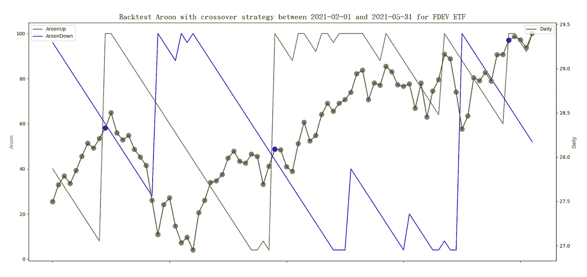
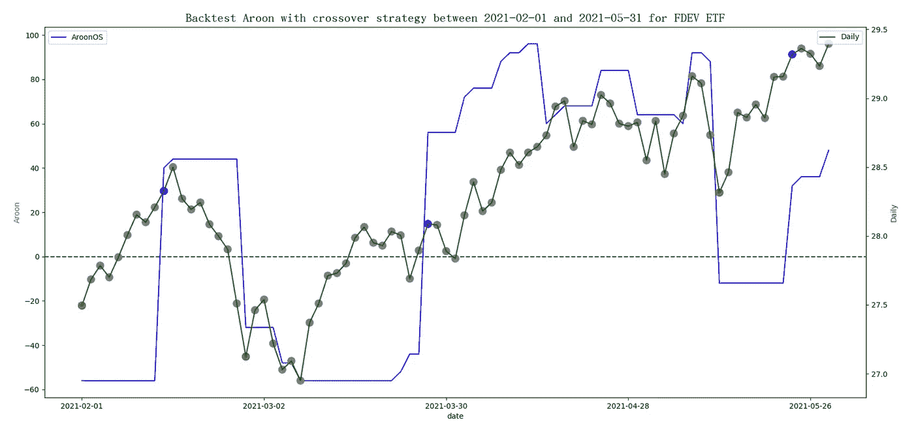
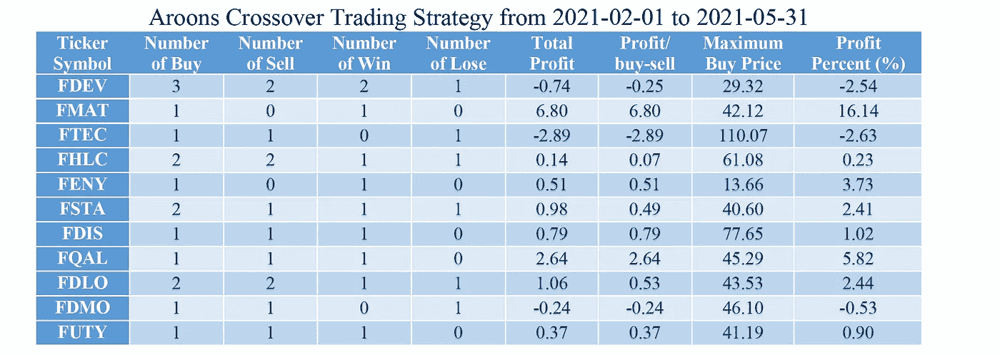
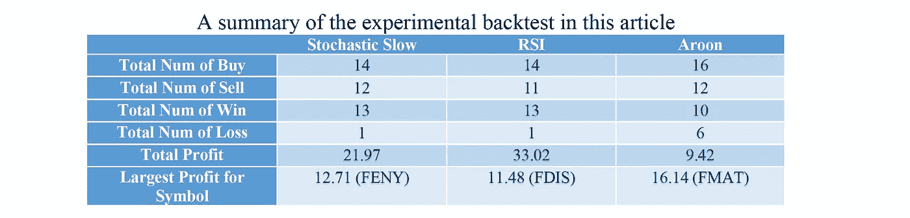

# 弹性搜索中的回测 Aroon 交叉策略

> 原文：<https://medium.com/nerd-for-tech/backtest-aroon-crossover-strategy-in-elasticsearch-ea912afcf907?source=collection_archive---------7----------------------->

我们已经讨论了如何回测 [RSI 交叉策略](/geekculture/wow-backtest-rsi-crossover-strategy-in-elasticsearch-1cdf837a72a1)和[随机交叉策略](/codex/backtest-fast-and-slow-Stochastic-crossover-strategy-in-elasticsearch-221d889408e3)。在本文中，我们将实现 Aroon 交叉策略，并将其性能与上述两种策略进行比较。Aroon 指标是由 Tushar Chande 于 1995 年提出的，它可以揭示一种新的趋势。相比以上两个指标，更年轻。

类似于 RSI 和随机指标，Aroon 指标也是一个振荡指标。其值介于 0 和 100 之间。但是，它的价值并不直接取决于价格。相反，计算是基于从最近的最高价格和最近的最低价格得出的距离。价格的高低波动转化为一种数据，即两个归一化距离之差。AroonUp 定义为自 n 个周期内的最高价格以来的距离。AroonDown 定义为从 n 个周期内的最低价开始的距离。等式可以改写如下，其中 MMaxP *n+1，1* 和 MMinP *n+1，1* 分别是 *n+1* 移动窗口中最高价和最低价以来的周期数。对应于 Elasticsearch 移动函数，它需要将 1 个数据向右移位，以包含当前数据。通常，25 个周期用于周期 *n* 。


Aroon 振荡器被定义为这两个归一化距离之间的差。


Aroon 交叉策略可以定义为当 aroons 从负变为零或正时发出买入信号，因为它表明了看涨交叉。可以解释为 AroonUp 经过 AroonDown 上方。当 AroonOS 从正变为零或负时，它发出卖出信号，因为它表明熊市交叉。对于其他值，请耐心等待信号。
使用图表观察数值变化要容易得多。在本文中，我们尝试将回溯测试应用于免佣金的交易所交易基金(ETF ),并将重点放在作为分析工具的弹性搜索上。下面的例子随机选择“富达国际多因子 ETF”。它的股票代码是 FDEV。将运行另外 10 只随机选择的 ETF，稍后将显示最终结果。数据选自投资者交易所 IEX 提供的 2021 年 2 月 1 日至 2021 年 5 月 31 日的时间范围。在下面的图表中，AroonUp 线和 AroonDown 线与每日收盘价一起绘制。在每日价格曲线中，有卖出信号的价格用红色标出，有买入信号的价格用蓝色标出。



下图用每日收盘价绘制了一个 Aroon 振荡指标。



这里，我们提出一个简单的 Aroon 交叉策略，并使用 Elasticsearch 来展示实现细节。

◆假设被限制一次买入并持有 1 股，在持有的股份卖出前不发生交易。
◆当 AroonUp 穿越 AroonDown 上方时买入 1 股。
◆当 AroonDown 穿过 AroonUp 下方时卖出 1 股。
◆测试期结束时，持有份额按现价兑现。

根据 Aroon 交易策略，有 3 个蓝点和 3 个红点。第一个卖出信号无法兑现，因为没有持股。对于其他信号可以兑现。因此，允许 3 次买入和 2 次卖出交易。观察表明，不知何故，这种策略可能会选择高价买入，稍后低价卖出。就像文章“ [Aroon 振荡器](https://www.investopedia.com/terms/a/aroonoscillator.asp)中的结论一样，“这个指标在波动的市场条件下会提供很差的交易信号。
让我们描述一下使用 Elasticsearch 的实现。假设有一个用数据填充的 Elasticsearch 索引，其使用的数据映射与上一篇论文中描述的相同。以下步骤演示了 REST API 请求体的代码。

> 通过搜索操作收集所有相关文件

使用带有“must”子句的“bool”查询来收集符号为 FDEV 且日期在 2021–02–01 和 2021–05–31 之间的文档。由于计算移动窗口的 25 个周期，额外数据调整为 1.5 个月(从 2020 年 12 月 15 日到 2021 年 1 月 31 日)。

```
{
    "query": {
        "bool": {
            "must": [
                {"range": {"date": {"gte": "2020-12-15", "lte": "2021-05-31"}}},
                {"term": {"symbol": "FDEV"}}
            ]
        }
    },
```

> 提取基金的收盘价值

使用名为 Backtest_Aroons 的“date_histogram”聚合，参数“field”为“date ”,参数“interval”为“1d ”,提取基金每天的价格。然后是一个名为 SDaily 的“bucket_selector”聚合，用于选择文档计数大于零的 bucket，以便过滤掉空 bucket(非交易日)。

```
 "aggs": {
        "Backtest_Aroon": {
            "date_histogram": {
                "field": "date",
                "interval": "1d",
                "format": "yyyy-MM-dd"
            },
            "aggs": {
                "SDaily": {
                    "bucket_selector": {
                        "buckets_path": {"count":"_count"},
                        "script": "params.count > 0"
                    }
                },
```

> 检索每日收盘价

```
 "Daily": {
                    "avg": {"field": "close"}
                },
```

> 提取桶的日期

由于存在额外的数据，后续操作需要稍后过滤掉超出范围的部分。一个名为“DateStr”的“min”聚合将获取存储桶的日期。在 Elasticsearch 服务器中，日期字段以纪元时间存储。时间单位是毫秒，时区是 UTC。

```
 "DateStr": {
                    "min": {"field": "date"}
                },
```

> 计算 MMaxPn+1，1 和 MMinPn+1，1

使用两个名为 MMaxP 和 MMinP 的“移动 _fn”聚合，参数“buckets_path”为 Daily，参数 window 为 26(需要 25 个周期)。参数“shift”被设置为 1，以包括最近的数据。“MMaxP”使用一个脚本在移动窗口中循环，找出当前交易日与窗口中日收盘价最高的那一天之间的距离。“MMinP”也可以这样做。

```
 "MMaxP": {
                    "moving_fn": {
                        "script": "int i = 0; float max=0f; int maxIndex=0; for (float daily : values){if (daily >= max){maxIndex=i; max=daily;} i++;} return values.length - 1 - maxIndex;", 
                        "buckets_path": "Daily", "window": 26, "shift": 1
                    }
                }, 
                "MMinP": {
                    "moving_fn": {
                        "script": "int i = 0; float min=10000f; int minIndex=0; for (float daily : values){if (daily <= min){minIndex=i; min=daily;} i++;} return values.length - 1 - minIndex;", 
                    "buckets_path": "Daily", "window": 26, "shift": 1
                    }
                },
```

> 计算 AroonUp、AroonDown 和 AroonOscillator

使用了三个“bucket_script”聚合，名为 AroonUp、AroonDown 和 AroonOS。“ArronUp”使用参数“buckets_path”作为 MMaxP，并根据等式编写脚本。同样的方法也可以完成。AroonOS 是 AroonUp 和 AroonDown 的区别。

```
 "AroonUp": {
                    "bucket_script": {
                        "buckets_path": {"MMaxP": "MMaxP"}, 
                        "script": "100 * (25.0 - params.MMaxP)/25"
                    }
                }, 
                "AroonDown": {
                    "bucket_script": {
                        "buckets_path": {"MMinP": "MMinP"}, 
                        "script": "100 * (25.0 - params.MMinP)/25"
                    }
                },
                "AroonOS": {
                    "bucket_script": {
                        "buckets_path": {"AroonUp": "AroonUp",              "AroonDown": "AroonDown"}, 
                        "script": "params.AroonUp - params.AroonDown"
                    }
                },
```

> 识别振荡器的交叉类型

a)需要前一个交易日的数据来确定交叉类型。使用名为“PRE_AroonOS”的“moving_fn”聚合，带参数“buckets_path”，指定“AroonOS”值，参数窗口设置为 1。

```
 "PRE_AroonOS": {
                    "moving_fn": {
                        "script": "MovingFunctions.sum(values)", 
                        "buckets_path": "AroonOS", "window": 1
                    }
                },
```

b)要确定交叉类型 AroonUp 线是在“AroonDown”线下方还是上方交叉，请检查以下汇总标准“AroonOS_Type”。如果是卖出信号，将“AroonOS_Type”设置为 1。如果是买入信号，设置为-1。否则，将其设置为 0。

◆交易日 AroonUp 在 AroonDown 上方交叉

参数。AroonOS == 0，params。PRE_AroonOS < 0

◆ AroonUp crosses below AroonDown on the trading day

params.AroonOS == 0 and params.PRE_AroonOS > 0

◆两个交易日之间 AroonUp 在 AroonDown 下方交叉

参数。PRE_AroonOS > 0 && params。AroonOS < 0

◆ AroonUp crosses above AroonDown between two trading days

params.PRE_AroonOS < 0 && params.AroonOS > 0

```
 "AroonOS_Type": {
                    "bucket_script": {
                        "buckets_path": {"AroonOS":"AroonOS", "PRE_AroonOS":"PRE_AroonOS"}, 
                        "script": "(params.AroonOS == 0) ? ( params.PRE_AroonOS < 0 ? -1 : 1) : ((params.PRE_AroonOS > 0 && params.AroonOS < 0 ) ? 1 : (params.PRE_AroonOS < 0 && params.AroonOS > 0) ? -1 : 0)"
                    }
                },
```

> 筛选出要输出的附加文档

使用名为 S_Date 的“bucket_selector”聚合，通过参数“buckets_path”指定“DateStr”来选择正确的存储桶。选择标准是那些日期等于或晚于 2021 年 2 月 1 日(纪元时间 1612137600000 毫秒)的时段。

```
 "S_Date": {
                    "bucket_selector": {
                        "buckets_path": {"DateStr": "DateStr"}, 
                        "script": "params.DateStr >= 1612137600000L"
                    }
                }
            }
        }
    },
    "from": 0, "size": 0
}
```

> 收集完结果后，我们就可以画出如图所示的图形了。

实现的结果将发出买入、卖出或持有信号；然而，这些信号只满足简单 Aroon 交叉策略交易策略的第二和第三种情况。对于第一种和第四种情况，我们需要使用 Python 编程语言来编写程序。该计划包括四个部分。

◆读取两个命令行参数。一个用于选择的股票代号，另一个用于包含使用 JSON 格式在 Elasticsearch REST API 请求体中编写的交易策略的文件名。
◆从 Elasticsearch 服务器获取数据。
◆解析响应数据，提炼买卖信号。
◆上报回测统计。

主要功能如下所示:

```
def main(argv):
    type = 'AroonOS_Type'
    inputfile, symbol = get_opt(argv)
    resp = get_data(inputfile, symbol)
    transactions = parse_data(resp, type)
    report(transactions, type)
```

在本文中，只显示了细化买卖信号的代码段。读者可以进一步参考 GitHub 上的开源项目 [Backtest_Aroon](https://github.com/wtwong316/Backtest_Aroon) 。为了确保一次买入并持有一股，在持有的股票卖出之前不发生交易，我们使用布尔变量“hold”来确保交易满足以下条件。
◆当保持标志为假时，接受买入信号(值等于-1)
◆当保持标志为真时，接受卖出信号(值等于 1)

parse_data()函数如下所示。最后，事务数组将包含有效信号。

```
def parse_data(resp, type):
    result = json.loads(resp)
    aggregations = result['aggregations']
    if aggregations and 'Backtest_Aroon' in aggregations:
        Backtest_Aroons = aggregations['Backtest_Aroon'] transactions = []
    hold = False
    if Backtest_Aroons and 'buckets' in Backtest_Aroons:
        for bucket in Backtest_Aroons['buckets']:
            transaction = {}
            transaction['date'] = bucket['key_as_string']
            transaction['Daily'] = bucket['Daily']['value']
            # honor buy signal if there is no share hold
            if bucket[type]['value'] == -1:
                transaction['original'] = 'buy'
                if not hold:
                    transaction['buy_or_sell'] = 'buy'
                else:
                    transaction['buy_or_sell'] = 'hold'
                hold = True
            # honor sell signal if there is a share hold
            elif bucket[type]['value'] == 1:
                transaction['original'] = 'sell'
                if hold:
                    transaction['buy_or_sell'] = 'sell'
                else:
                    transaction['buy_or_sell'] = 'hold'
                hold = False
            # for other situations, just hold the action
            else:
                transaction['original'] = 'hold'
                transaction['buy_or_sell'] = 'hold'
            transactions.append(transaction) return transactions
```

python 程序提供了交易策略的统计数据，包括整个买卖交易的“赢”和“输”。以下是运行 FDEV 后的结果。

```
number of buy:              3
number of sell:             2
number of win:              2
number of lose:             1
total profit:           -0.74
profit/transaction:     -0.25
maximum buy price:      29.32
profit percent:        -2.54%
```

下表收集了 2021 年 2 月 1 日至 2021 年 5 月 31 日期间使用 Aroon 交叉交易策略随机挑选的 11 只 ETF 的所有统计数据。结果显示，性能不如预期的好，因为它比其他两个指标更新。然而，没有根据大多数交易者的建议提出交易的单一指标。



下表汇总了所有 11 只 ETF 的买入、卖出、赢、亏次数，以及总盈利。表格还显示了每种策略的符号交易的最大利润。总之，与其他两种策略相比，Aroon 交叉交易策略是最差的。但是，它可以为其中一个符号带来最高的利润。



备注:
一、感谢 IEX(投资者交易所)提供 ETF 数据，GitHub 提供开源项目存储。
二。本文基于一种技术思路，不构成任何投资建议。读者在使用时必须承担自己的责任。
三。文章可能还有错误，恳请读者指正。
四。感兴趣的读者可以参考作者撰写的《弹性搜索的基本技巧》一书。《高级弹性搜索 7.0》，2019 年 8 月，Packt，ISBN: 9781789957754。