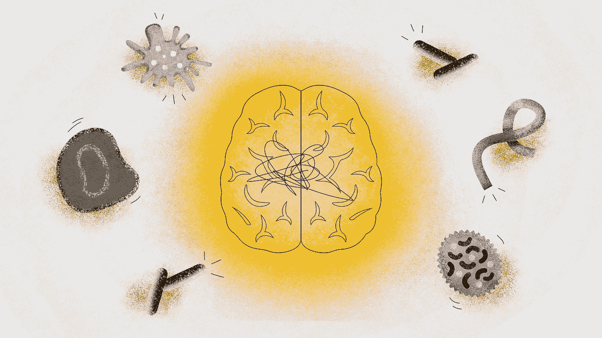

# 细菌和病毒——神经退行性疾病的罪魁祸首？

> 原文：<https://medium.com/nerd-for-tech/bacteria-and-viruses-culprits-in-neurodegenerative-diseases-5f6a39dd8f49?source=collection_archive---------3----------------------->

## 一个长期假说的复活

*由* [*本杰明博物馆*](https://www.linkedin.com/in/benjamin-musrie-379a23116/) *，医学研究员。澳大利亚悉尼。*

刘文秀的插图

B 细菌和病毒。我们都听说过他们。肉眼看不见，但能引起你咳嗽或发烧。我们生活在一个细菌和病毒主宰的世界。科学家估计有 5x1030…