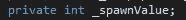
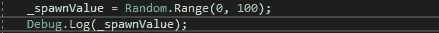
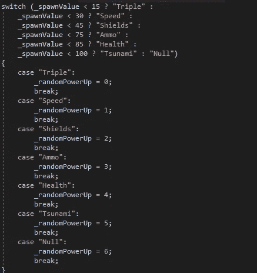
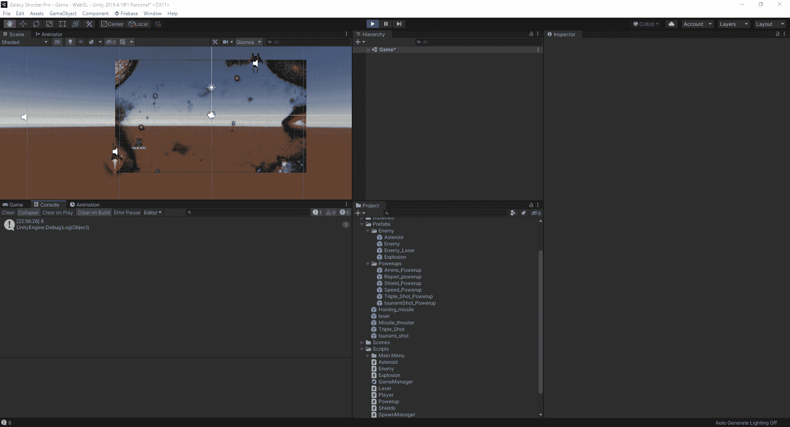

# 平衡加电产卵

> 原文：<https://medium.com/nerd-for-tech/balancing-powerup-spawns-bcba0d632d6a?source=collection_archive---------30----------------------->

现在我们已经增加了一些新的能量类型，让我们看看如何平衡新生命的比率，这样我们就有更多的机会获得弹药，而更少的机会获得基于健康的能量。如果我们保持目前的速度，我们将有大约 16%的机会产生弹药，在某些情况下，当玩家没有子弹时，会感觉像是永远没有子弹了。有多种方法可用于此过程，但是在这种情况下，我们将在 spawn manager 脚本中使用 switch 语句。我们将首先创建一个新变量:

有了这个值，我们可以进入我们的 SpawnPowerup 例程，并给它一个随机范围值，每当例程再次启动时，就会创建这个值:

我们现在将添加 debug.log 来查看我们玩游戏时在游戏中滚动的值，并确保它们正确匹配应该用该数字生成的值。接下来，我们将开始执行 switch 语句，以确定将产生的加电:

在这种情况下，我们可以对 switch 语句做的是放弃每种情况的范围，并在初始语句中键入所有内容。然后，不管值变成什么，它知道你想要它成为特定的上电，它会调用这种情况。同样，如果恰好是 64，它将调用最低可能的情况，在这种情况下是弹药。健康和海啸在技术上符合这一价值，但 switch cases 将选择第一个可用的选项。
现在我们已经把所有这些都放进去了，我们可以看看它在我们的游戏中是什么样子的，看看这些数字是否与我们想要的情况相符:

正如我们从上面看到的，如果它的值是滚动的，我们想要产生的能量就会出现，并且没有额外的能量进来，因为它们符合标准。