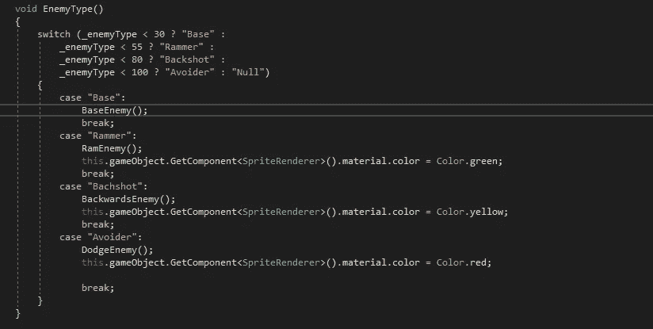

# 平衡敌人的产卵率

> 原文：<https://medium.com/nerd-for-tech/balancing-the-enemy-spawn-rates-1e6467b513fd?source=collection_archive---------19----------------------->

现在我们已经添加了一些新的敌人类型，让我们快速进入我们的选择方法，调整每个敌人类型的产卵率。我们将遵循与我们使用[电源](/nerd-for-tech/balancing-powerup-spawns-bcba0d632d6a)时相同的方法。

我们需要做的就是调整 _enemytype 变量的范围，这样我们就可以给它更多的%的机会来实现它。这样，我们就可以用 10%的固体来给我们的敌人产卵。

接下来，我们必须添加我们的敌人类型和我们希望他们少于的值。就像我们对 powerups 所做的那样，我们可以简单地将所有标准放入 switch 语句的初始括号中，然后为每个标准命名，我们可以将其作为不同的情况添加到语句的其余部分。

现在我们已经实现了一种方法来控制每个单位产卵的机会，我们正接近游戏的尾声。接下来，我们将会考虑增加第五种敌人类型，一个波动系统或者自动寻的导弹，然后再考虑如何对付一个大 boss。