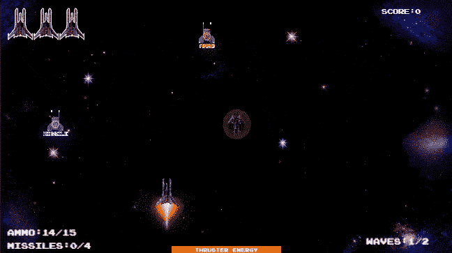
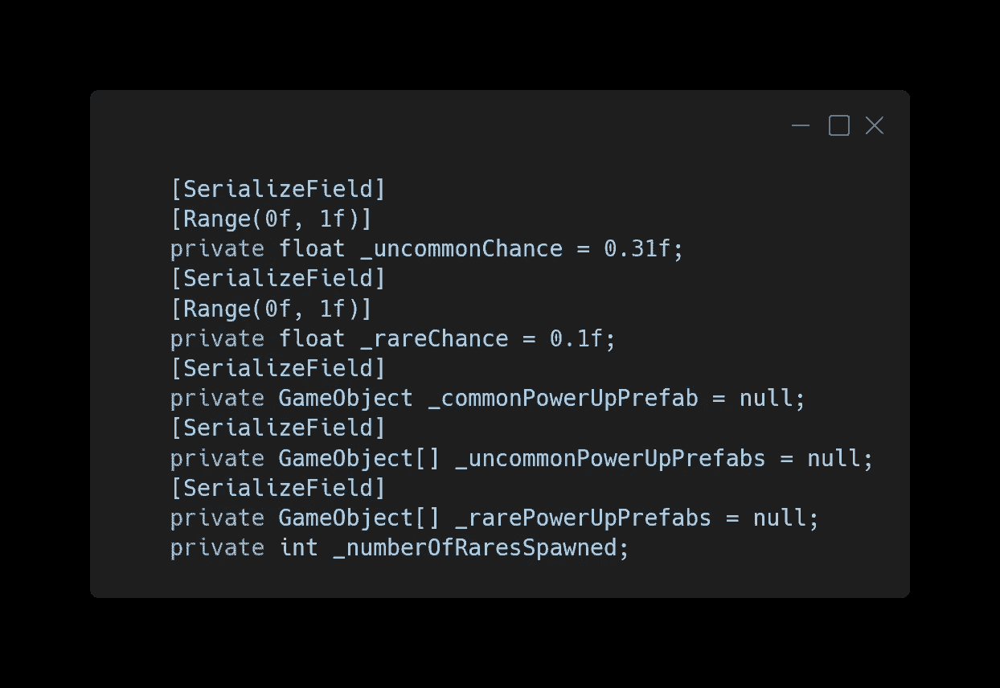
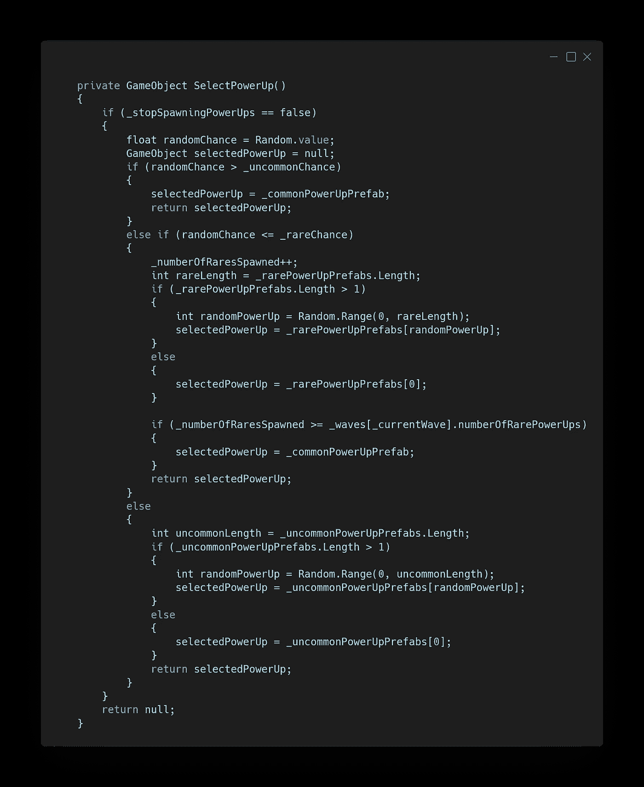
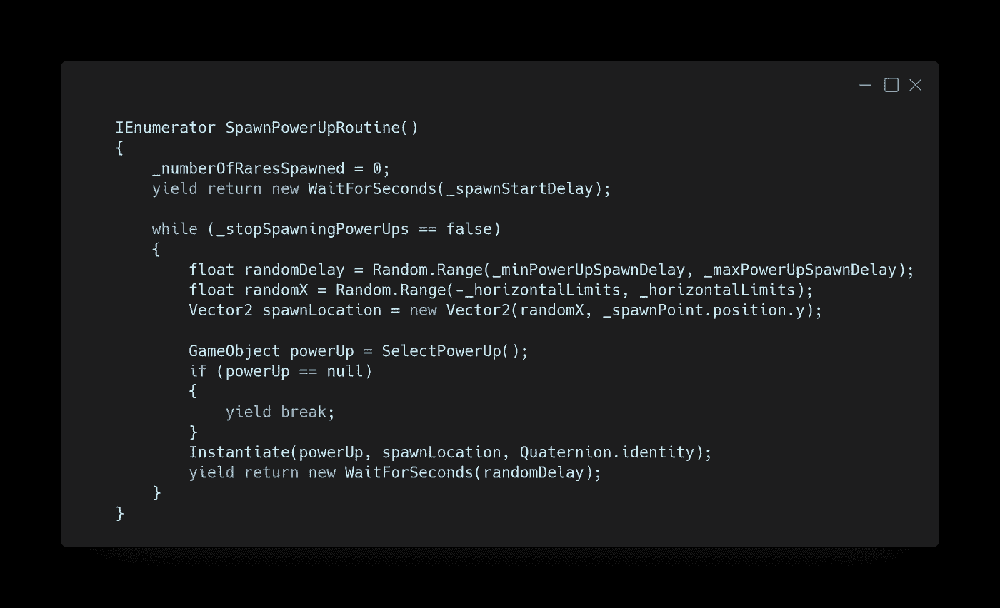
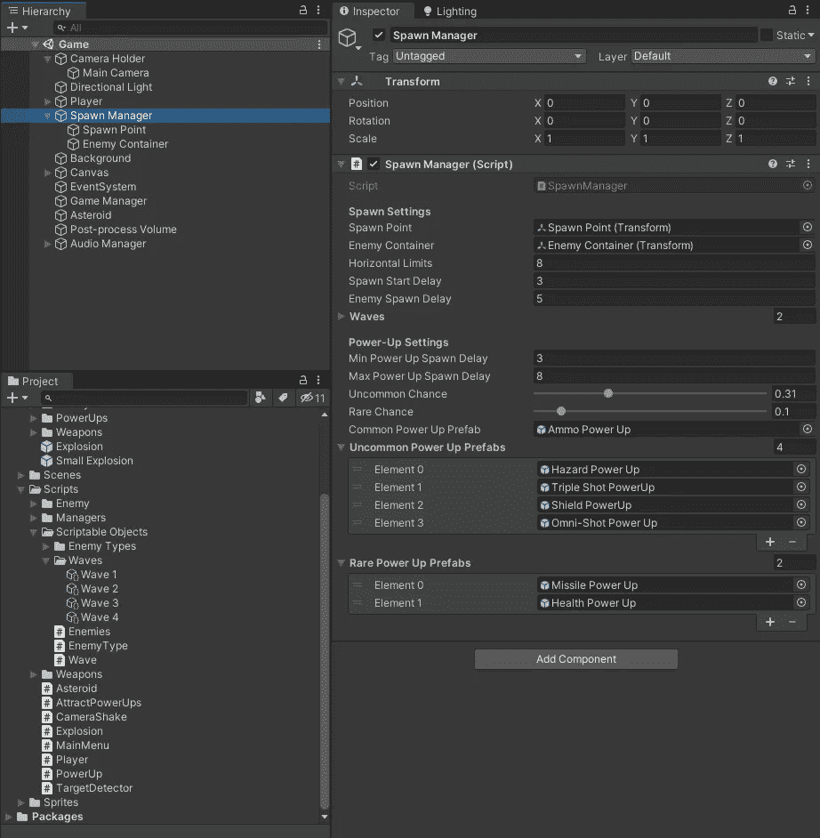
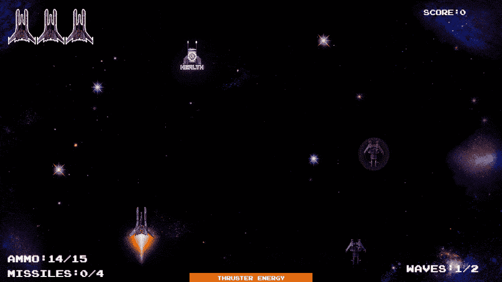

# 平衡开机产卵

> 原文：<https://medium.com/nerd-for-tech/balancing-the-power-up-spawns-cd4ef7f23155?source=collection_archive---------20----------------------->

在这篇文章中，我们将使弹药加电频繁出现，而其余的加电很少出现。

在 SpawnManager 脚本中，我们需要添加一些变量。第一个是两个浮动，一个是不常见阵列中的加电机会，另一个是罕见阵列。然后我们需要一个普通弹药加电预置的游戏对象和两个不常见和罕见加电预置的游戏对象数组。我们需要的最后一个变量是一个 int 来记录一波中有多少罕见的能量产生。

这个方法基于 0.0 和 1.0 之间的随机值返回选择的加电，或者如果加电不应该产生，则不返回任何值。如果随机值大于罕见几率，我们返回普通的加电预置。如果随机值小于或等于稀有几率，我们返回一个随机稀有加电预置，如果只有一个随机稀有加电预置，我们返回第一个随机稀有加电预置，如果这波加电达到最大稀有加电，我们返回普通加电预置。对于其他所有东西，我们返回一个随机的不寻常的启动预置，或者第一个，如果只有一个的话。

现在更新 SpawnPowerUpRoutine 来使用不同组的预置。我们需要调用 SelectPowerUp 方法，并存储返回的 GameObject 以便实例化，如果它不为 null 的话。并且在协程开始时将所产生的稀有数量设置回零。

在 SpawnManager 上，你可以看到电源是如何分类的。

每一波，玩家都有机会获得一定数量的稀有能量，一次不寻常能量的机会，以及大量的弹药。

