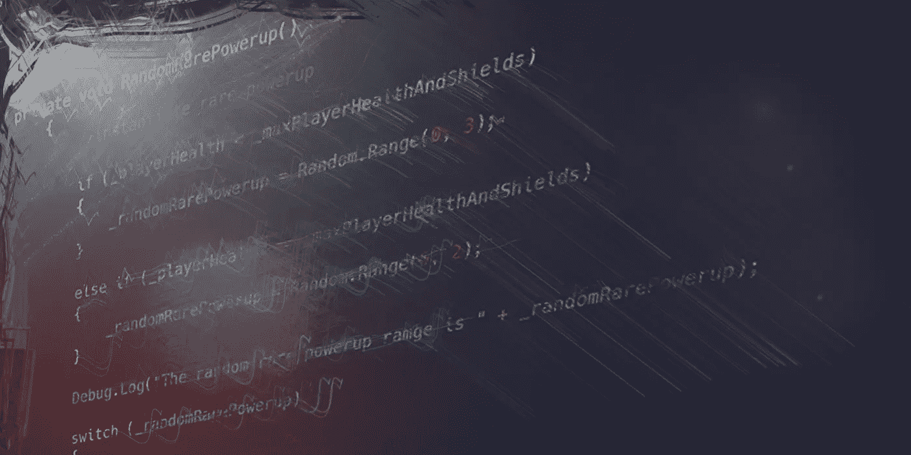

# 平衡产卵管理器

> 原文：<https://medium.com/nerd-for-tech/balancing-the-spawn-manager-19f926a899b6?source=collection_archive---------9----------------------->

并非所有的敌人和力量都是平等的。因为这个原因，我在这篇文章中的**目标**是为我的异能和敌人类型创造一个平衡的产卵。

这是一个非常基本的设置，使用少量的*随机整数*掷骰子来给我的敌人和加电掉落不同的机会，基于我想要如何打破掉落表。然后我用了相当多的*方法*和*如果其他的* …