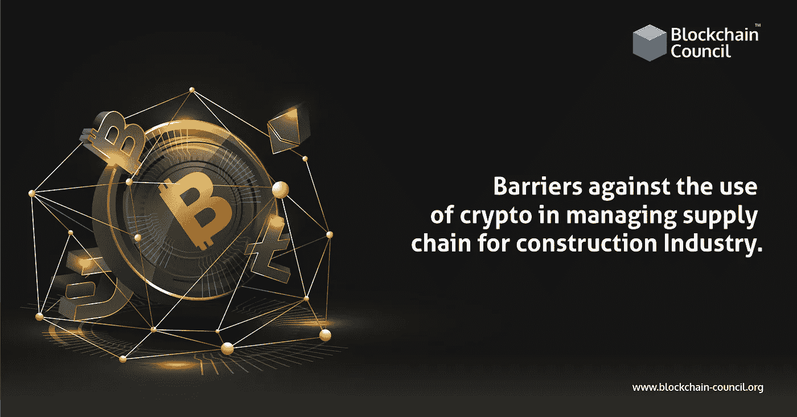

# 建筑业供应链管理中使用密码的障碍

> 原文：<https://medium.com/nerd-for-tech/barriers-against-the-use-of-crypto-in-managing-supply-chains-for-construction-industry-a3ea22cf459b?source=collection_archive---------3----------------------->

区块链被誉为尖端技术，将通过提高信任、效率和透明度来改善今天的供应链结构。然而，尽管区块链技术很吸引人，但它并不是解决供应链问题的灵丹妙药。在供应链中采用区块链的好处和坏处数不胜数:由于上升趋势，对加密货币开发者和加密顾问的需求日益增长

# 障碍

## 被许可的区块链

因为供应链数据可能是敏感的，许可的区块链(不向公众公开的)通常是更可取的。另一方面，许可系统不太安全，因为区块链由更少的节点组成，并且这些节点通常彼此都知道，这使得合谋更改块变得更容易。

## 人的因素

虽然知道区块链上的数据一旦建立就不能被修改是非常有价值的，但是在将初始数据输入到区块链上时，仍然存在人为错误或蓄意不当行为的可能性。因此，区块链的数据并不总是可靠的；它可能是不准确的，甚至是欺诈性的。例如，一个坏演员可能会在一个容器里装满鹅卵石，并声称这个容器里装满了区块链上的汽车零件。区块链技术可能会更容易确定供应链中集装箱装满石头的位置，但它不会阻止伪造数据到达区块链。

本质上，区块链技术并不禁止不准确的数据放入链中；相反，它允许区块链上的每个用户验证链上的数据自给定时间点以来没有发生更改。由于区块链技术的不变性，注入到链中的错误数据是一个问题。尽管一些区块链技术专家批评了区块链的这种做法，声称消除不变性违背了在传统数据库上使用区块链的目的，但埃森哲开发了一个原型，允许获得许可的区块链当局在特殊情况下编辑以前的交易，以解决人为错误

## 缩放比例

因为交易必须在几台计算机或服务器上进行验证，所以区块链系统处理交易的时间要比传统数据库长得多。此外，由于供应链中的交易量巨大，区块链解决方案的无许可部分可能很昂贵，因为需要交易费来支持矿工节点执行的构建区块的工作。鉴于某些供应链每天处理数百万笔交易，因此必须在考虑可扩展性的情况下仔细考虑区块链技术的实施技术。

## 前期成本

部署区块链技术的初始成本可能非常高。雇佣区块链开发人员是有代价的，因为他们的专业领域比标准开发人员更昂贵。规划、许可和维护的成本加起来会是一个沉重的价格标签。

# 包扎

虽然区块链技术有可能为供应网络带来显著优势，但它也有可能存在重大缺陷，这表明任何区块链解决方案都必须针对特定的供应链量身定制。立即学习加密交易。报名参加[加密货币认证](https://www.blockchain-council.org/certifications/certified-cryptocurrency-expert/)并立即开始。