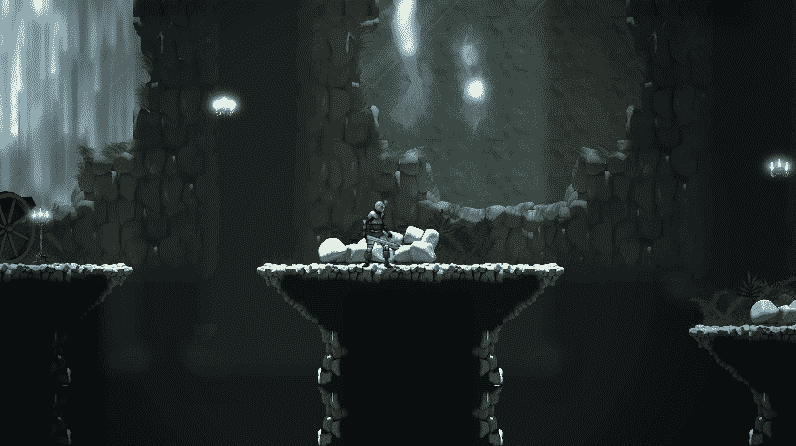
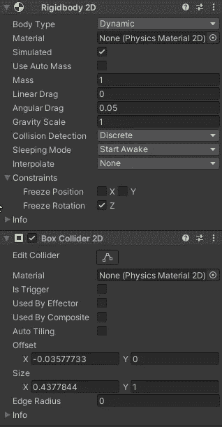
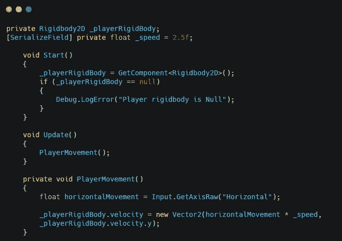
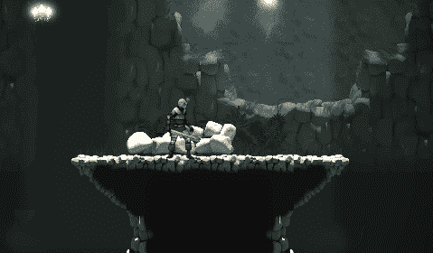
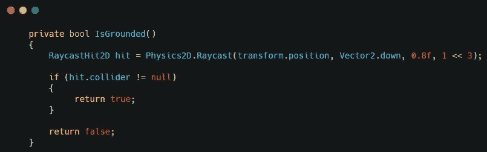
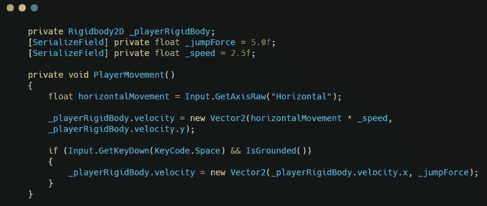
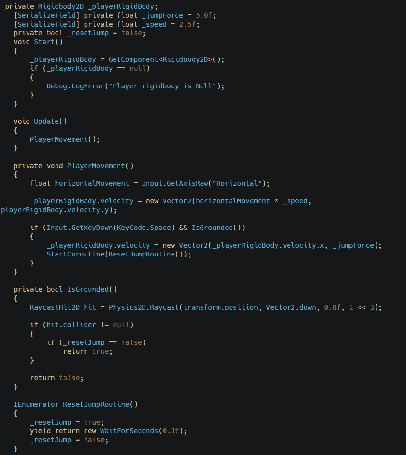
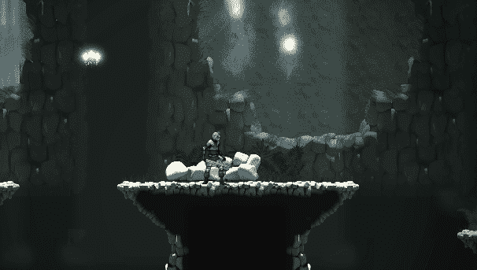

# 基本 2D 球员运动

> 原文：<https://medium.com/nerd-for-tech/basic-2d-player-movement-587d181372b?source=collection_archive---------18----------------------->

要在 Unity 中为你的 2D 角色创建基本动作，你需要添加一个刚体 2D 和一个 2D 碰撞器。

注意:冻结 z 轴上的旋转

为你的玩家创建一个新的脚本并添加到角色中。

创建对角色刚体的引用，并创建速度变量。获取角色的水平输入，并用它来设置角色的速度。

这将使角色左右移动。

为了让角色跳跃，创建一个新的 bool 方法，它将使用 raycast 来检测地面碰撞器。当光线投射探测到地面对撞机时将返回 true，当没有探测到时返回 false。

注意:1 << 3 是一个图层蒙版，用来忽略任何不在地面图层上的碰撞器

在玩家移动方法中创建一个逻辑，让玩家在击中空间并被禁足时可以跳跃。您还需要创建一个跳跃力变量。

最后要做的事情是创建一个协程，让玩家在跳跃时离开地面碰撞器的范围。创建一个 bool 来重置跳转。协程会将变量设置为真，并等待一段时间，然后再次将变量设置为假。您还将使用变量来检查 grounded 是否为真。

这会让玩家跳起来。

