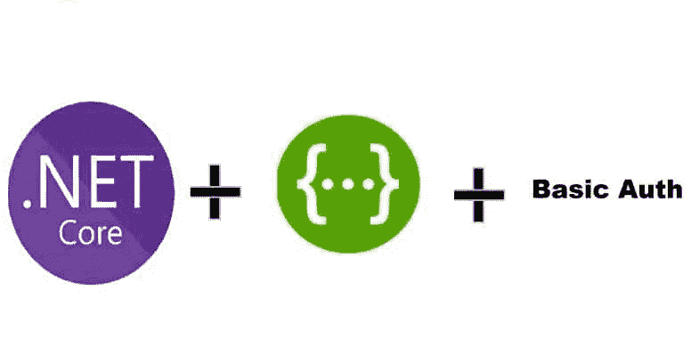
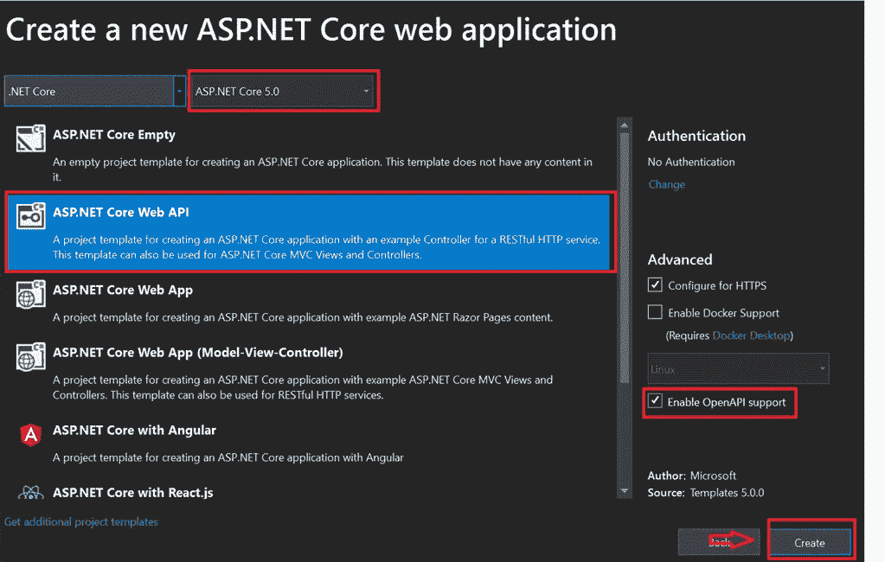
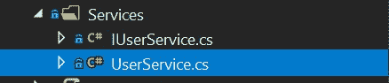
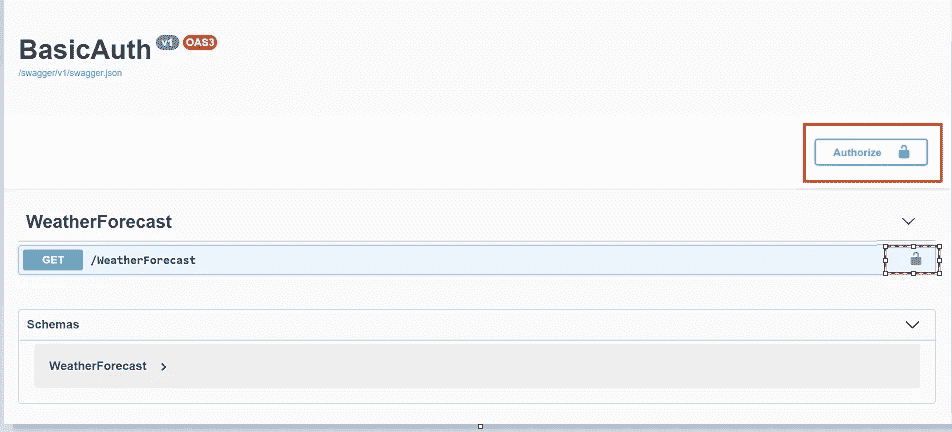
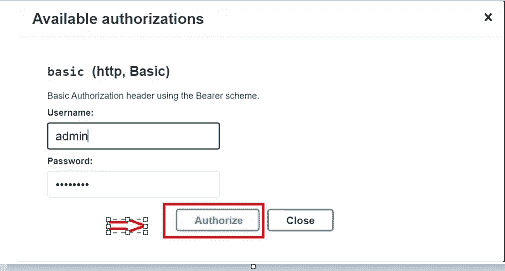
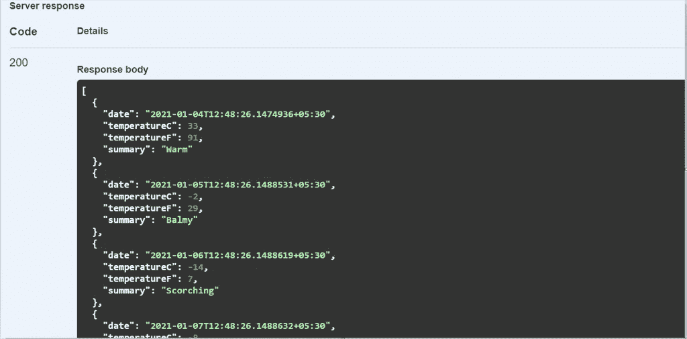
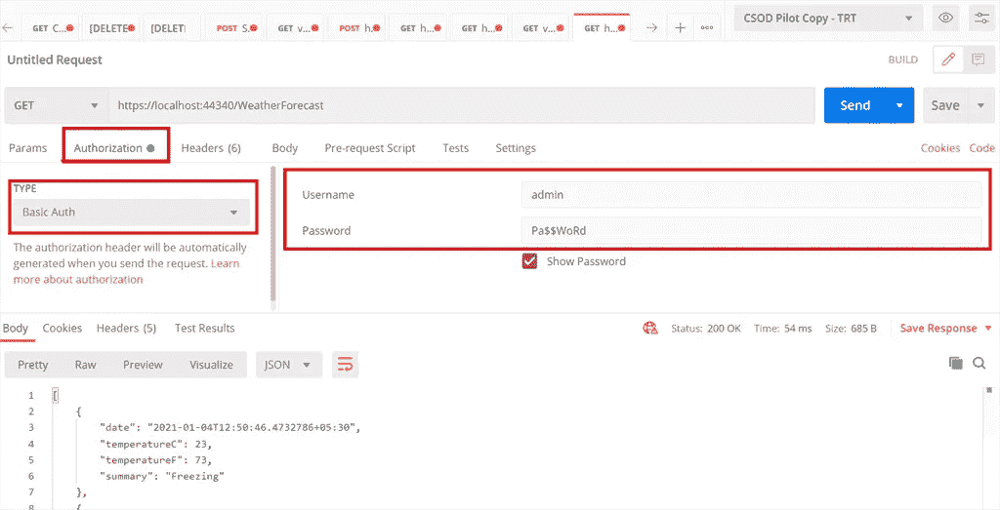

# Swagger(开放 API)中的基本认证。网络 5

> 原文：<https://medium.com/nerd-for-tech/basic-authentication-in-swagger-open-api-net-5-436f7d4a2f01?source=collection_archive---------4----------------------->

基本认证 Swagger。网络 5

在这篇文章中，我们将学习如何在 ASP.NET 5.0 中使用 swagger 为我们的 API 设置基本认证。众所周知，其新推出的框架于 11 月正式发布。在这里我分享了为[安装 SDK 的链接。网 5](https://dotnet.microsoft.com/download/dotnet/5.0)

**GitHub 回购**

 [## JayKrishnareddy/BasicAuth

### Swagger 中的基本认证(OpenAPI)。净 5。为 JayKrishnareddy/BasicAuth 开发做出贡献，创建一个…

github.com](https://github.com/JayKrishnareddy/BasicAuth) 

**本项目使用的软件包！**

1.  Swashbuckle。AspNetCore(最新版本)

如果您使用的是 ASP.NET 核心 5.0，默认情况下会安装上述软件包

**第一步**

在 Visual Studio 中创建一个项目，并确保遵循下图所示的相同过程。

Visual Studio 模板

**第二步**

添加服务文件夹，我们可以在其中添加业务逻辑。

服务文件夹

目前，我已经在代码中硬编码了用户名和密码，如果您有包含所有登录凭证的数据库，您可以使用该表进行验证。

**用户服务. cs**

我已经在控制器级别添加了依赖注入的接口。

**IUserService.cs**

**第三步**

添加身份验证处理程序代码，以便处理基本身份验证。

API 文件夹

**basicauthenticationhandler . cs**

添加 AuthenticationHandler 代码后，我们可以使用 Authorize 属性作为控制器中每个方法的头，以进行基本的身份验证设置。我没有添加任何其他控制器，因为我重复使用了同一个控制器。

**weatherforecastcontroller . cs**

**第四步**

我已经在 swagger 中设置了这个基本身份验证，所以我们已经在 startup.cs 文件中添加了这个 swagger 的配置。

**Startup.cs**

**第五步**

运行应用程序，默认情况下，swagger URL 将使用默认端口打开。在下图中,“授权”按钮处于启用状态，每个 API 都处于未授权状态，直到您的授权成功。

点击**授权**按钮。传递用户名和密码来访问 API。

API 的响应

如果你想和 postman 确认，下面是通过授权访问 API 的过程。

在本文中，我们了解了如何通过 Swagger 为 API 设置基本认证，并使用 Postman 运行和测试它。如果您想要克隆项目

希望这篇文章对你有帮助！！！

继续学习…..！