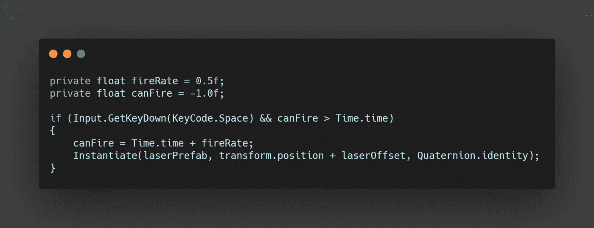

# Unity 中的基本冷却系统

> 原文：<https://medium.com/nerd-for-tech/basic-cooldown-system-in-unity-bf217678f715?source=collection_archive---------13----------------------->

今天下午还有一篇关于使用 Unity 的时间功能为我们的激光器创建一个冷却系统的文章。

首先，我们需要为我们的射速创建一个变量，我个人认为 0.5f 或半秒是理想的。

接下来，一个变量来检查我们的激光发射。如果我们创建一个 **canFire** 变量，将其设置为-1.0f，我们知道我们将能够在游戏中直接开火，如果我们需要一个宽限期，我们可以将它设置为正数。

来检查我们是否能开火。我们需要将其与实时进行比较，Unity 的 **Time.time** 允许我们在几秒钟内跟踪我们游戏的运行时间。我们可以为我们的 if 语句添加一个条件来实例化我们的 laser 预置。这个条件测试 **Time.time** 是否大于我们的 **canFire** 变量。目前，我们的运行时间大于我们的初始值-1.0f，所以如果我们按空格键，激光将发射。

现在，除了我们的**之外，在 if 语句中实例化**行代码。我们可以让我们的 **canFire** 变量等于 **Time.time** 加上我们的 **fireRate** 。例如，如果当前运行时间是 20 秒。我们的 **if 语句**不会运行 true，直到我们运行时间大于 20.5 秒。

