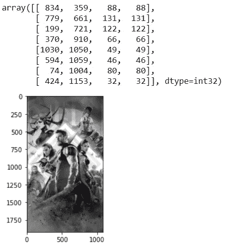
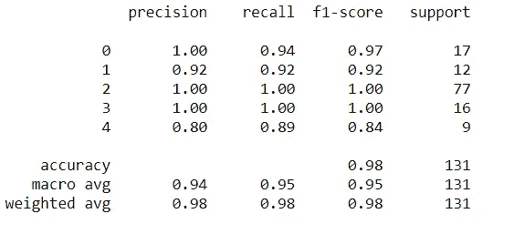
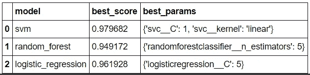
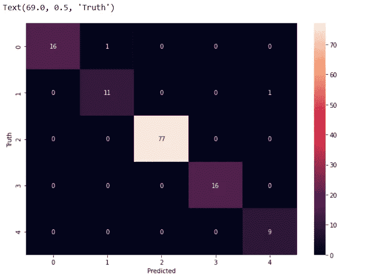

# 基本图像分类器项目

> 原文：<https://medium.com/nerd-for-tech/basic-image-classifier-project-9f3b2c0b7798?source=collection_archive---------7----------------------->

该项目的目的是:

*   创建一个复仇者联盟图像的标签数据集-美国队长，钢铁侠，黑寡妇，绿巨人，雷神。
*   训练一个 CNN 能够以合理的准确度对一个看不见的图像进行分类。

基本上，在图像分类器中有 4 个主要的数据操作步骤。这些是:

1.  数据收集
2.  数据预处理
3.  特征抽出
4.  模特培训

现在，让我们一步一步地实现和各种可用的方法。将采用最合适的方法。

**注:** *我们正在使用* ***谷歌 Colab*** *在这个项目中，但人们可以使用任何可用的软件。*

# 步骤 1 —数据收集

在这个项目中，我们需要收集图像形式的数据。可以通过手动废弃单个(静态和/或动态)网站来获得图像。但是由于需要大量的图片，所以，许多网站将不得不被废弃。你可以删除谷歌图片或必应图片，而不是手动登录不同的网站。

可以有许多方法来废弃图像。常用的三种方法如下:

1.  使用 python 和 web scrapping 工具直接从 google 自动下载某种类型的图像。这种方法是相当非法的，所以，网站和谷歌本身确保这些网络爬虫不工作。这就是代码需要定期更新的原因。
2.  通过使用像 fatkun 这样的 Chrome 浏览器扩展。这些扩展比以前的方法使用起来要稳定得多。但是根据这个项目的要求，图片应该从网上删除。
3.  使用 Python 工具(如 Bing Image Downloader)将所需图像直接导出到目录中。

*本项目中，为了方便起见，使用了 Bing 图片下载器。*

首先，我们将安装下载器并通过以下方式导入所需的库:-

```
!pip install bing-image-downloader 
**from** **bing_image_downloader** **import** downloader
```

现在，它通过使用以下代码行来废弃图像:-

```
downloader.download('Captain America Chris Evans', output_dir= './drive/MyDrive/datasets/collection', limit = 400, adult_filter_off = **False**, force_replace = **False**, timeout = 6000)
```

同样，钢铁侠、雷神、绿巨人和黑寡妇的形象也被废弃了。

# 步骤 2 —数据预处理

这个步骤对于执行图像分类非常重要。它提高了算法的整体效率。

这一步在这个项目中是必需的，因为在数据收集之后，观察到收集了许多漫画书中不重要的图像。这些类型的图像将导致消耗更多的系统资源。此外，分类器可能会出错。所以，这些图像不应该直接使用。

在这个项目中，OpenCV 和一种叫做 **haar 的技术级联**，用于数据清理目的。他们会检测一张脸和两只眼睛是否清晰可见。如果它们是可见的，则图像被保留，否则图像被丢弃。大多数数据清理工作将使用 python 代码完成，但也有一些清理工作必须手动完成。需要手动检查图像来移除不想要的面部。例如，在钢铁侠的文件夹中，其他角色的脸可能会出现，这降低了模型的效率。

数据清理的步骤:

1.  使用哈尔级联从原始图像中提取具有两只眼睛的人脸
2.  手动丢弃有两张或多张面孔的照片。也有模糊的照片和其他照片

## 哈尔梯级功能和使用简介:-

每个图像都有线条和边缘特征。Haar Cascade 使用这种边缘特征的移动窗口来检测眼睛和整个面部。

例如，为了检测眼睛，眼睛的区域往往比下面的区域更暗。哈尔喀斯喀特用这个面具来探测这些区域。

OpenCV 有现成的 API 来检测人脸、眼睛等。手动上传用于运行 API 的 17 个不同的 xml 文件，以便使用 haar 级联函数来检测各种特征。

现在，让我们导入所需的库，并创建使用面部层叠和眼睛层叠功能的函数:-

```
**import** **numpy** **as** **np**
**import** **cv2**
**import** **matplotlib**
**from** **matplotlib** **import** pyplot **as** plt
%matplotlib inline

face_cascade = cv2.CascadeClassifier("./drive/MyDrive/Colab Notebooks/opencv/haarcascades/haarcascade_frontalface_default.xml")
eye_cascade = cv2.CascadeClassifier("./drive/MyDrive/Colab Notebooks/opencv/haarcascades/haarcascade_eye.xml")
```

让我们试运行一下，看看这些功能是否工作正常:

```
img = cv2.imread('/content/drive/My Drive/datasets/collection/Thor Chris Hemsworth/Image_8.jpg')
*#img.shape*
plt.imshow(img)
gray = cv2.cvtColor(img, cv2.COLOR_BGR2GRAY)
gray.shape
plt.imshow(gray, cmap='gray')

face_cascade = cv2.CascadeClassifier('./drive/MyDrive/Colab Notebooks/opencv/haarcascades/haarcascade_frontalface_default.xml')
eye_cascade = cv2.CascadeClassifier('./drive/MyDrive/Colab Notebooks/opencv/haarcascades/haarcascade_eye.xml')
faces = face_cascade.detectMultiScale(gray)
faces
```

这几行代码检查图像是否有一张脸和两只眼睛。如果它没有任何面孔或眼睛，那么它将返回一个错误。如果图像有，那么它将返回一个类似如下所示的输出



有脸和两只眼睛的图像

现在，由于函数工作正常，让我们编写代码来检查数据集中的所有图像。符合要求的图像将被转换为灰色，然后进行裁剪。这些图像保存在单独的文件夹中以备将来使用。

```
**def** get_cropped_image_if_2_eyes(image_path):
    img = cv2.imread(image_path)
    gray = cv2.cvtColor(img, cv2.COLOR_BGR2GRAY)
    faces = face_cascade.detectMultiScale(gray, 1.3, 5)
    **for** (x,y,w,h) **in** faces:
        roi_gray = gray[y:y+h, x:x+w]
        roi_color = img[y:y+h, x:x+w]
        eyes = eye_cascade.detectMultiScale(roi_gray)
        **if** len(eyes) >= 2:
            **return** roi_color

path_to_data = "./drive/My Drive/datasets/collection/"
path_to_cr_data = "./drive/My Drive/datasets/cropped/"

**import** **os**
img_dirs = []
**for** entry **in** os.scandir(path_to_data):
    **if** entry.is_dir():
        img_dirs.append(entry.path)

**import** **shutil**
**if** os.path.exists(path_to_cr_data):
     shutil.rmtree(path_to_cr_data)
os.mkdir(path_to_cr_data)

cropped_image_dirs = []
celebrity_file_names_dict = {}

**for** img_dir **in** img_dirs:
    count = 1
    celebrity_name = img_dir.split('/')[-1]
    print(celebrity_name)

    celebrity_file_names_dict[celebrity_name] = []

    **for** entry **in** os.scandir(img_dir):
        roi_color = get_cropped_image_if_2_eyes(entry.path)
        **if** roi_color **is** **not** **None**:
            cropped_folder = path_to_cr_data + celebrity_name
            **if** **not** os.path.exists(cropped_folder):
                os.makedirs(cropped_folder)
                cropped_image_dirs.append(cropped_folder)
                print("Generating cropped images in folder: ",cropped_folder) *#Checking whether the code is running successfully or not*

            cropped_file_name = celebrity_name + str(count) + ".png" *#changing file type of every image to png*
            cropped_file_path = cropped_folder + "/" + cropped_file_name 

            cv2.imwrite(cropped_file_path, roi_color)
            celebrity_file_names_dict[celebrity_name].append(cropped_file_path)
            count += 1
```

# 步骤 3——使用小波变换进行特征提取

这个步骤的重要性在于，在特征提取中，彩色图像会导致许多错误。彩色图像可以具有各种阴影和各种颜色，这使得分类器很难识别这样的图像。

为了避免这些错误，图像被转换成黑白颜色，不同的区域有不同的对比度。小波变换允许从图像中提取重要特征。通常，在小波变换的图像中，眼睛的区域将与前额的区域区分开来，鼻子也将是明显的等等。

在浏览图像处理文献时，发现小波变换通常是最有效的提取方法。因此，小波变换被用于这个项目。

输入图像后，它将使用 PYWT (pi 小波变换库)在图像上执行小波变换，并返回新的小波变换图像。信号处理、频域、时域、傅立叶变换的概念已被用于在主要代码中应用小波变换。**下面简要解释其中一些概念:**

> 任何信号，像音频信号、图像也可以被认为是信号。它可以呈现在两种类型的域中。因此，图像可以在像空间(x 和 y)这样的空间域中呈现，或者可以表示为频域。音频信号可以在时域或频域中表示。
> 
> 傅立叶变换将获取一个复信号，并返回构成该复信号的基本信号。例如，让我们考虑一些菜，比如 Dosa。如果在 Dosa 上进行逆向工程，得到的基本成分是水、米粉、乌拉尔豆，可能更多。
> 
> 类似的情况还有一个复杂的信号，其中有不同的乐器演奏，也有噪声。有许多噪声消除器件，那么它们实际上是如何消除噪声的呢？这是使用傅立叶变换完成的，因为它可以分离出声带的声音和噪音。它可以将所有这些信号分离成不同的频率，使用频率滤波器可以抑制一些频率，或者可以进行内部放大。某些音频设备中的某些频率，高音或低音可以增加。因为傅立叶变换，所有这些都是可能的。
> 
> 小波变换有点类似于傅立叶变换，它放大图像的某些特征。

对于进一步的步骤，输入将是垂直堆叠的彩色图像及其小波变换的图像。其代码如下:

```
**import** **numpy** **as** **np** 
**import** **pywt** 
**import** **cv2**      
**def** w2d(img, mode='haar', level=1):     
 imArray = img     
 *#Datatype conversions*     
 *#convert to grayscale*     
 imArray = cv2.cvtColor( imArray,cv2.COLOR_RGB2GRAY )     
 *#convert to float*     
 imArray =  np.float32(imArray)        
 imArray /= 255;     
 *# compute coefficients *     
 coeffs=pywt.wavedec2(imArray, mode, level=level)       
 *#Process Coefficients*     
 coeffs_H=list(coeffs)       
 coeffs_H[0] *= 0;        
 *# reconstruction*     
 imArray_H=pywt.waverec2(coeffs_H, mode);     
 imArray_H *= 255;     
 imArray_H =  np.uint8(imArray_H)      
 **return** imArray_H
```

让我们为这 5 个字符中的每一个分配一个数字(或键)。

```
class_dict = {}
count = 0
**for** celebrity_name **in** celebrity_file_names_dict.keys():
    class_dict[celebrity_name] = count
    count = count + 1
class_dict
```

> { '黑寡妇·斯嘉丽·约翰逊':2，
> 《美国队长克里斯·埃文斯》:0，
> 《绿巨人马克·鲁弗洛》:3，
> 《钢铁侠托尼·斯塔克》:1，
> 《雷神克里斯·海姆斯沃斯》:4 }

创建字典以引用各个字符的所有剪切图像的路径；

```
celebrity_file_names_dict = {}
**for** img_dir **in** cropped_image_dirs:
    celebrity_name = img_dir.split('/')[-1]
    file_list = []
    **for** entry **in** os.scandir(img_dir):
        file_list.append(entry.path)
    celebrity_file_names_dict[celebrity_name] = file_list
```

现在，让我们创建一个字典，其中彩色图像与小波变换后的图像垂直堆叠，以备将来使用。

```
X, y = [], []
**for** celebrity_name, training_files **in** celebrity_file_names_dict.items():
    **for** training_image **in** training_files:
        img = cv2.imread(training_image)
        **if** img **is** **None**:
          **continue**
        scalled_raw_img = cv2.resize(img, (32, 32)) *#resizing using openCV as images maybe of different sizes*
        img_har = w2d(img,'db1',5) *#getting the wavelet transformed image*
        scalled_img_har = cv2.resize(img_har, (32, 32)) *#resizing wavelet transformed image*
        combined_img = np.vstack((scalled_raw_img.reshape(32*32*3,1),scalled_img_har.reshape(32*32,1))) *#vertically stacking both the images*
        X.append(combined_img)
        y.append(class_dict[celebrity_name])
X = np.array(X).reshape(len(X),4096).astype(float)
```

# 步骤 4 —模型训练:使用 SVM 和启发式微调

在这个项目中，首先 SVM 被用来训练主模型。

然后使用 **GridSearch** 测试其他模型，以决定哪个模型最适合这个项目。

GridSearch CV 用于超调参数。它有助于决定哪种模型表现最好。

在我们的项目中，我们将候选模型定义如下，以供比较:

1.  参数为的 SVM-C 值为 1，10，100，1000，核值为 rbf 和线性。
2.  参数为的随机森林—估计量(或决策树)的数量为 1，5，10。
3.  参数为的逻辑回归——C 值为 1，5，10。

*最后，最佳模型存储在“已训练模型. pkl”中，类别字典也被保存。*

SVM 培训代码:

```
**from** **sklearn.svm** **import** SVC
**from** **sklearn.preprocessing** **import** StandardScaler
**from** **sklearn.model_selection** **import** train_test_split
**from** **sklearn.pipeline** **import** Pipeline
**from** **sklearn.metrics** **import** classification_reportX_train, X_test, y_train, y_test = train_test_split(X, y, random_state=0)

*#Pipeline is created to scale the Data.* 
pipe = Pipeline([('scaler', StandardScaler()), ('svc', SVC(kernel = 'rbf', C = 10))])
pipe.fit(X_train,y_train)
pipe.score(X_test,y_test)
```

这给出了一个 0.9 分。18966.888688898617

现在，让我们得到一份完整的分类报告。

```
print(classification_report(y_test, pipe.predict(X_test)))
```

这产生了以下输出:



使用 SVM 的分类报告

培训和测试前面提到的其他模型:

```
**from** **sklearn** **import** svm
**from** **sklearn.ensemble** **import** RandomForestClassifier
**from** **sklearn.linear_model** **import** LogisticRegression
**from** **sklearn.pipeline** **import** make_pipeline
**from** **sklearn.model_selection** **import** GridSearchCV
model_params = {
    'svm': {
        'model': svm.SVC(gamma='auto',probability=**True**),
        'params' : {
            'svc__C': [1,10,100,1000],
            'svc__kernel': ['rbf','linear']
        }  
    },
    'random_forest': {
        'model': RandomForestClassifier(),
        'params' : {
            'randomforestclassifier__n_estimators': [1,5,10]
        }
    },
    'logistic_regression' : {
        'model': LogisticRegression(solver='liblinear',multi_class='auto'),
        'params': {
            'logisticregression__C': [1,5,10]
        }
    }
}
scores = []
best_estimators = {}
**import** **pandas** **as** **pd**
**for** algo, mp **in** model_params.items():
    pipe = make_pipeline(StandardScaler(), mp['model'])
    clf =  GridSearchCV(pipe, mp['params'], cv=5, return_train_score=**False**) 
    *# cv=5 => There will be 5 folds of testing the model and* 
    *# then will avereage out the scores* 
    clf.fit(X_train, y_train)
    *# Scores are appended and a data frame is created from it*
    scores.append({
        'model': algo,
        'best_score': clf.best_score_,
        'best_params': clf.best_params_
    })
    best_estimators[algo] = clf.best_estimator_

df = pd.DataFrame(scores,columns=['model','best_score','best_params'])
df
```

所得分数的最终报告如下:



三个测试模型的分数

这些分数在训练数据上。现在，让我们获得模型在测试数据上的得分:

```
best_estimators['svm'].score(X_test,y_test)
best_estimators['random_forest'].score(X_test,y_test)
best_estimators['logistic_regression'].score(X_test,y_test)
```

获得的分数如下:

SVM: 0.9770992366412213
随机森林:0.933331297709 9237
逻辑回归:0。59666.76666666667

正如我们所注意到的，SVM 在训练数据和测试数据上都表现良好，因此，支持向量机将用于这个项目。

```
best_clf = best_estimators['svm']
```

现在绘制混淆矩阵:

```
**from** **sklearn.metrics** **import** confusion_matrix
cm = confusion_matrix(y_test, best_clf.predict(X_test))
**import** **seaborn** **as** **sn**
plt.figure(figsize = (10,7))
sn.heatmap(cm, annot=**True**)
plt.xlabel('Predicted')
plt.ylabel('Truth')
```



混淆矩阵

将模型保存在各自的 pkl 文件中，以便将来在制作 Web 应用程序等时使用。

```
!pip install joblib
**import** **joblib** 
*# Save the model as a pickle in a file* 
joblib.dump(best_clf, 'saved_model.pkl')
```

将字典保存为 Json 文件以备将来使用:

```
**import** **json**
**with** open("class_dictionary.json","w") **as** f:
    f.write(json.dumps(class_dict))
```

**一个模型已经制作成功，现在可以进一步用于制作网站。**

完整代码的链接是: [Github](https://github.com/Sampurn-Anand/Databyte_inductions/blob/main/Task%202/Inductions_Task2.ipynb)

感谢您花费宝贵的时间阅读本文。请在评论中告诉我你的观点和建议。