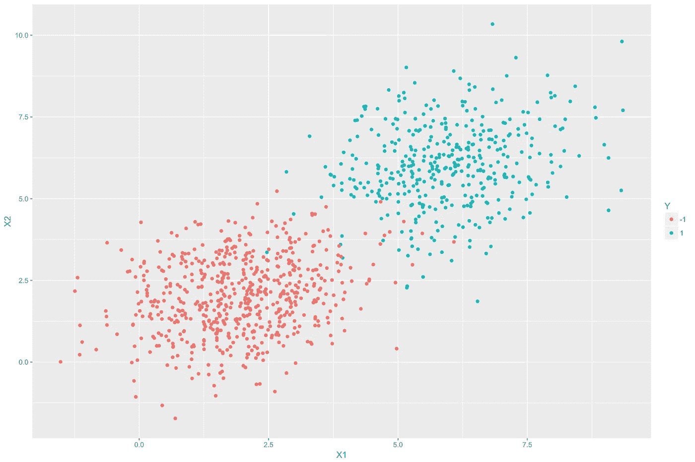

# LDA 的基本直觉

> 原文：<https://medium.com/nerd-for-tech/basic-intuition-of-lda-33f34f6ad603?source=collection_archive---------14----------------------->

每当我们遇到涉及图像数据分类的机器学习模型或必须处理复杂维度的向量时，计算就会成为及时获得结果的障碍。因此，使用减少涉及向量的计算复杂性并帮助获得及时和更好的结果的算法是直观的。我们将讨论一种使用降维的分类技术——线性鉴别分析或 LDA。

图片由 Edureka 提供

# 降维与线性判别分析

假设我们正在处理一个包含图像的数据集。我们的目标是训练一个模型，将图像分为两个或更多类别。那么数据集中的这些图像本质上是什么呢？它们是需要处理的更高维的向量，导致大量的计算工作和延迟。一个很好的例子是研究人类基因的模型，它通常包括大量的多维数据。减少维度不仅可以节省时间和资源，还可以帮助消除不必要的复杂性。
线性判别分析(LDA)是一种在统计学、模式识别和机器学习中使用的方法，用于寻找表征或分离两类或更多类对象或事件的特征的线性组合。所得到的组合可以用作线性分类器，或者更常见的是，在稍后的分类之前用于维度减少。目标是找到一个或多个轴，以便在投影数据时，确保类之间的最大距离，并且每个类中的数据分散或变化最小，这是良好分类模型的直观要求。
LDA 的工作与 PCA 的工作几乎相同，除了一些小的不同-

1.  PCA 是一种无监督的技术，而 LDA 是有监督的，即它使用标签进行训练。
2.  PCA 找到最大化数据方差的轴，而 LDA 找到最大化聚类之间的距离同时最小化每个类中的方差的轴。

简而言之，我们的目标是找到这样的轴，帮助我们降低复杂数据集的维度，同时帮助我们以有效的方式将给定数据分类到所需的聚类中。值得注意的是，对于 k 类分类问题，我们只能找到前 k-1 个这样的轴-对于三类数据集，我们只能找到前两个轴，其细节将在后面讨论。

# 理论与方法

让我们取一个二元分类数据集，它有一个多达 n 个点的矩阵 X = [x₁ x₂ x₃ x₄ … ]，其中 x 中的每个点都是一个维数为 d 的向量，从而使 x 成为一个 d⨉n 矩阵。我们还有一个 1⨉n 矩阵 Y= [y₁ y₂ y₃ y₄ … ]，它包含类编码，即 y ∈{0，1}，其中 0 和 1 表示两个类的编码。我们的目标是将点投影到一个轴上，使得类间距离最大，类内方差最小。让我们假设 w₁是一个 d⨉1 维度的向量，它应该是我们的轴之一。因此，x₁沿 w₁的投影值将是 w₁ᵀx₁，其中 w₁ᵀ是 w₁的转置，维度为 1⨉d，从而使乘积成为标量。因此，我们试图把 x 的所有值都投影到 w₁.上

根据定义，类 0 的平均值表示为μ₀是⅟ₙ∑xᵢ，因此 yᵢ是 0。类似地，μ₁ = ⅟ₙ∑xᵢ，这样 yᵢ就是 1。如果我们将每一项乘以 w₁ᵀ，新的平均值也会乘以相同的因子，即 w₁ᵀ.
所以，现在我们有了两个集群的方法，我们的目标是最大化它们之间的距离。为了适应负面结果的前景，我们试图最大化(w₁ᵀμ₀-w₁ᵀμ₁)的价值。根据定义，

(w₁ᵀμ₀-w₁ᵀμ₁)=(w₁ᵀμ₀-w₁ᵀμ₁)ᵀ(w₁ᵀμ₀-w₁ᵀμ₁)
=(μ₀-μ₁)ᵀ(w₁)(w₁ᵀ)(μ₀-μ₁)
=w₁ᵀ(μ₀-μ₁)ᵀ(μ₀-μ₁)w₁
=w₁ᵀSₑw₁，其中 sₑ是(μ₀-μ₁)ᵀ(μ₀-μ₁)或类间方差

**注:** *上述转换是可能的，因为乘法的结果是 scaler，给出了 scaler trace，scaler trace 暗示矩阵的元素可以旋转。*

我们还知道，求矩阵 x 的协方差的形式是通过求 XXᵀ.所以，
variance(w₁ᵀx)=(w₁ᵀx)(w₁ᵀx)ᵀ
u₁ᵀ(wwᵀ)u₁
w₁ᵀ∑w₁，其中∑为 x 的协方差矩阵，维数为 d⨉d
所以，类 0 和 1 的类方差分别为 w₁ᵀ ∑₀ w₁和 w₁ᵀ ∑₁ w₁。为了最小化它们，我们可以认为它们的和是最小的。所以，
w₁ᵀ(∑₀+∑₁)w₁或 w₁ᵀ(Sᵢ)w₁被认为是最小的，
这里 Sᵢ = ∑₀+∑₁

现在，我们有类间方差 w₁ᵀ Sₑ w₁和类内方差 w₁ᵀ Sᵢ w₁，其中类间方差被最大化，类内方差被最小化，因此，总的来说，它们的比率可以最大化。这可以通过固定 w₁ᵀ Sᵢ w₁ = 1 和最大化 w₁ᵀ Sₑ w₁.来实现

现在，我们将使用拉格朗日形式来求解方程-
L(w₁，λ₁)=(w₁ᵀsₑw₁)-λ₁(w₁ᵀsᵢw₁-1)
以获得最大值/鞍点，我们对这个 w.r.t. w₁进行部分微分并使其等于 0，并且，撇开复杂的计算，得到下面的方程-
2sₑw₁-2λ₁sᵢw₁= 0
sₑw₁=λ₁sᵢw₁
(sᵢsₑ)w‖=λw‖，其中 s 是 s 的逆

它是特征值和特征向量对的表示。这里的问题是，Sₑ是两个一维向量的乘积，因此秩为 1，因此乘积的总秩为 1。因此，只有一对特征向量和特征值存在。

# 扩展到 k 类

现在我们将其扩展到 k 类数据集。我们会用 W = [w₁ w₂ w₃ … wₖ-₁]替换 w₁，这是意料之中的(对于 k 个职业，k-1 个轴是可用的)。所以，w 的维数是 d⨉(k-1).

我们需要找出一种方法来使用这个矩阵 w 来使比率最大化，所以一种方法是可能使用(w₁ᵀ Sₑ w₁)和(w₁ᵀ Sᵢ w₁)的迹，这相当于对个体方差求和。
所以 Trace(w₁ᵀ Sₑ w₁)/trace(w₁ᵀ Sᵢ w₁)是要最大化的。
使用类似的拉格朗日概念，我们得到一个方程-
trace(w₁ᵀsₑw₁)-λ₁(trace(w₁ᵀsᵢw₁)-1，这将最终给我们 k-1 个特征向量，因为(Sᵢ Sₑ)具有 k-1 个秩。

现在，很容易计算 Sᵢ，因为它只是单个类内方差的总和。但是发现新 Sₑ有两个以上的类会带来一个问题，但是我们有一个解决方案！我们知道总方差 Sₜ是类内方差和类间方差之和，计算 Sₜ.很容易所以通过逆向计算，我们得到 Sₑ.

Sₜ = ⅟ₙ∑(xᵢ-μ)(xᵢ-μ)ᵀ，其中μ是整个 xᵢ.的平均值

现在，我们有了所有需要的值，我们可以很容易地找出前 k-1 个轴！