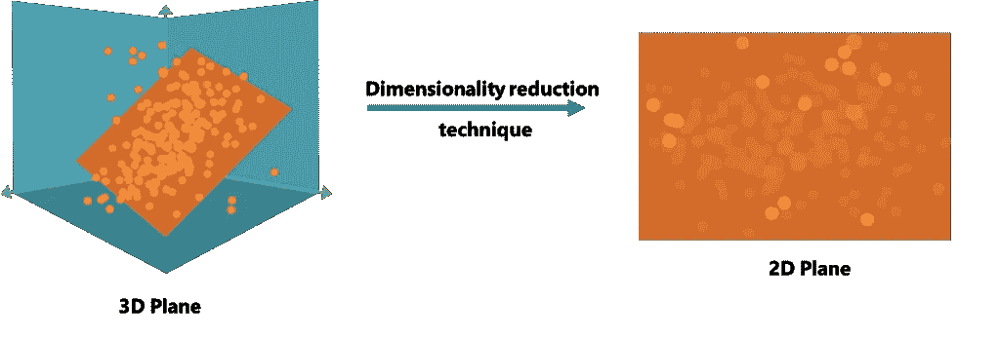

# 主成分分析的基本直觉

> 原文：<https://medium.com/nerd-for-tech/basic-intuition-of-pca-9b2e9b8a7ca2?source=collection_archive---------15----------------------->

每当我们遇到涉及图像的机器学习模型或必须处理复杂维度的向量时，计算就会成为及时获得结果的障碍。因此，使用减少涉及向量的计算复杂性并帮助获得及时和更好的结果的算法是直观的。其中一种方法是降维，我们将讨论当今降维最重要的技术之一——主成分分析(PCA)。

从 365 数据科学看 PCA 的直观性

# 降维与主成分分析

假设我们正在处理一个包含图像的数据集。我们的目标是训练一个模型，将图像分为两个或更多类别。那么数据集中的这些图像本质上是什么呢？它们是需要处理的更高维的向量，导致大量的计算工作和延迟。一个很好的例子是研究人类基因的模型，它通常包括大量的多维数据。减少维度不仅可以节省时间和资源，还可以帮助消除不必要的复杂性。

想象一张上面刻有一些点的纸，以某种方式折叠，比如占据一个 3D 空间。现在，要引用那张纸上的任何一点，由于它的 3D 形状，我们需要 3 个方向点。现在，如果我们展开这张纸，它现在占据了一个 2D 空间，那么我们需要多少个方向来定位一个点？当然是两个！！

这正是 PCA 算法所做的。它帮助我们将一个高维的数据投影到一个低维的空间中，从而降低了计算中涉及的维数，并且精度不会受到太大影响。这是一种无监督的学习算法，主要用于以可接受的精度损失为代价降低复杂度的情况。在不进入正式定义的情况下，PCA 最终的主要目的是 ***将 d 维的数据投影到 p 维的空间中，使得 p<d .*我们通过找到数据的主成分来实现。主轴可以定义为 ***轴，当数据点沿着该轴投影时，确保最大方差。根据该定义，第一主轴将是确保投影点的最大方差的轴，第二主轴将是确保投影点的第二最大方差的轴，依此类推。这些主轴的一个有趣的特征是它们相互垂直。*****

# 理论

让我们假设我们有一个多达 n 个点的矩阵 X = [x₁ x₂ x₃ x₄ … ]，其中 x 中的每个点都是一个维数为 d 的向量，从而使 x 成为一个 d⨉n 矩阵。现在我们的目标是将矩阵投影到一个轴上，使得方差最大。让我们假设 U₁是一个维数为 d⨉1 的向量，它应该是我们的主轴之一。因此，沿 U₁的投影值将是 U₁ᵀX，其中 U₁ᵀ是 U₁的转置，维度为 1⨉d.

所以我们的目标是最大化 Variance(U₁ᵀX).这里，由于涉及向量，所以是协方差而不是方差。我们知道找到矩阵 x 的协方差的一种形式是通过找到 XXᵀ.
所以，
variance(u₁ᵀx)=(u₁ᵀx)(u₁ᵀx)ᵀ
u₁ᵀ(xxᵀ)u₁
u₁ᵀsu₁，其中 s 是 x 的协方差矩阵，维数为 d⨉d

我们不能最大化这个二次函数 U₁ᵀSU₁，因为它没有上限。因此，我们将引入另一个约束，即 U₁ᵀU₁=1.我们这样做的原因是因为我们的主要目的是找到向量的方向，因此长度是有界的。

现在，我们将使用拉格朗日形式来求解方程-
l(u₁,u₁ᵀ)=(u₁ᵀsu₁)-λ₁(u₁ᵀu₁-1)
以获得最大值/鞍点，我们对这个 w.r.t. U₁进行部分微分并使其等于 0，并且，撇开复杂的计算，得到下面的方程-
2su₁-2λ₁u₁= 0
su₁=λ₁u₁，这是特征值和特征向量对的表示。这就得出结论，主分量不过是 s 的特征向量，而且，我们可以看到，U₁ᵀSU₁ = U₁ᵀλ₁U₁或λ₁U₁ᵀU₁或简单的λ₁，这是一个定标器。
因此，根据这一概念，所有特征值集合中的最大λ对应于最大方差或第一主分量。因此，我们需要找到这些特征值，按降序排列，我们将获得我们的主成分。

# 方法

我们通过奇异值分解或单值分解方法来实现这一点。
让我们首先将 x₂…x₁的数据点转换为 x₂-⨱x₁-⨱的数据点..以此类推，其中⨱是相应列中所有点的平均值。这样做是为了对相应列中的数据进行规范化。设 x’代表这样形成的新矩阵。

根据 SVD，任何矩阵 x 都可以表示为 U∑Vᵀ，其中 u 是 XXᵀ的特征向量，v 是 XᵀX 的特征向量，∑是对角矩阵。因此，在我们的例子中，x '的 SVD 将产生 U∑Vᵀ，其中 u 是 X`X`ᵀ.的特征向量现在，使用协方差的定义，我们知道 X`X`ᵀ只不过是 x 的协方差矩阵。根据定义，协方差矩阵的特征向量默认是主分量，如上所示。这就是我们如何得到矩阵的主分量。

# 算法

1.  通过从点数中减去平均值(将数据居中)，将 X 转换为 X`。
2.  对 x '执行奇异值分解。
3.  这样形成的 u 包含 X 的主要成分

值得一提的是，U 的每一列代表一个主成分，即第一列是第一主成分，第二列是第二主成分，以此类推..

4.使用 U 的前 p 列作为矩阵的前 p 个主分量。形成的矩阵将是 p⨉d.阶的，现在我们把它命名为 g。

5.因此，GX 将从 d⨉n 矩阵中产生一个 p⨉n 矩阵，该矩阵显然具有更低的维数，因为 p < d.

This is how a matrix is projected into a lower dimension through PCA.

# Other uses

Many times, there is some noise in the photograph to be used as a dataset, that needs to be removed for accurate results. For this, we can eliminate the lower Principal components through PCA and re-project the matrix into its original dimensions. This can be done as follows-

let U= d⨉p matrix to be used for finding the first p principal components from X.
所以，y = UᵀX 具有 p⨉n
的维数。现在，为了获得新的反向投影矩阵 Xnew，我们只需将 y 与 u 相乘。
Xnew = Uy，其中 Xnew 也具有 d⨉n 的维数，但是具有不同的值，因为它仅与总共 d 个 PC 中的前 p 个 PC 反向投影。

今天就到这里吧！！希望你喜欢。