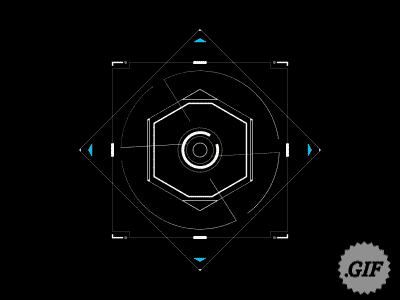
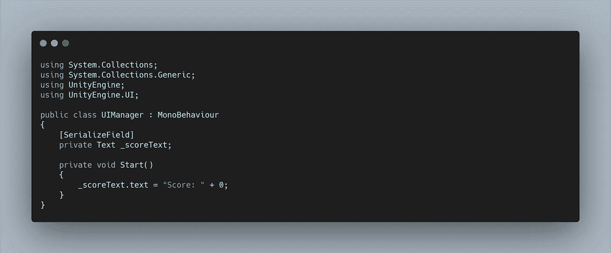
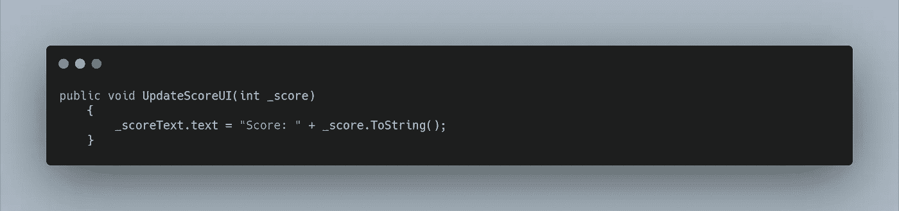
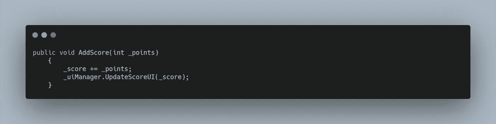
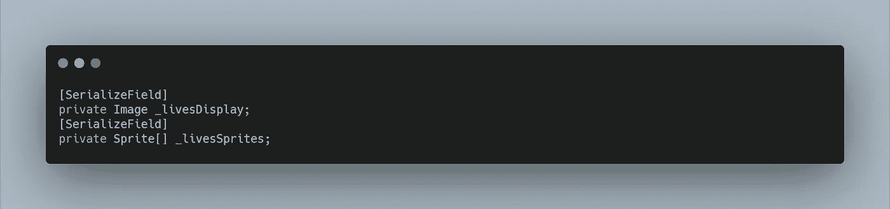
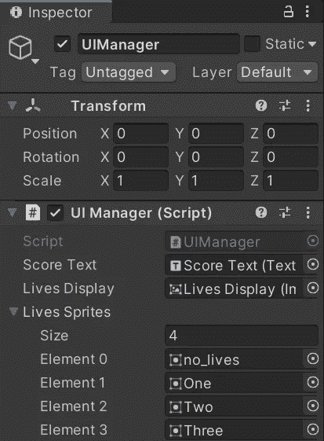
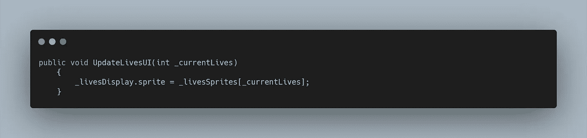
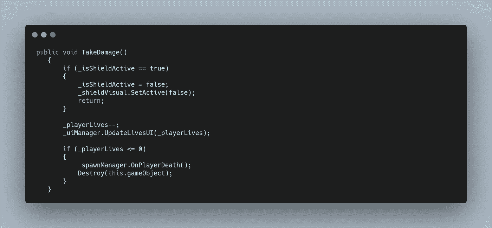
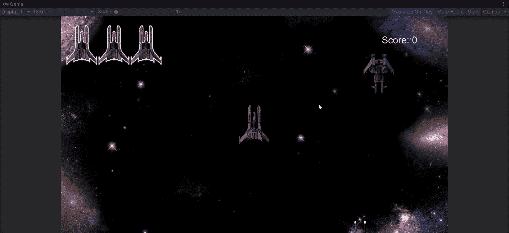

# Unity 中的基本 UI 元素

> 原文：<https://medium.com/nerd-for-tech/basic-ui-elements-in-unity-db3b05fc926?source=collection_archive---------19----------------------->

所以我们有了一个功能游戏，但是玩它给我们留下了许多问题。我们的分数是多少？我们还剩多少条命？我们死后会发生什么？

我们需要一个用户界面。这让我们能够在更深的层次上与我们的游戏联系起来，更有效地互动。

幸运的是，Unity 有一个内置的 **UI** 部分，它相当自给自足。让我们从增加我们的分数开始。如果我们进入我们的创建菜单并突出显示 **UI** ，一个下拉菜单包含多个对玩家互动有用的组件。让我们为分数创建一个简单的**文本组件**。

这样，Unity 会自动创建一个**画布**和一个**事件系统。****画布**允许我们在游戏上方渲染 **UI** 并正确缩放。而**事件系统**允许我们通过已经配置好的**输入系统**轻松地与我们的 **UI** 的所有不同元素进行交互。

有了我们的**乐谱文本**，它的功能就像任何旧的文本框一样。关键的区别是我们的**矩形变换**，这允许我们在屏幕上设置我们的位置和锚点。如果我们将**分数**固定在右上角，当我们上下缩放游戏尺寸时，**分数**也会相应地保持在它的位置。

为了改变我们的**分数文本**我们需要制作一个**分数变量**，我们应该在我们的**播放器**上这样做，并且有一个**公共方法**被我们的**敌人**在**用**激光**碰撞**时调用。现在，我们可能最终会包括多个**敌人**类型，所以让我们创建一个**模块点值**。在我们的**公共方法的括号**中，我们可以创建一个需要被调用的 **int 值**。在**敌人脚本**中调用这个**方法**时，我们可以发送在**检查器中分配的那个**敌人的点**的值。**

我们的游戏内玩家有办法追踪我们的**分数。**我们需要更新**的用户界面**，这样我们作为玩家也可以保持跟踪。让我们创建一个 **UI 管理器脚本**。为了访问我们的 **UI 函数**，我们需要在**脚本的顶部使用**名称空间的**。**我们想使用 UnityEngine 访问**。UI；**

现在我们可以为我们的**分数**创建一个**文本变量**，并在**检查器中分配游戏对象。**在我们的**开始方法中，**我们应该把分数设为零。

现在更新我们的**分数，**让我们使用另一个**公共方法**来调用我们的**玩家**。同样，我们可以创建一个 int 变量**来调用它，它可以简单地在**播放器脚本中添加**分数变量**。**现在，当我们更新我们的 **_scoreText** 时，我们可以添加那个 **int 变量**。**

UI 管理器

玩家。记住，我们需要使用 GameObject 将 UI 管理器存储在一个变量中。查找并获取组件。然后空检！！！

对**图像**也可以做同样的事情，包含**精灵**的**文件库资产**显示**玩家**还剩多少 **live 的**。让我们从使用**全健康精灵**作为占位符开始。然后，我们可以创建一个**数组**来包含各种**精灵、**，并使用从 0 开始的**数组的**编号约定，这使得在我们的**脚本中很容易遵循。**

与我们的**得分 UI** 类似，我们可以创建一个**公共方法**来更新我们的**生活图像**，使用从我们的**玩家脚本调用的**变量**。**

UI 管理器

玩家采取伤害方法

现在，当我们玩游戏时，我们可以直观地看到我们的**分数增加**和我们的 **live 减少。**

