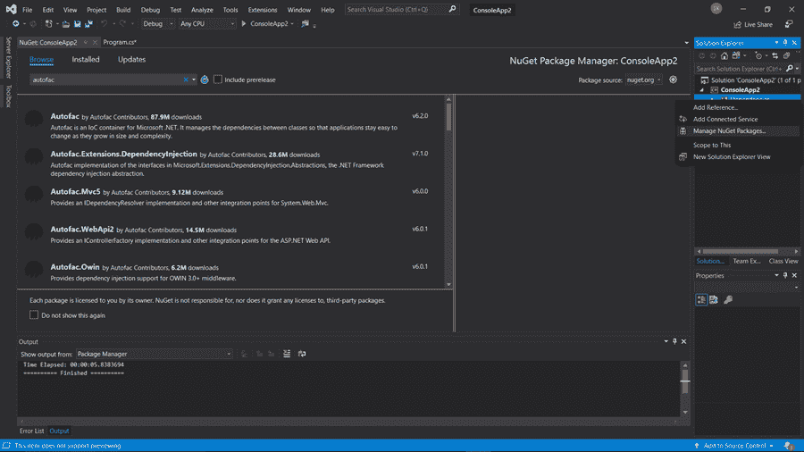
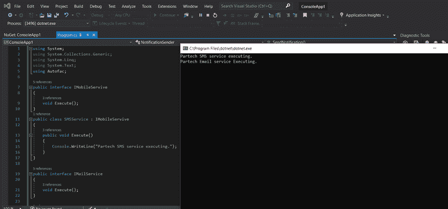

# AutoFac 基础知识如何在 ASP.NET 应用程序中实现它

> 原文：<https://medium.com/nerd-for-tech/basics-of-autofac-how-to-implement-it-in-asp-net-application-eee4d76412fa?source=collection_archive---------15----------------------->


如果您过去使用过依赖注入，您一定知道为什么它非常有用。依赖注入提供了松散耦合，有助于维护和测试应用程序。

依赖注入和 IoC 概念构成了大多数面向对象应用程序的核心。

IoC 是一个通用术语，表示控制流是这样的:框架调用应用程序提供的实现，而不是调用框架中的方法。

依赖注入为开发人员提供了对应用程序的巨大控制权，赋予了他们一些最好的特性，比如配置和类的独立性。这种依赖注入是由 ASP.NET 核心的阿迪容器提供的。它是预构建的，不需要额外安装。

但是第三方 DI 容器可以提供更多的功能。这就是开发人员在大规模应用程序中采用第三方 DI 容器而不是预建容器的主要原因。AutoFac 是一个强大的第三方 DI 容器，在 ASP.NET 核心开发人员中广泛使用。让我们更深入地了解什么是 Autofac 以及它为什么有用。

**目录**

*   一些背景
*   什么是 Autofac？
*   Autofac 优于内置 DI 容器的优势
*   Autofac 的实际实现
*   结论

# 背景

依赖注入是 IoC(控制反转)的一种形式，在这种形式中，实现通过应用程序赖以正确运行的构造函数或设置函数来传递。

换句话说，它是一种编程技术，允许类独立于它们的依赖关系。这使得开发人员可以很好地控制多个类。这种依赖注入是由预构建的 DI 容器或第三方 DI 容器提供的。但是当涉及到开发企业级应用程序时，开发人员总是寻求第三方 DI 容器的帮助，比如 AutoFac。

# 什么是 AutoFac？

AutoFac 是一个反转的控制容器，用于解析应用程序的依赖关系。这意味着它也是一个依赖注入框架。

如果您在面向对象的世界中不熟悉这种思想，这是一种注入其他类所依赖的依赖项的方法，通常在构造函数中。Autofac 被誉为 ASP.NET 社区中使用最广泛的框架。它是开发者中下载量最大的软件包之一。AutoFac 为 ASP.NET MVC 框架提供了更好的集成，并且是使用 Google 代码开发的。

AutoFac 管理类的依赖关系，这样当应用程序的规模和复杂性增加时，它可以很容易地改变。让我们来看看为什么内置的 DI 容器被 AutoFac 所取代。

# AutoFac 优于内置 DI 容器的优势

1.  ASP.NET DI 容器对验证配置没有帮助，很难发现常见错误配置引起的问题。在大规模应用程序中，自己很难发现错误配置。
2.  ASP.NET DI 容器只提供了一个构造函数注入。
3.  使用 AutoFac，可以访问内置 IoC 容器所没有的新特性，比如属性注入。
4.  内置容器非常轻，是基本应用程序的默认容器。用户可以很容易地切换到第三方 IoC 容器，如 AutoFac 或 structuremap。
5.  AutoFac 支持各种各样的应用设计，只需最少的额外基础设施和集成代码，学习曲线更短。
6.  实现像 AutoFac 这样的第三方 IoC 容器可以产生可重用的代码、可读性更好的代码和易于测试的代码，集中了依赖关系管理的逻辑。
7.  Autofac 涵盖了 IoC 容器提供的所有特性，以及其他一些细微的特性，这些特性有助于应用程序配置、管理组件的生命周期以及管理您所关注的多个依赖项。

# AutoFac 的实际实现

正如我们在这个博客中不断强调的，为了释放依赖注入的全部好处，使用第三方 DI 容器总是比内置的 DI 容器更好。从管理运行时依赖到开源，Autofac 是在 ASP.NET 工作的开发人员不可或缺的资源。

现在让我们使用 AutoFac 执行一个简单的依赖注入。

## 第一步

打开 Visual Studio 并创建一个新项目。选择控制台应用程序(。NET Core)从指定的运行时环境列表中删除。控制台应用程序用于创建可以在上运行的命令行界面。网芯。您还可以自由选择构建项目所基于的 web 应用程序。


## 第二步

下一步是配置您的项目。指定项目的名称以及希望项目托管的位置。继续创建。

## 第三步

Visual Studio 现在自动创建默认的 Hello world 程序，这是一个控制台应用程序。

在开始我们的任务之前，有必要添加第三方 DI 容器扩展。转到项目右上角的“解决方案资源管理器”选项卡。右键单击依赖项并选择管理 NuGet 包。现在通过搜索软件包栏来安装 AutoFac 软件包。



## 第四步

现在 AutoFac 已经安装好了，让我们使用 AutoFac 实现依赖注入。下面是一个简单的控制台应用程序，涉及到使用 AutoFac 实现依赖注入。

```
using System; using System.Collections.Generic; using System.Linq; using System.Text; using Autofac; public interface IMobileServive { void Execute(); } public class SMSService : IMobileServive { public void Execute() { Console.WriteLine("Partech SMS service executing."); } } public interface IMailService { void Execute(); } public class EmailService : IMailService { public void Execute() { ​ Console.WriteLine("Partech Email service Executing."); } } public class NotificationSender { public IMobileServive _mobileSerivce = null; public IMailService _mailService = null; //injection through constructor public NotificationSender(IMobileServive tmpService) { ​ _mobileSerivce = tmpService; } //Injection through property public IMailService SetMailService { ​ set { _mailService = value; } } public void SendNotification() { ​ _mobileSerivce.Execute(); ​ _mailService.Execute(); } } namespace Client { class Program { ​ static void Main(string[] args) ​ { ​ var builder = new ContainerBuilder(); ​ builder.RegisterType<SMSService>().As<IMobileServive>(); ​ builder.RegisterType<EmailService>().As<IMailService>(); ​ var container = builder.Build(); ​ container.Resolve<IMobileServive>().Execute(); ​ container.Resolve<IMailService>().Execute(); ​ Console.ReadLine(); ​ } } }
```

这里我们实现了两个接口类和它们对应的具体类。

然后，我们实现了一个依赖于 mailService 和 mobileService 的通知发送者类。我们通过构造函数注入了两个类的依赖关系。查看 Main()函数，查看依赖类型的存储库并构建存储库。

这是代码的输出-



# 结论

为了使类独立于它们的依赖，使用依赖注入是明智的。它使您能够在不中断类组件或主代码的情况下替换或更改依赖项。所以对于小规模的应用，可以使用内置的 DI 容器。但是当涉及到大规模远程应用程序时，Autofac 是不二之选，因为它提供了 ASP.NET 的内置 DI 容器所缺乏的大量特性。

*原载于*[*https://www . partech . nl*](https://www.partech.nl/nl/publicaties/2021/05/basics-of-autofac-how-to-implement-it-in-asp-net-application)*。*