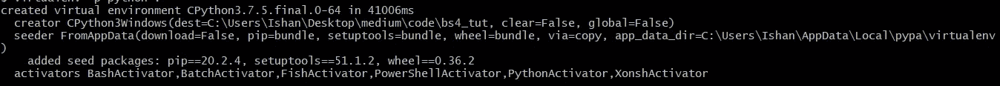
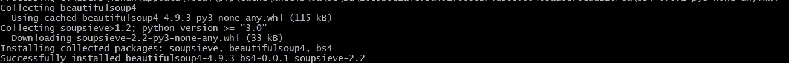
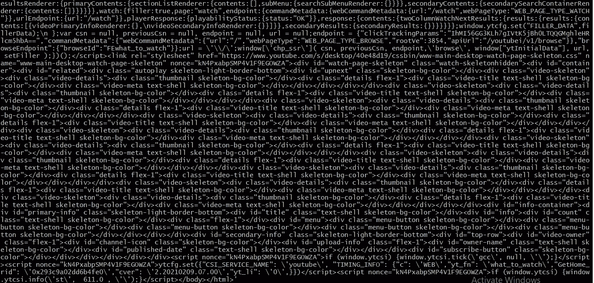
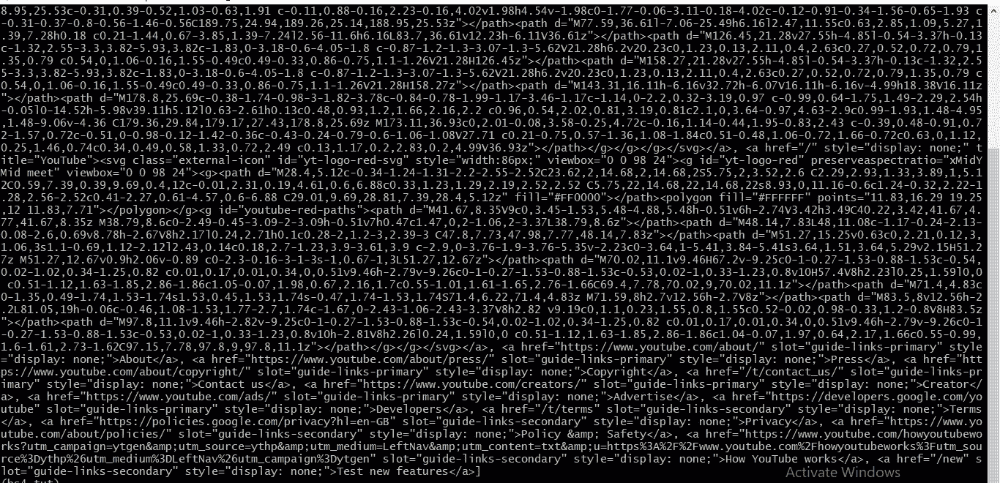
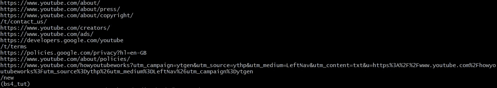
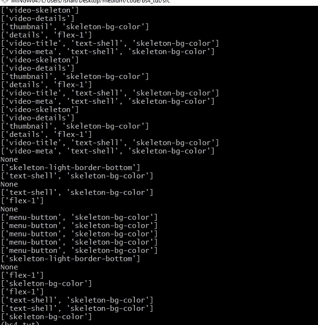

# 蟒蛇汤的基础知识 3

> 原文：<https://medium.com/nerd-for-tech/basics-of-beautiful-soup-with-python3-192215814a1c?source=collection_archive---------12----------------------->


大家好！今天我们将学习另一个对网络抓取非常有用的模块。我的第一篇博客是关于 Python 3 中 selenium 的基础知识。这个博客将会讲述另一个叫做美丽的汤的模块的基础知识，这个模块和 selenium 一起用于网络抓取。在继续之前，我还建议您先了解一下 HTML 的基础知识。

我们从创建项目目录开始。我将打开我的命令提示符，进入我存储所有项目的文件夹，创建一个名为“bs4_tut”的新文件夹，然后进入该目录。

假设你还没有安装 virtualenv 包。在这种情况下，您可以先这样做，然后再继续。然而，这不是必须的，你可以跳过所有这些步骤，直到得到你的虚拟环境被激活的信号。我更喜欢这样做，如果你想的话，你可以跟着做。现在，在您的主目录中，您可以:

```
pip3 install virtualenv
```

我们从创建项目目录开始。所以我会打开我的命令提示符，转到我存储所有项目的文件夹，创建一个名为 bs4_tut 的新文件夹，这是'美丽的汤教程'的缩写，然后进入该目录。

```
cd desktop
mkdir bs4_tut
cd bs4_tut
```

一旦到了那里，我们就创建了一个虚拟环境。

```
virtualenv -p python .
```

如果您收到如下消息:



那就好！这意味着创建了虚拟环境。让我们像这样激活虚拟环境:

```
Scripts/activate
```

对于 mac:

```
source venv/bin/activate
```

希望你能得到这样的提示:

```
(THE FOLDER NAME WHERE YOU CREATED THE ENVIRONMENT)
```

现在让我们像这样安装 bs4 模块:

```
pip3 install bs4
```

如果安装成功，将会显示如下消息:



现在让我们创建一个名为“src”的新文件夹，将我们的代码文件与当前目录中的文件分开:

```
mkdir src
cd src
```

现在你可以使用任何你想要的编辑器，但是我用的是 Vim。创建一个”。py”文件，并随意命名。我把我的名字叫做“main.py”。让我们导入 urllib.request 和漂亮的汤，如下所示:

```
import urllib.request
from bs4 import BeautifulSoup
```

让我们首先获得 youtube.com 的完整 HTML。使用 Python 3，只需几个步骤就可以完成。首先，我们将想要打开的链接提供给一个名为 urlopen 的 urllib.request 函数，然后我们请求读取并打印数据，如下所示:

```
html = urllib.request.urlopen('https://www.youtube.com').read()
print(html)
```

如果我们运行这个:



很难从*到得到所有<到>的标签。这就是 BeautifulSoup 发挥作用的地方。让我们首先保存我们想要在变量中搜索< a >标签的链接。然后我们将告诉 BeautifulSoup 使用 HTML 解析器找到并打印所有的< a >标签:*

```
*link = 'https://www.youtube.com'
html = urllib.request.urlopen(link).read()
search = BeautifulSoup(html, 'html.parser'
a_tags = search('a')print(a_tags)*
```

*运行该文件后，您可以看到:*

**

*这就是 BeautifulSoup 的力量。我们可以得到 HTML 页面中所有的标签。但是我们可以更进一步。如果我们想在所有的标签中包含所有的‘href’属性呢？我们只是像这样使用“for 循环”:*

```
*for tag in all_tags:
    print(tag.get('href'))*
```

*结果是:*

**

*让我们看看能否找到所有*

*标签的 class 属性:*

```
*tags = search('div')for tag in tags:
    print(tag.get('class'))*
```

*结果是:*

**

*原来如此。在未来，我们将整合硒和美丽的汤，以创造一个网页刮刀。*

*我希望你们都喜欢这个博客。如果你喜欢它，那么请按下鼓掌按钮，并确保关注我，因为我每周都这样放博客。以下是完整的代码:*

```
*import urllib.request
from bs4 import BeautifulSouplink = ‘[https://www.youtube.com'](https://www.youtube.com') #You can give any link you want
html = urllib.request.urlopen(link).read()
search = BeautifulSoup(html, ‘html.parser’)
tags = search(‘div’) #You can search for any tag you wantfor tag in tags:
 print(tag.get(‘class’)) #You can ask for any attribute you want*
```

*再次感谢你的阅读。*