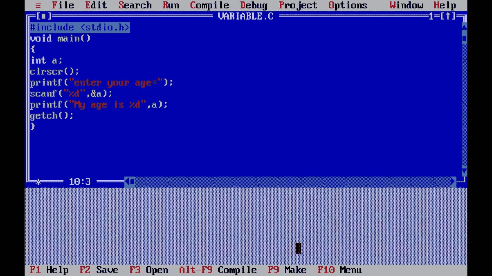
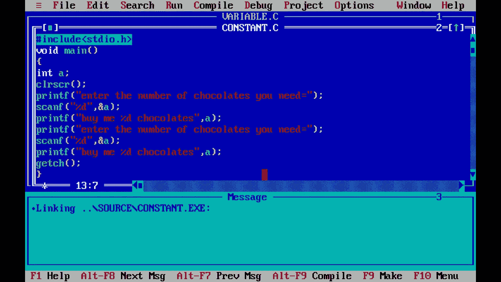
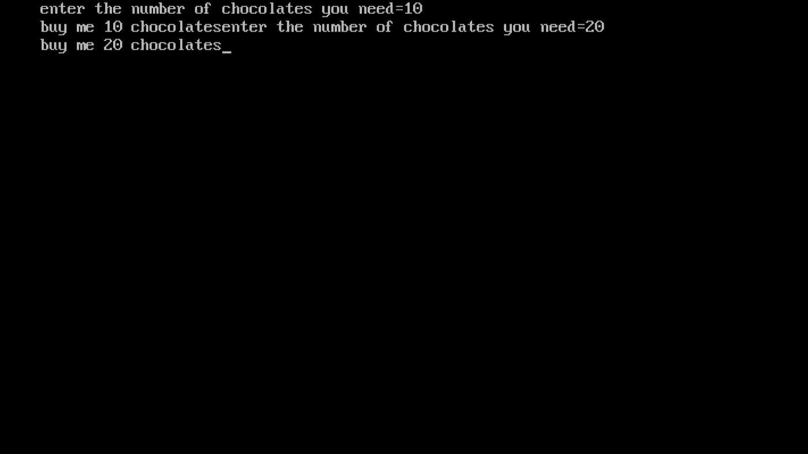
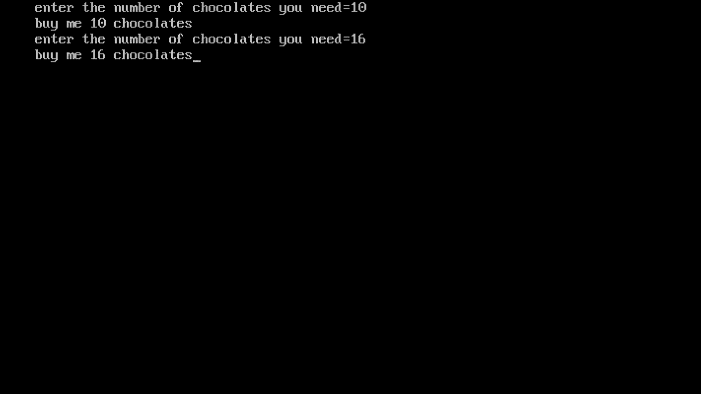
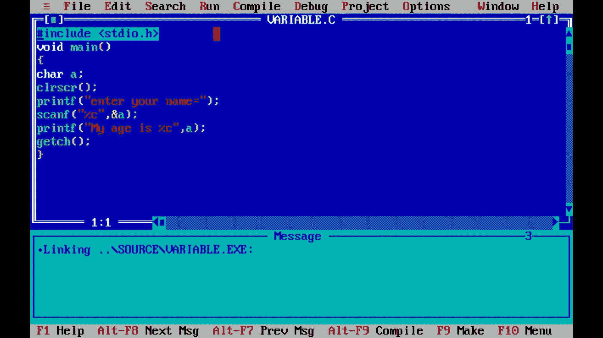
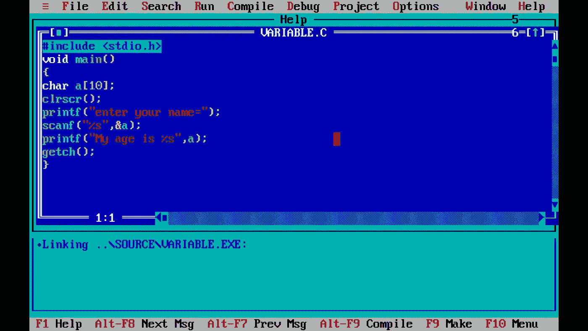

# C 编程基础

> 原文：<https://medium.com/nerd-for-tech/basics-of-c-programming-175c5550bc4a?source=collection_archive---------24----------------------->

学习 c 编程的基本术语。我将包括一些例子，让你更好地理解。

开始吧！

# 下面是你可以从这个博客中学到的东西。

> 下载 turbo C++的链接。
> 
> 如何在 Turbo C++中保存一段代码？
> 
> 什么是编译器？
> 
> 什么是变量和数据类型？
> 
> 什么是字符串和数组？
> 
> 什么是 printf 和格式说明符？
> 
> 用例子解释所有的术语。

# 下载 Turbo C++的链接。

## 对于 Windows-

 [## 下载适用于 Windows 7、8、8.1 和 Windows 10 (32-64 位)的 Turbo C++全屏/窗口模式…

### 1.如何安装 Turbo C++步骤 1 从此处下载 Turbo C++ 3.2 下载 Turbo C++步骤 2 如果任何以前版本的…

developerinsider.co](https://developerinsider.co/download-turbo-c-for-windows-7-8-8-1-and-windows-10-32-64-bit-full-screen/) 

## 对于手机-

 [## Google Play 上的 TurboCdroid 应用程序

### Everyone TurboCdroid 是专为学校/大学学生设计的，用于在 android 平台上运行 Turbo C++。有…

play.google.co](https://play.google.com/store/apps/details?id=www.turboc8.com.turbocdroider&hl=en_IN) 

# 如何在 Turbo C++中保存一段代码？

第一步:进入文件选项。

第二步:选择另存为。

第三步:用扩展名命名文件。c

例如，Hello.c

第四步:你的文件将被保存。下一步是编译。

# 什么是编译器？

我们正在输入的代码是人类可以理解的语言。编译器把我们的代码转换成计算机语言，这样我们就能得到我们想要的输出。

第一步:点击编译选项。

第二步:你要么成功，要么失败。如果你成功了，那么你的代码就编译好了，你现在可以运行代码了。

# 什么是变量和数据类型？

变量就像可以存储不同项目的容器。但是，这里我们说它们存储不同的数据类型。

数据类型基本上是我们可以在编码中使用的数据类型。例如，整数、字符(字母)、浮点(十进制数的数据类型)或双精度。Double 和 Float，可用于十进制数。我们将在本博客后面的代码中看到它们是如何被使用的。

# 什么是字符串和数组？

我们已经看到 char 数据类型用于字符。而字符串基本上是一系列字符的数据类型。字符串的大小，即一个字符串可以存储的字符数是不固定的。此外，字符串仅用于字符数据(仅字母)。

而数组用于存储任何类型的数据；数字或字符。要在编码时使用数组，就不得不提到元素的限制。我们如何在代码中使用它们将在本博客后面的代码示例中解释。

# 什么是 printf 和格式说明符？

printf 基本上是一个函数，对于初学者来说，它在每个代码中都是非常必要的。我们使用 print 来打印输出屏幕上的内容。当你读到例子部分时，你会有更好的理解。

格式说明符告诉 printf 函数，我们想要打印出不仅仅是文本或字符的数据。

例如，“%d”用于打印整数。

“%s”用于打印文本(字符串)。

“%c”用于打印字符，并且

" %f "用于打印十进制数。

**附加分-**

\n 在 print 语句中使用，用于在下一行打印您的输入。

**示例 1-**

打印你年龄的程序。

1.  花括号内的任何内容都应该以分号结束。
2.  可以看到 int a；在图像中。正如你现在所知道的，int 只是告诉计算机数据是一个整数。“a”是存储输入的变量。
3.  我们后面会看到为什么要用清屏。
4.  下一个命令是打印-输入你的年龄=。这将打印在输出页面上，您可以提供您的输入。
5.  这里你可以看到 **scanf 被**使用。这用于扫描提供的输入，我们知道它是一个整数，所以我们使用了%d 说明符。
6.  还有&a 是一个**地址操作符**。这告诉你必须扫描给定的整数输入，该输入被寻址到变量“a”。

输出-

输出-使用 printf 和 scanf。

**示例 2-**

**使用 clrscr。**

**不使用 clrscr 时的输出。**

**使用 clrscr 时的输出。**

**示例 3-**

1.  这里可以看到%c 的用法。
2.  看输出。

你可以在这里看到只有“s”是从希亚姆印刷的。这是因为该变量只能容纳一个字符。所以只打印第一个字母 S。

**例 4-**

程序使用%s 格式说明符输入字符序列。

这里可以看到使用了 char a[10]。这只是一个使用的数组，提到了 10 个元素的限制。[]这些大括号用于显示数组的用法。

输出。

从实施例 3 和 4 中可以理解%s 的使用。如果你想打印一个名字，那么使用字符串。一个变量只能包含一个字符。

希望这篇文章对你有用。如有任何疑问或意见想留下，请在回复区回复。