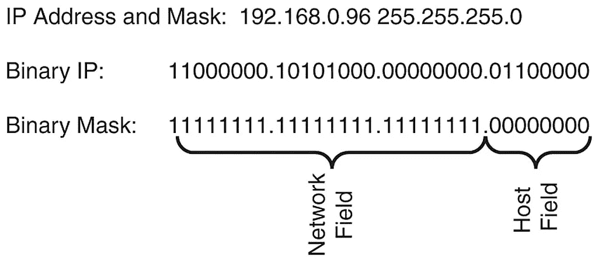
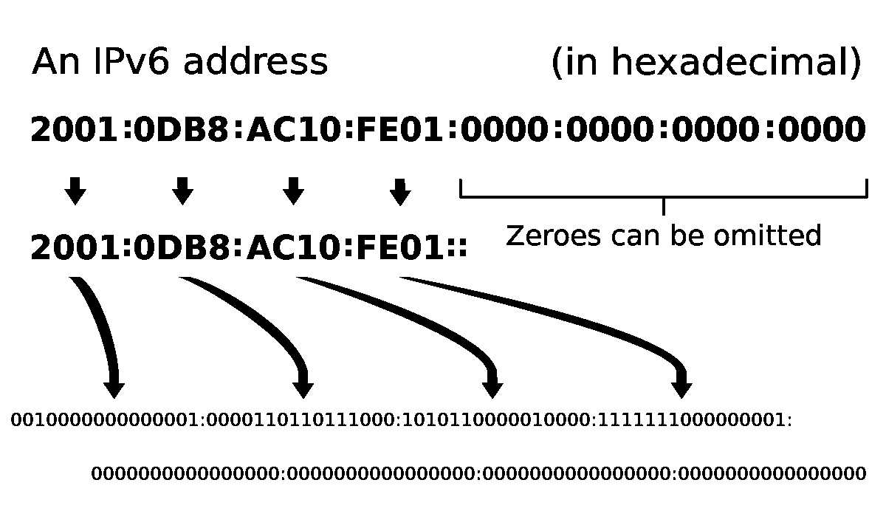
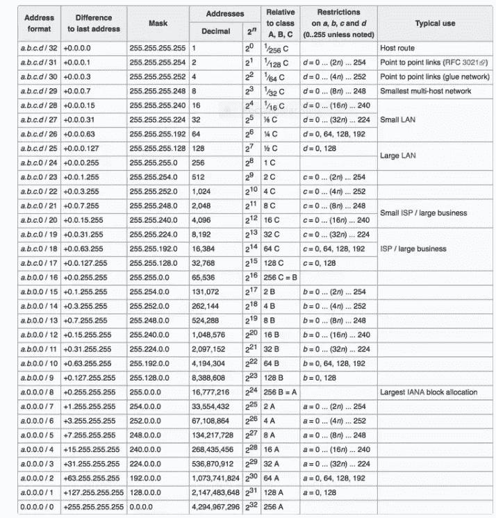
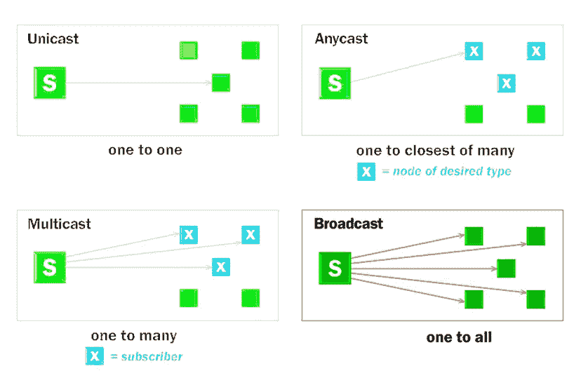
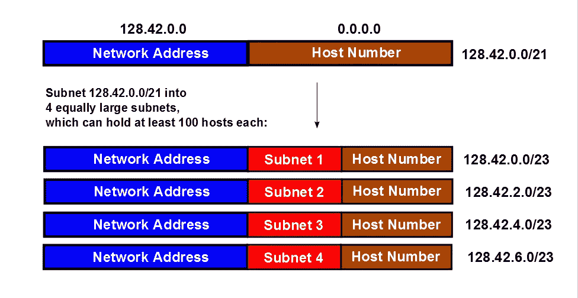

# IPv4 和 IPv6 寻址基础知识

> 原文：<https://medium.com/nerd-for-tech/basics-of-ipv4-and-ipv6-addressing-3c9717c7a40d?source=collection_archive---------11----------------------->

TCP/IP 是互联网通信的主干。现在有两个版本的因特网协议可用于网络层上的通信，即 IP 版本 4 和版本 6。这两者之间的主要区别是，IPv4 地址是 32 位，用点分十进制表示，而 IPv6 地址是 128 位，用十六进制格式表示。


**IPv4 与 IPv6 表示法**

*   **IP 第四版**



IPv4 表示

正如我们从图中看到的，IPv4 被分成 4 个由点分隔的位域(4 * 8 = 32)，用十进制表示。IPv4 地址分为两部分，用于子网划分，分为网络和主机字段。随着互联网上的设备数量开始增长，IPv4 地址空间开始耗尽，20 年前实施了一个解决方案。

*   **IP 第六版**



IPv6 地址表示

IPv6 地址使用 128 位十六进制表示法，每 4 位(半字节)由一个十六进制表示(4*32=128)。在 IPv6 表示中，字母数字字符不区分大小写，因此 9 之后的数字可以是 *A 或*。

> 非正式地，IPv6 中的四个十六进制部分被称为 hextet，类似于 IPv4 的 octet。RFC 2373 和 RFC 5952 提供了减少 IP 地址的规则

*   **规则 1:省略前导零 IPv4 或 IPv6 地址中可以省略前导零。**

```
**Preferred**: **2001:0db8:85a3:0000:0000:0000:0000:0000
omitting zeros: 2001:0db8:85a3:0:0:0:0:0**
```

IP 仅允许省略前导零省略尾随零会导致不明确的寻址。

```
**Preferred: 192.168.000.001
Omitting zeros: 192.168.0.1**
```

*   **规则 2:省略所有 0 六进制数**

对于 IPv6 地址，双栏(::)是一个或多个六元组的任何单个传染性字符串，这种双栏的使用进一步减小了 IPv6 地址的大小。以下示例显示了结合两个规则后的 IPv6 地址示例。

```
**Preferred**: **2001:0008:0000:0000:0000:0000:0000:0000
omitting zeros: 2001:8:0:0:0:0:0:0**
```

**无类域间路由(CIDR)**

CIDR 用于划分子网和分配 IP 地址范围。CIDR 把一个 IP 分成两组数字。IPv4 地址的 CIDR 符号如下所示。

**192.255.255.255/24**

32 位中的前 24 位将是网络地址，其余位用于主机部分。下图说明了 IPv4 地址的 CIDR 寻址格式，以及它可以拥有的各个类别的最大主机数量及其用途。



随着互联网的发展，有限的 IPv4 地址空间很快耗尽。客户对 IPv4 地址和前缀长度(子网掩码)的请求通过依赖**网络地址转换(NAT)得到解决。**容纳其主机中的内部 IPv4 地址数量。

*   **CIDR IPv6 符号**

在 IPv4 寻址的情况下，如果需要增加主机地址，则需要从网络部分获取，IPv6 解决了这个问题。下面给出了 CIDR 符号。

IPv6-地址/ *前缀*-长度

前缀长度标识地址的前缀或网络部分。让我们看一个地址的例子。

```
**2001:0008:0000:0000:0000:0000:0000:0000/64**
```

第一部分 64 是已知的网络地址，第二部分是接口地址。如果一个站点收到/48 前缀，这将允许(16⁴=65,535)主机为每个主机提供 18 万亿个接口/56 个地址(space(16⁴=256)子网为每个子网提供相同的接口。

**IP 地址类型**

IPv6 支持三种类型的寻址

*   单播
*   任播
*   多点传送
*   所有节点多播(在 IPv4 中广播)

**单播**

单播地址唯一标识 IPv6 设备上的接口。发送到单播地址的数据包被传送到该地址定义的接口(前缀地址)。单个接口可以有多个地址

**选播**

任播是分配给几个设备的单播。在任意播数据包被传送到配置有该地址的设备时，该任意播数据包将被路由到最近的设备。

**组播**

多播标识属于不同设备的一组接口。传送到多播地址的数据包将由所有设备传送。多播和单播的区别在于，在非多播中，数据包将只传送到一个设备，而在多播中，数据包将由所有设备传送和处理。

在 IPv4 寻址中存在广播，其中分组将被传送到系统中的所有节点。



IP 传输模式

**全局路由前缀**

根据要求，IP 分配需要大量规划。这种分配称为子网划分。



IPv4 的子网划分

典型的 IPv6 站点前缀会有一个由提供商(通常来自 ISP)分配的/48。这将创建 16 位子网 ID，允许 65，536 个子网。为我们提供 64 位接口 ID(我们称之为接口 ID，因为每个子网都有接口),为我们提供每个子网 18 万亿个接口(主机)。