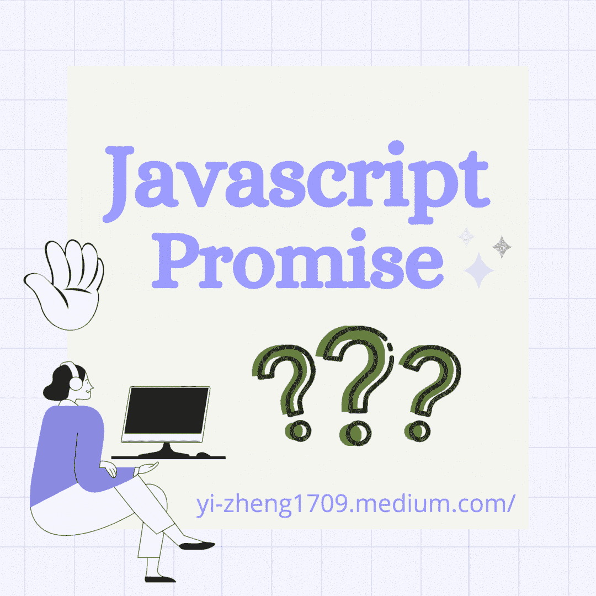
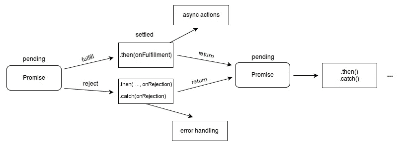

# Javascript 承诺的基础

> 原文：<https://medium.com/nerd-for-tech/basics-of-javascript-promises-e4fee3d98cd5?source=collection_archive---------17----------------------->



# **定义**

MDN 很好地解释了什么是承诺。

> `**Promise**`对象表示异步操作的最终完成(或失败)及其结果值。



[https://developer.mozilla.org/](https://developer.mozilla.org/)

# 句法

当创建一个新的承诺时，它接受一个**执行函数**作为参数。**执行器函数**接受两个参数。

第一个参数表示应该调用来解析承诺的函数。第二个代表承诺被拒绝时会发生的功能。

```
let myPromise = new Promise((resolve, reject) => {
   //insert condition of myPromise
   if (true) {
      resolve(`Successful`)
   } else {
      reject(`not successful`)
   }
})
```

如果条件为真，将执行解析功能。如果条件不为真，将采用拒绝方法。

# Javascript 承诺的状态

Javascript Promise 对象可以处于三种状态之一:**待定**、**已解决**或**已拒绝**。

当承诺对象尚未就绪时，状态将为**待定**。一旦解决，它可以进入**解决**状态(成功承诺)或**拒绝**状态(不成功承诺)。

# 然后呢？

如果承诺成功，意味着它进入了 **resolved** 状态，我们可以将一个`.then`链接到承诺对象。`.then()`方法将**回调函数**作为参数。除非明确声明，否则`.then()`方法的返回值是一个 Promise 对象。

```
// if myPromise ends up in a resolved state, I can call myPromise.then()myPromise.then(state => console.log(`The Promise was ${state}.`)
// This will print `The Promise was Successful.`
```

# 接住？

如果`myPromise`最终处于拒绝状态，我们将需要一个`.catch()`方法来处理它。

```
// if myPromise is in the rejected state, the .then() method would be skipped over and go directly to the .catch() methodmyPromise.then(state => {
   console.log(`The Promise was ${state}.`
}).catch(state => {
   console.log(`The Promise ended up in the catch because it was ${state}.`
})// if myPromise is rejected, this will print `The Promise ended up in the catch because it was not successful.`
```

# 多重承诺

如果要同时运行多个承诺，可以使用`Promise.all()`方法。这个函数接受一组承诺作为参数。返回值是一个承诺(待定或已解决)。

```
Promise.all([myPromise, myPromiseAgain])
.then( () => console.log("All Promises are resolved."))
```

如果承诺数组中有任何拒绝，将显示来自最早索引的承诺的拒绝消息。关于`Promise.all()`更深入的文章可以在这里阅读[。](https://developer.mozilla.org/en-US/docs/Web/JavaScript/Reference/Global_Objects/Promise/all)