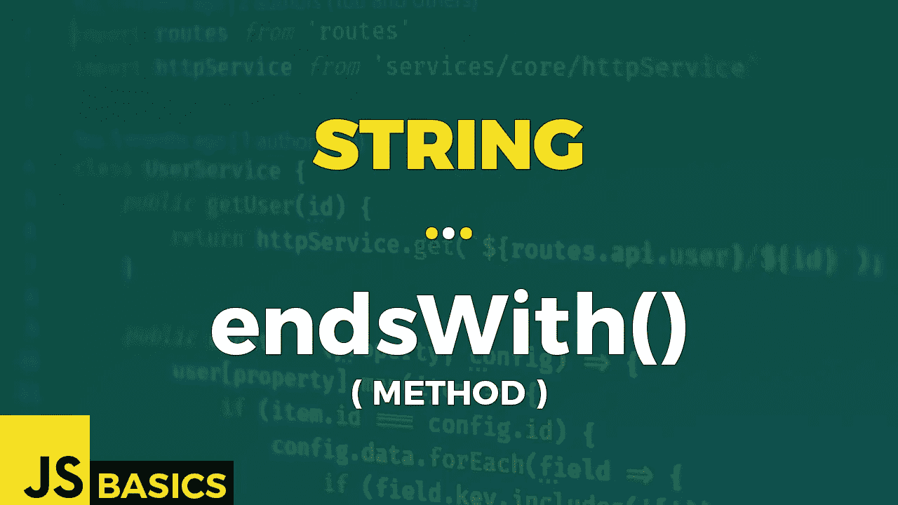

# Javascript 字符串 endsWith()的基础知识(方法)

> 原文：<https://medium.com/nerd-for-tech/basics-of-javascript-string-endswith-method-53d57eb39c0c?source=collection_archive---------19----------------------->



这篇文章是我在 youtube 上免费发表的关于网络开发基础的系列文章的抄本。如果你更喜欢看而不是读，请随时访问我的频道“Dev Newbs”。

你好，我的新手伙伴们。Jacob 在这里用另一个字符串方法。我们按时间顺序进行，今天的方法叫做 endsWith()。我们开始吧。

endsWith()方法确定一个字符串是否以指定字符串的字符结尾。如果字符串以字符结尾，该方法返回 true，否则返回 false。我们还可以选择提供要搜索的字符串的长度。还有一点很重要，那就是该方法区分大小写。

让我们看看在例 1 中这个方法的基本用例是什么。

```
let str = "Welcome to the channel Dev Newbs!";str.length                                        // 33str.endsWith("!")                                 // true
str.endsWith("Dev Newbs!")                        // truestr.endsWith("!", 33)                             // true
str.endsWith("Newbs!", 33)                        // truestr.endsWith("?", 33)                             // false
str.endsWith("newbs!", 33)                        // false
```

在这个例子中，我们有一个变量中有一个句子的字符串。它的长度等于 33。第一个块显示了没有指定可选参数长度的情况。这意味着使用变量的默认长度。就好像我们把 33 作为第二个参数。带有第二个参数的第二段代码证实了这一点。到目前为止，所有的结果都是积极的。

在第三段代码中，我们可以看到我们的句子既没有以问号结尾，也没有以小写单词“newbs！”结尾。这些都是假的。

但是我们不仅仅局限于字母表、数字和空白字符。我们也可以使用表情符号和任何其他我们喜欢的特殊符号。第二个例子中有一个带笑脸表情符号的句子说明了它的工作原理。让我们看一看。

```
let str2 = "My name is Jacob...🙂";str2.length                                // 21str2.endsWith("🙂")                       // true
str2.endsWith("...🙂", 33)                // true
```

同样，我首先输出句子的长度，所以下面的代码块中发生了什么是显而易见的。正如你所看到的，表情符号不会引起任何问题，并且可以像其他字符一样被搜索到。

在下一个例子中，我将再次关注可选的长度参数和它为我们提供的可能性。请记住，在整个过程中，我们处理的是代码单元，而不是代码点。这意味着可以只使用表情符号的一部分或由多个代码单元组成的其他符号进行搜索。

```
let str3 = "Oh, I forgot, what to do next! 🤦🤦🤦";str3.length                                       // 37
"🤦".length                                       // 2// how we got code unit values for facepalm emoji
"🤦".charCodeAt(0).toString(16)                   // d83e
"🤦".charCodeAt(1).toString(16)                   // dd26// adding '\u' as prefix specifies that the value is
// hexadecimal code unit value of unicode character '\ud83e\udd26'// searched string "Oh, I forgot, what to do next! 🤦🤦"
str3.endsWith("🤦🤦", 35)                         // true// searched string "Oh, I forgot, what to do next! 🤦"
str3.endsWith("🤦", 33)                           // true// searched string "Oh, I forgot, what to do next"
str3.endsWith("next!", 30)                        // true// searched string "Oh, I forgot, what to do next! 🤦"
str3.endsWith("🤦🤦", 33)                        // false// searched string "Oh, I forgot, what to do next! 🤦"
// "🤦" consists of two code units: \ud83e & \udd26
str3.endsWith("\udd26", 33)                       // true// searched string "Oh, I forgot, what to do next! 🤦🤦"
// "🤦🤦" can be also written as \ud83e\udd26\ud83e\udd26
str3.endsWith("\udd26\ud83e\udd26", 35)           // true
```

每个输出之前都有一个注释行，解释字符串的哪一部分用于搜索。通过使用可选的参数长度，我们可以根据需要有效地限制搜索范围。

我们如何获得 facepalm 表情符号的两个代码单元的 unicode 十六进制值的解释在示例的顶部提供。这超出了这个方法的范围，所以只要把它当成是正确的就行了。但是如果你有兴趣了解更多的话，你可以自己研究一下。

这些例子本身向我们展示了搜索和比较是在代码单元的详细程度上执行的。这显然很好，因为它允许我们进行更细致的比较。

最后一个例子——例子 4 是一个模拟真实场景的尝试。假设我们有一个记录约会网站访问者的系统。每个访问者在日志文件中创建一个记录，记录中有他或她的名字和基于访问者性别的短语“自我介绍”。我们可能想知道有多少雄性拜访过。当然，还有其他更好的方法，但是假设我们只能使用这种方法。

让我们看看今天最后一个例子的代码。

```
let introductionArray = [
  "Rose introduced herself",
  "Tiffany introduced herself",
  "Josh introduced himself",
  "Sparky introduced itself",
  "Andrew did not introduce himself"
];let expectedString = "himself";introductionArray.forEach((item, index) =>{
  console.log("Person '" + index + "' is male: " +   
  item.endsWith(expectedString));
})// Person '0' is male: false
// Person '1' is male: false
// Person '2' is male: true
// Person '3' is male: false
// Person '4' is male: true
```

我们有一个记录数组，其中每一项都是日志文件中的一行，我们对搜索男性感兴趣，所以我们的搜索短语是数组中每一项末尾的单词“his”。

我们使用一个循环逐个检查数组中的每一项，并使用 endsWith()方法检查记录是否是由男性访问者创建的，然后输出结果。

好了，这就是 endsWith()及其在或多或少真实场景中的使用。我想今天就到这里吧。

一如既往，非常感谢您的关注，我期待在下一篇文章中见到您。