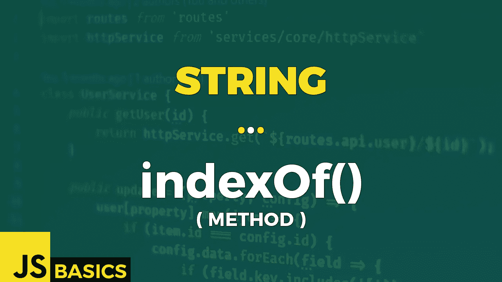

# Javascript 字符串 indexOf()的基础知识(方法)

> 原文：<https://medium.com/nerd-for-tech/basics-of-javascript-string-indexof-method-5a778534f926?source=collection_archive---------13----------------------->



这篇文章是我在 youtube 上免费发表的关于网络开发基础的系列文章的抄本。如果你更喜欢看而不是读，请随时访问我的频道“Dev Newbs”。

向所有开发新手问好。另一天，另一个字符串方法覆盖。今天我们将使用 indexOf()方法来告诉我们正确的位置。

indexOf()方法返回指定字符串值在搜索字符串中第一个匹配项的索引。可选地，我们还可以提供搜索的起始位置。方法返回被搜索字符串第一次出现的位置的索引，如果没有找到被搜索的字符串，则返回-1。

让我们看看它在第一个例子中是如何工作的:

```
let searchedString = "Hello my fellow dev newbs! 🙂";
let stringToLookFor = "fellow";searchedString.indexOf(stringToLookFor)                  // 9
searchedString.indexOf(stringToLookFor, 9)               // 9
searchedString.indexOf(stringToLookFor, 12)              // -1
```

我们正在搜索第一个和第二个案例中字符串“fellow”的位置。我们得到的值是 9，因为这是指定字符串第一次出现的起始位置。最后一种情况返回值-1，因为我们在从位置 12 开始的有限范围内进行搜索，该位置不再包含指定的字符串。

同样，与前面的方法 includes()一样，indexOf()也是区分大小写的。除此之外，我还想指出这样一个事实，即方法只返回指定字符串第一次出现的位置。

```
let welcomeString = "Hi to my Fellow fellow mellow newbs dewbs! 🙂";welcomeString.indexOf("Fellow")                // 9
welcomeString.indexOf("fellow")                // 16welcomeString.indexOf("Mellow")                // -1
welcomeString.indexOf("mellow")                // 23 welcomeString.indexOf("Dewbs")                 // -1
welcomeString.indexOf("newbs")                 // 30
```

第一组很好地展示了区分大小写如何导致不同的结果。大写字母 F 的字符串从位置 9 开始，但小写字母 F 的字符串只从位置 16 开始。

其余情况表明，如果指定的字符串不完全匹配(包括区分大小写)，则结果为-1。

好的，和以前一样，这很好，但是在现实生活中，我们也将处理由两个代码单元组成的字符。那么这是怎么做到的呢？嗯，你可能会感到震惊，但大多数情况下就像前面的方法一样。因为它们做的几乎一样…让我们看一下今天最后一个例子的代码，自己看看。

```
let smileyFace = "🙂";// smileyFace:
//   0 -> "\ud83d" 
//   1 -> "\ude42"smileyFace.indexOf("🙂")                       // 0
smileyFace.indexOf("\ud83d\ude42")             // 0smileyFace.indexOf("🙂", 1)                    // -1
smileyFace.indexOf("\ude42", 1)                // 1// 4 smiley faces:
//   0 -> "\ud83d" 
//   1 -> "\ude42" 
//   2 -> "\ud83d" 
//   3 -> "\ude42" 
//   4 -> "\ud83d" 
//   5 -> "\ude42" 
//   6 -> "\ud83d" 
//   7 -> "\ude42""🙂🙂🙂🙂".indexOf('\ude42\ud83d', 1)         // 1
"🙂🙂🙂🙂".indexOf('\ude42\ud83d', 2)         // 3
```

第一套很简单。我们搜索笑脸的位置，在两种情况下都是在索引 0 处。唯一的区别是我们如何指定字符串来查找位置。

第二组中的第一种情况等于-1，因为我们将搜索范围限制为表情符号的第二个代码单元，而不包括整个表情符号。然而，后半部分正好包含我们在第二种情况下要搜索的值，所以结果就是它的位置。那就是位置 1。

最后一组展示了一个更复杂的例子，有四个表情符号。我选择使用 4 个表情符号来指出我们总是会得到第一次出现的开始索引。即使在搜索的字符串中有多个匹配。

在第一种情况下，我们搜索的是由表情符号的后半部分和后半部分组成的字符串的位置。幸运的是，代码单元序列正好从位置 1 跨越到位置 2，所以结果是起始位置，因此值为 1。

第二种情况也包含这个代码单元序列的匹配。如果没有第二个可选参数的限制，结果值将是 1。但是因为我们从位置 2 开始限制搜索范围，所以指定代码单元序列的下一个出现在位置 3。这也是我们得到的结果。如果我们要修改这个序列，下一个值将是 5，因为这是指定字符串第二次出现的起始位置。

所以，这就是你需要知道的关于 indexOf()方法的全部内容。你现在可以自己使用它了…

一如既往，非常感谢你的时间，我会尽快看到你的下一个方法。