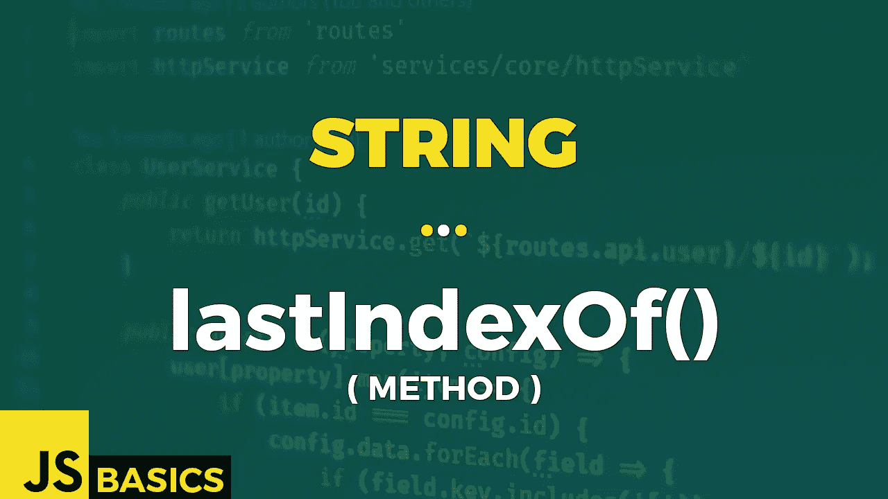

# Javascript 字符串 lastIndexOf()的基础知识(方法)

> 原文：<https://medium.com/nerd-for-tech/basics-of-javascript-string-lastindexof-method-2cfe3de6ce33?source=collection_archive---------18----------------------->



这篇文章是我在 youtube 上免费发表的关于网络开发基础的系列文章的抄本。如果你更喜欢看而不是读，请随时访问我的频道“Dev Newbs”。

你好，我亲爱的全世界的开发人员。嗯，说实话，在录制这一集的时候，我仍然没有订户，所以从技术上来说，我是在自言自语，但这并不妨碍我接受盛大的欢迎。我们的每日特餐是 lastIndexOf()方法，除此之外我没有什么要补充的，所以让我们开始吧。

lastIndexOf()方法返回指定字符串值在搜索字符串中最后一次出现的索引。默认情况下，从搜索字符串的最后一个索引开始向后搜索，并向索引 0 移动。可选地，我们可以提供一个起始位置，它指定第一个位置来检查指定字符串的匹配。方法返回找到指定字符串的最后一个匹配项的索引，如果找不到指定字符串，则返回值-1。

现在让我们在示例中检查一下:

```
let searchedString = "Hello my fellow fellows! 🙂";
let stringToLookFor = "fellow";// both case have same range of search
searchedString.lastIndexOf(stringToLookFor)           // 16// searchedString.length -> 27 - 1 = 26
searchedString.lastIndexOf(stringToLookFor, 26)       // 16// range for first character is "Hello my fellow f"
searchedString.lastIndexOf(stringToLookFor, 16)       // 16// range for first character is "Hello my f"
searchedString.lastIndexOf(stringToLookFor, 9)        // 9// range for first character is "Hello my "
searchedString.lastIndexOf(stringToLookFor, 8)        // -1
```

我们正在搜索第一个和第二个案例中最后出现的字符串“fellow”的位置。我们得到的值是 16，因为这是指定字符串最后一次出现的起始位置。这两个选项实际上是相同的，因为如果它的值等于或大于搜索字符串中最后一个字符的索引，则搜索整个搜索字符串。

其他三种情况分别返回 16，9 a -1。如果你看看我在每一行上面留下的评论，你会看到范围。请注意，这不是搜索特定字符串的范围，而是搜索特定字符串的第一个代码单元的范围。所以我们只需要“fellow”这个词的第一个字母“f”在这个范围内。记住，这个方法返回指定字符串最后一次出现的起始位置。所以这实际上是有意义的。

接下来，让我们看看同样的情况，其中区分大小写非常重要，并且检查当我们提供一个负值作为可选的第二个参数时会发生什么。

```
let welcomeString = "Hi to my Fellow fellow mellow newbs dewbs! 🙂";welcomeString.lastIndexOf("Fellow")               // 9
welcomeString.lastIndexOf("fellow")               // 16welcomeString.lastIndexOf("Mellow")               // -1
welcomeString.lastIndexOf("mellow")               // 23welcomeString.lastIndexOf("hi", -7)               // -1
welcomeString.lastIndexOf("Hi", -7)               // 0
```

在第一组结果中，我们看到，由于区分大小写，我们得到了完全不同的结果。第二组结果也是如此。

在第三组中，我们可以看到，如果我们为起始位置提供一个负的可选参数，则使用 0。幸运的是，单词“Hi”实际上从指定字符串的位置 0 开始。

因为 start position 参数为零，所以它主要检查搜索的字符串是否以指定的字符串开始。这是一个很好的技巧，将来可以派上用场。所以尽量不要忘记它。

好吧，就这样。现在让我们用一些更糟糕的例子来破坏我们的一天。我们可以试着玩一点表情符号，对吗？

```
let smileyFace = "🙂";// smileyFace:
//   0 -> "\ud83d" 
//   1 -> "\ude42"smileyFace.lastIndexOf("🙂")                         // 0
smileyFace.lastIndexOf("\ud83d\ude42");              // 0smileyFace.lastIndexOf("🙂", 1)                      // 0
smileyFace.lastIndexOf("\ude42", 1)                  // 1// 4 smiley faces:
//   0 -> "\ud83d" 
//   1 -> "\ude42" 
//   2 -> "\ud83d" 
//   3 -> "\ude42" 
//   4 -> "\ud83d" 
//   5 -> "\ude42" 
//   6 -> "\ud83d" 
//   7 -> "\ude42""🙂🙂🙂🙂".lastIndexOf('\ude42\ud83d')              // 5
"🙂🙂🙂🙂".lastIndexOf('\ude42\ud83d', 9)           // 5
"🙂🙂🙂🙂".lastIndexOf('\ude42\ud83d', 8)           // 5
"🙂🙂🙂🙂".lastIndexOf('\ude42\ud83d', 7)           // 5
"🙂🙂🙂🙂".lastIndexOf('\ude42\ud83d', 6)           // 5
"🙂🙂🙂🙂".lastIndexOf('\ude42\ud83d', 5)           // 5
"🙂🙂🙂🙂".lastIndexOf('\ude42\ud83d', 4)           // 3
"🙂🙂🙂🙂".lastIndexOf('\ude42\ud83d', 3)           // 3
"🙂🙂🙂🙂".lastIndexOf('\ude42\ud83d', 2)           // 1
"🙂🙂🙂🙂".lastIndexOf('\ude42\ud83d', 1)           // 1
"🙂🙂🙂🙂".lastIndexOf('\ude42\ud83d', 0)           // -1
"🙂🙂🙂🙂".lastIndexOf('\ude42\ud83d', -1)          // -1
```

第一组中的两个结果是相同的。我们正在寻找最后出现的笑脸，我们得到了它。我们如何编写指定的字符串并不重要。

第二组更有趣一点。第一个结果等于 0，因为那是笑脸的起点。在第二个结果中，我们得到索引 1 作为结果，因为同样在从 0 到 1 的范围内，指定字符串的最后一次出现在位置 1。

最后一组结果有点长，因为我想向您展示可选参数如何改变输出。一条一条解释所有的台词有点枯燥，所以我解释一条，你可以试着自己解释其余的，作为练习。或者不是…我只是你正在看的视频中的一个人。我不能让你做任何你不想做的事。

好，让我们以可选参数等于 4 的第 86 行为例。这意味着搜索指定字符串的第一个字符的最后一个匹配项的范围是从 0 到 4。从 4 开始倒着到 0。当我们从位置 4 开始时，我们看到代码单元值与我们要寻找的不同。所以，移动到位置 3。还有…找到了！代码单元值是我们正在寻找的值…所以只需检查字符串的其余部分..是的。它们匹配。所以我们开始吧。没有必要继续，因为我们不会得到比这更大的指数。

今天到此为止。下一次，我们将看看 localeCompare()方法。

感谢您坚持到最后，我们将在下一篇文章中再见。