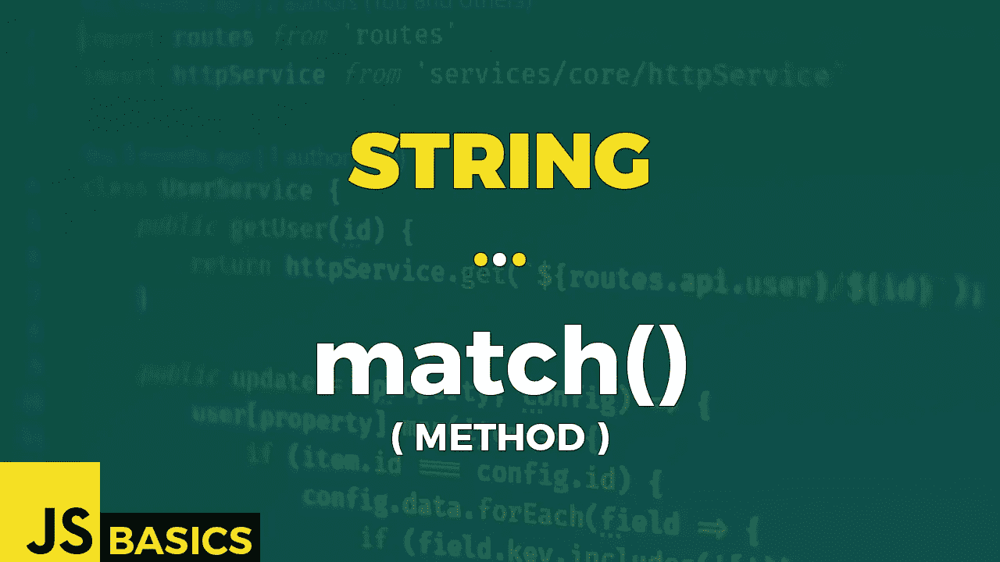

# Javascript 字符串匹配()的基础知识(方法)

> 原文：<https://medium.com/nerd-for-tech/basics-of-javascript-string-match-method-ce47295bfd97?source=collection_archive---------12----------------------->



这篇文章是我在 youtube 上免费发表的关于网络开发基础的系列文章的抄本。如果你更喜欢看而不是读，请随时访问我的频道“Dev Newbs”。

各位开发者朋友，你们好！我们今天要讲的方法并不令人愉快。这是一个可以使用的强大工具，但是您需要首先掌握正则表达式。这听起来不像是基本知识，你可能是对的。但是不要太担心。我将指导你完成基本的工作，所以如果你将来需要它，你只需要一点额外的谷歌搜索来覆盖你的特殊情况，就可以实现你需要的任何东西。说够了…让我们开始吧！

match()方法在字符串中搜索正则表达式的匹配项，并将匹配项作为数组对象返回。

如果正则表达式不包含“g”标志，我们将在索引 0 处获得数组对象的结果。产生的数组对象的格式与我们调用正则表达式上的方法 exec()传递引用的字符串的格式相同。数组对象包含额外的数据，如匹配第一次出现的索引、原始输入等。

如果我们使用“g”标志，得到的数组对象只包含匹配项，不包含任何其他内容。

好了，理论到此为止。让我们回到现实世界。或者…你知道…虚拟的那个。

```
let str = "The main bulk of rain will fall in SPAIN. That's our gain.";let regExp = /ain/;
let regExpG = /ain/g;
let regExpGI = /ain/gi;str.match(regExpG)                   // ["ain","ain","ain"]str.match(regExpGI)                  // ["ain","ain","AIN","ain"]str.match(regExp)                    
// [
//   "ain",
//   groups: undefined,
//   index: 5, 
//   input: "The main bulk of rain will fall in SPAIN. That's...",
//   length: 0
// ]regExp.exec(str)
// [
//   "ain",
//   groups: undefined,
//   index: 5, 
//   input: "The main bulk of rain will fall in SPAIN. That's...",
//   length: 0
// ](str.match(regExp))[0]                   // ain
```

第一种情况使用正则表达式搜索带有附加标志“g”的字符串“ain ”,该标志指定我们希望找到所有匹配。得到的数组包含 3 个匹配项。

第二种情况使用了一个额外的标志“I ”,告诉该方法它不关心大小写。由于这个事实，它在单词“西班牙”中找到了一个额外的出现。

最后一种情况显示了当我们不使用全局标志“g”时会发生什么。结果只是第一个匹配项，它存储在索引为 0 的结果数组对象的第一个位置。

使用正则表达式时，一个非常重要的特性是定义允许的字符集。如果我想找到任何大写字符，我可以显式地将它们写在方括号中，或者我可以使用破折号来指定一个序列，只提供序列的第一个和最后一个字符。

```
let str2 = "The quick brown fox jumps over the lazy dog. It barked.";let regExpUpper = /[A-Z]/g;
let regExpLower = /[a-z]/g;
let regExpOther = /[ .]/g;let regExpCapital = /[A-Z][a-z]*/g;str2.match(regExpUpper)               // ["T","I"]
str2.match(regExpUpper).length        // 2str2.match(regExpLower)               // ["h","e","q",...]
str2.match(regExpLower).length        // 41str2.match(regExpOther)               // [" ",...," ","."]
str2.match(regExpOther).length        // 12str2.match(regExpCapital)             // ["The","It"]
str2.match(regExpCapital).length      // 2
```

我想将字符串中的字符分成三组:大写、小写和剩余的字符。

最后有一个额外的正则表达式——假设我们想要获取所有以大写字母开头的单词。我们首先指定第一个字符应该来自一组大写字母，后面是零个或多个小写字母。第二个方括号后的星号表示这一点。仅此而已。

好了，继续。让我们玩特定类型的角色。数字是一个很好的选择，所以我们就用数字吧。我们可以有一份提及具体章节的文本，我们希望找到所有这些参考资料。让我们来看看如何做到这一点。

```
let str3 = "Chapter 2.7 This text contains references to chapter 4.2.1 & also to chapter 5";let regExp3 = /chapter \d+(\.\d)*/gi;str3.match(regExp3)   // ["Chapter 2.7","chapter 4.2.1","chapter 5"]
```

我们希望找到单词“chapter ”,后跟由数字组成的章节号，数字之间可能用点分隔。我们不关心单词“chapter”是以小写还是大写开头。我们想找到所有的事件。

第一步是指定“g”和“I”标志。然后我们指定单词“章”，空格，然后我们使用反斜杠和字母“d”来表示我们正在寻找一个数字。我们需要至少一个数字，所以我们添加了一个加号字符。现在，这一章可以只有一个数字，没有点，后面跟着一个子章节号。因此，我们目前掌握的信息涵盖了这些案例。然而，子章节数字后面可能有零个或更多的点，所以我们在后面加上带星号的括号来表示。在括号内，我们指定我们期望一个点。点是一个特殊的字符，表示任何字符的一部分，所以我们需要用反斜杠对它进行转义。然后我们用反斜杠加字符“d”来表示另一个数字。仅此而已。

感谢您坚持使用本系列，即使是在最后两种方法之后，这是迄今为止最具挑战性的方法。我希望你也学到了新的东西。

感谢您坚定不移的关注，我希望我们能在下一篇文章中再次见面。