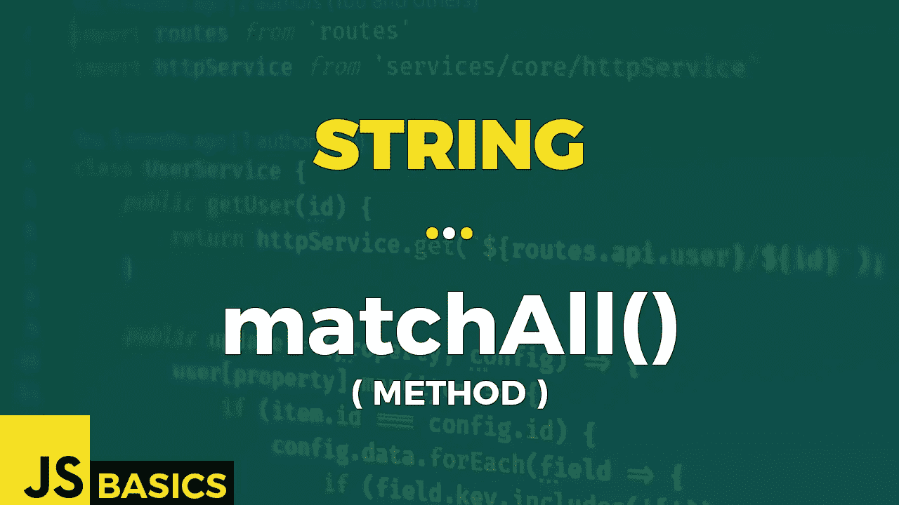

# Javascript String matchAll()的基础知识(方法)

> 原文：<https://medium.com/nerd-for-tech/basics-of-javascript-string-matchall-method-1dd7fdc90e21?source=collection_archive---------3----------------------->



这篇文章是我在 youtube 上免费发表的关于网络开发基础的系列文章的抄本。如果你更喜欢看而不是读，请随时访问我的频道“Dev Newbs”。

matchAll()方法返回所有匹配正则表达式字符串的结果的迭代器，包括捕获组。

我们需要提供一个正则表达式来查找匹配，作为该方法的强制参数。这必须有一个全局标志“g”，否则我们会抛出一个 TypeError。

matchAll()方法的结果是找到的匹配项的迭代器。

每个匹配都表示为一个数组。数组中的第一个值是一个匹配的字符串，然后是零个、一个或多个表示每个捕获组的项，后面是表示找到的匹配项的起始位置的额外属性索引和表示用于查找匹配项的字符串的额外属性输入。

唷，真了不起。好的，让我们确定在第一个例子中没有那么难。

```
let str = "The main bulk of rain will fall in SPAIN. That's our gain.";let regExp = /(a)i(n)/;
let regExpG = /(a)i(n)/g;
let regExpGI = /(a)i(n)/gi;
try {
    console.log(...str.matchAll(regExp));
}
catch(err){
    console.log(err);
}// TypeError: String.prototype.matchAll called with a non-global 
// RegExp argument at String.matchAllconsole.log(...str.matchAll(regExpG));// outputs 3 arrays containing matches 3x "ain"console.log(...str.matchAll(regExpGI));// outputs 4 arrays containing matches 3x "ain" + 1x "AIN"
```

我优雅地借用了前一个方法的示例输入，因此您可以看到两个姐妹方法的行为差异。

一个区别是我们必须使用全球国旗。否则，我们会看到第一种情况——我们会看到 TypeError 通知我们这种确切的情况。

第二个区别是我们得到的不是一个数组，而是一个可迭代的对象。不用担心——我们使用 spread 语法将它转换成一个数组，这样就万事大吉了。

第三个区别是每场比赛的内容。正如本文理论部分所述，我们不仅可以获得匹配的字符串，还可以获得捕获的组、索引和输入属性。

我使用括号在正则表达式中制造了一些捕获组。捕获的组只不过是括号中的任何表达式。

除此之外，我们的结果基本相同。由于有“I”标志，第一组结果区分大小写，而另一组不区分大小写。继续前进。

我在理论部分没有提到，但是作为匹配结果的迭代器是不可重启的。这意味着一旦我们遍历了所有的匹配，我们就不能再使用这个结果了。我知道，这听起来很奇怪，所以让我们在示例 2 中检查一下。

```
let str2 = "The quick brown fox jumps over the lazy dog. It barked.";let regExpCapital = /[A-Z][a-z]*/g;// "FOR..OF with ITERATOR (NON-RESTARTABLE)"
let foundMatches = str2.matchAll(regExpCapital);for (const match of foundMatches) {
    console.log(match);
}
// this iteration returns 2 arrays for matches "The" & "It"for (const match of foundMatches) {
    console.log(match);
}
// this iteration doesn't return anything - iterator exhausted// "FOR..OF with ARRAY created by SPREAD OPERATOR (RESTARTABLE)"
let foundMatchesArray = [...str2.matchAll(regExpCapital)];for (const match of foundMatchesArray) {
    console.log(match);
}
// this iteration returns 2 arrays for matches "The" & "It"for (const match of foundMatchesArray) {
    console.log(match);
}
// this iteration also returns 2 arrays for matches "The" & "It"console.log("OUTPUT NEW MATCHALL RESULT EACH TIME");
console.log(...str2.matchAll(regExpCapital));
// this iteration returns 2 arrays for matches "The" & "It"console.log(...str2.matchAll(regExpCapital));
// this iteration also returns 2 arrays for matches "The" & "It"
```

我们有正则表达式来查找所有以大写字母开头的单词。在第一种情况下，我们将 matchall()的结果赋给变量“foundMatches”。我们尝试使用“for”对其进行迭代..“循环的。第一次一切正常。但是第二次——我们什么也没得到。因为没有什么可迭代的。保存在变量中的迭代器是不可重启的。

幸运的是，还有第二种情况，首先使用 spread 语法将迭代器转换成数组。众所周知，数组的迭代器是可重启的，我们可以任意多次循环遍历数组。

另一种选择是第三种情况，我们根据需要多次执行该方法，并且总是输出结果。

我想展示的最后一点是，当使用 matchAll()方法时，您总是可以访问附加属性，如“索引”和捕获的组。因为有时我们需要的不仅仅是实际的比赛。但是，当与全局标志一起使用时，这就是 match()所能提供全部内容。但这对我们来说可能还不够。我们可能需要一些额外的信息。那么接下来该怎么办呢？让我们在最后一个例子中找出答案。

```
let str3 = "Chapter 2.7 This text contains references to chapter 4.2.1 & also to chapter 5";let regExp3 = /chapter \d+(\.\d)*/gi;console.log("MATCH()");
console.log(str3.match(regExp3));
// return 1 array with 3 found matches (no added data of matches)console.log("MATCHALL()");
console.log(...str3.matchAll(regExp3));
// returns 3 arrays with additional details about matchesconsole.log("EASY ACCESS TO ADDITIONAL INFORMATION");
let matches = str3.matchAll(regExp3);for (const match of matches) {
    console.log('MATCH: ' + match[0]);
    console.log('START: ' + match.index);
    console.log('  END: ' + (match.index + match[0].length));
}// MATCH: Chapter 2.7
// START: 0
// END:   11
//
// MATCH: chapter 4.2.1
// START: 45
// END:   58
//
// MATCH: chapter 5
// START: 69
// END:   78
```

如果我们想在不使用 matchAll()方法的情况下访问附加信息，我们就必须使用 exec()方法。然后，我们必须使用“while”循环迭代结果。这绝对是一个不太舒服的解决方案。

好了，matchAll()到此结束。当然，我们可以涵盖更多的用例，但我相信我们至少解释了重要的部分。当你遇到具体的事情时，你必须用谷歌搜索，但至少现在，你会对正在发生的事情有所了解。

一如既往——非常感谢您的关注，我们将在下一篇文章中再见。