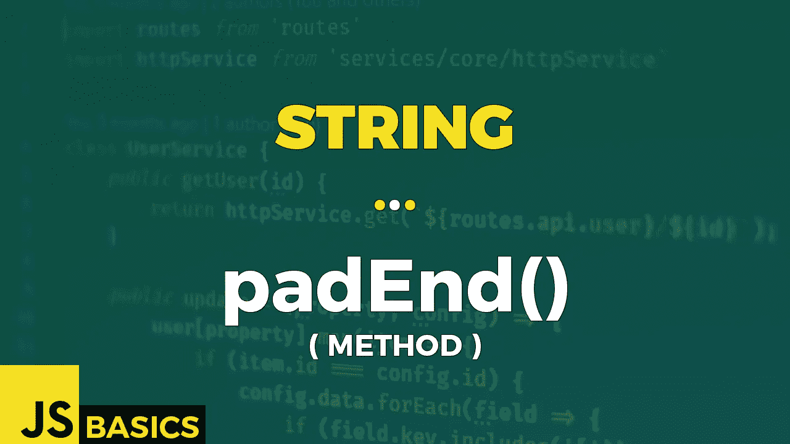

# Javascript 字符串 padEnd()的基础知识(方法)

> 原文：<https://medium.com/nerd-for-tech/basics-of-javascript-string-padend-method-d6b527dbc4c3?source=collection_archive---------21----------------------->



这篇文章是我在 youtube 上免费发表的关于网络开发基础的系列文章的抄本。如果你更喜欢看而不是读，请随时访问我的频道“Dev Newbs”。

向所有忠诚的开发新手问好！我们身后有一些艰难的方法，现在是时候放松一下了，用一些简单明了的好方法为我们的字符串腾出空间。认识 padEnd()。

padEnd()方法用给定的字符串填充当前字符串，直到结果字符串达到目标长度。对于此方法，填充应用于当前字符串的末尾。

我们需要提供一个强制参数，它是最终填充字符串的目标长度。第二个参数是可选的，它指定应该用于填充的字符串。

让我们看看这个方法的一些基本例子。

```
// no optional parameter
'"' + 'ABC'.padEnd(10) + '"'                       // "ABC       "// current length >= target length
'"' + 'ABCDEFGHIJ'.padEnd(5) + '"'                 // "ABCDEFGHIJ"// padding keeps repeating in loop until target length is achieved
'"' + 'ABCDE'.padEnd(10, "abc") + '"'              // "ABCDEabcab"// padding stops once target length is achieved
'"' + 'ABCDEF'.padEnd(10, "abcdef") + '"'          // "ABCDEFabcd"// default padding sequence is one empty space character (" ")
'"' + 'ABCDEF'.padEnd(10, " ") + '"'               // "ABCDEF    "
'"' + 'ABCDEF'.padEnd(10) + '"'                    // "ABCDEF    "
```

如果目标长度小于或等于当前长度，则不应用填充，字符串保持不变。

填充过程是在一个循环中一次一个字符地完成的。一旦我们应用了填充字符串的最后一个字符，并且字符串的当前长度小于目标字符串，我们就从填充字符串的第一个字符开始重复填充，依此类推。

另一方面，如果我们在使用填充字符串的每个字符之前就达到了目标长度，那么填充过程就会立即结束。

如果没有提供其他字符串序列，填充字符串的默认值是空白。

好吧，目前没有突破性进展。但是和往常一样，通过引入占用多个代码单元空间的字符，我们可以使我们的生活变得更加悲惨。

```
let emoji = "🙂";"Length: " + emoji.length                          // Length: 2// padding with characters that require two code units
'"' + 'ABCDE'.padEnd(9, '🙂') + '"'                // "ABCDE🙂🙂"
'"' + 'ABCDE'.padEnd(10, '🙂') + '"'               // "ABCDE🙂🙂�"// padding with unicode values
'"' + 'ABCDE'.padEnd(9, '\ud83d\ude42') + '"'      // "ABCDE🙂🙂"
'"' + 'ABCDE'.padEnd(10, '\ud83d\ude42') + '"'     // "ABCDE🙂🙂�"
```

代码长度为 2 的表情符号笑脸就这样消失了。

只要填充符符合两个代码单元值，一切都是好的。但是一旦我们只填充了一个代码单元，就会出现一个未知字符。

我们可以直接用表情符号来尝试，或者我们可以为每个代码单元使用 unicode 值。结果是一样的。那太糟糕了，但不幸的是我们对此无能为力。因为技术上来说，弦没有问题。是的，它很难看，我们无法读取最后一个字符，但除此之外，它是一个完全有效的字符串序列。

所以，你知道，如果没有必要，就不要填充两个代码单元字符..好吗？

这篇文章比通常的要短一点，因为没有太多的内容。不管怎样，谢谢你的关注。下一集再见。