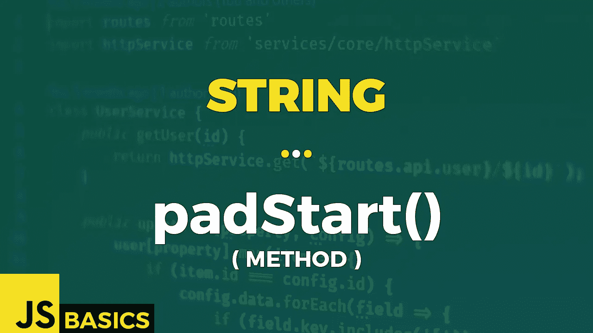

# Javascript 字符串 padStart()的基础知识(方法)

> 原文：<https://medium.com/nerd-for-tech/basics-of-javascript-string-padstart-method-f7646d8ac674?source=collection_archive---------13----------------------->



这篇文章是我在 youtube 上免费发表的关于网络开发基础的系列文章的抄本。如果你更喜欢看而不是读，请随时访问我的频道“Dev Newbs”。

向所有的新手朋友问好！另一个懒鬼方法在我们前面，今天它将是 padStart()。让我们开始吃吧，这样我们就可以去吃冰淇淋什么的了。

padStart()方法用给定的字符串填充当前字符串，直到结果字符串达到目标长度。在此方法的情况下，从当前字符串的开头应用填充。

我们需要提供一个强制参数，它是最终填充字符串的目标长度。第二个参数是可选的，它指定应该用于填充的字符串。

让我们看看这个方法的一些基本例子。

```
// no optional parameter
'"' + 'ABC'.padStart(10) + '"'                    // "       ABC"// current length >= target length
'"' + 'ABCDEFGHIJ'.padStart(5) + '"'              // "ABCDEFGHIJ"// padding keeps repeating in loop until target length is achieved
'"' + 'ABCDE'.padStart(10, "abc") + '"'           // "abcabABCDE"// padding stops once target length is achieved
'"' + 'ABCDEF'.padStart(10, "abcdef") + '"'       // "abcdABCDEF"// default padding sequence is one empty space character (" ")
'"' + 'ABCDEF'.padStart(10, " ") + '"'            // "    ABCDEF"
'"' + 'ABCDEF'.padStart(10) + '"'                 // "    ABCDEF"
```

如果目标长度小于或等于当前长度，则不应用填充，字符串保持不变。

填充过程是在一个循环中一次一个字符地完成的。一旦我们应用了填充字符串中的最后一个字符，并且字符串的当前长度小于目标字符串，我们就继续从填充字符串的第一个字符开始填充，依此类推。

另一方面，如果我们在使用填充字符串的每个字符之前就达到了目标长度，那么填充过程就会立即结束。

如果没有提供其他字符串序列，填充字符串的默认值是空白。

好吧，还是没有突破。但一如既往，我们可以让自己的生活更痛苦。为什么不这样做，对不对？让我们把两个代码单元字符弄乱。

```
let emoji = "🙂";"Length: " + emoji.length                          // Length: 2// padding with characters that require two code units
'"' + 'ABCDE'.padStart(9, '🙂') + '"'              // "🙂🙂ABCDE"
'"' + 'ABCDE'.padStart(10, '🙂') + '"'             // "🙂🙂�ABCDE"// padding with unicode values
'"' + 'ABCDE'.padStart(9, '\ud83d\ude42') + '"'    // "🙂🙂ABCDE"
'"' + 'ABCDE'.padStart(10, '\ud83d\ude42') + '"'   // "🙂🙂�ABCDE"
```

这里躺着我们忠诚的笑脸，代码单元长度为 2。

只要填充符符合两个代码单元值，一切都是好的。但是一旦我们只填充了一个代码单元，就会出现一个未知字符。

我们可以直接用表情符号来尝试，或者我们可以为每个代码单元使用 unicode 值。结果是一样的。同样，我们也无能为力，因为这是一个有效的字符串序列。

所以我应该再次强调不要使用那些讨厌的两个代码单元字符作为填充。如果你真的想展示它们。如果没有，请自便，无论如何。

和上一篇一样，这篇文章也是重点和简短的。没什么好说的。不过，还是谢谢你的关注。一如既往——下一篇文章再见。