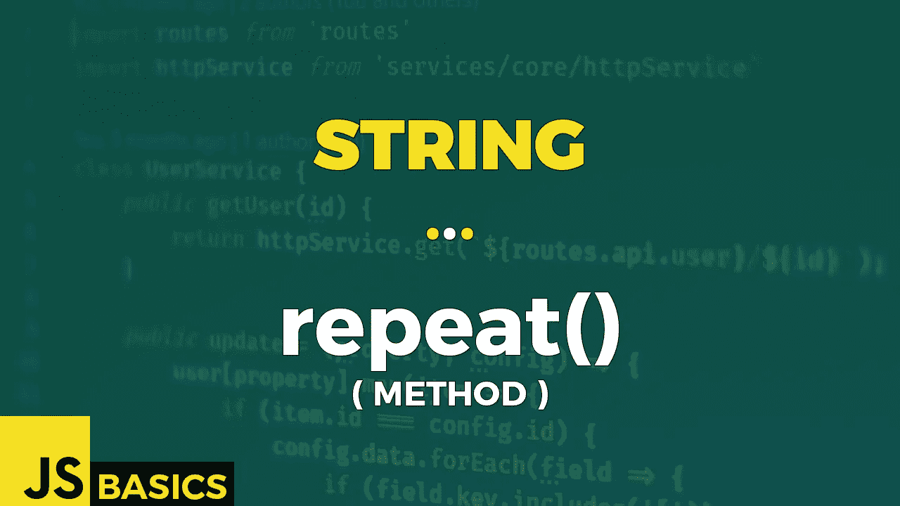

# Javascript 字符串重复()的基础知识(方法)

> 原文：<https://medium.com/nerd-for-tech/basics-of-javascript-string-repeat-method-8f225ebe0b3c?source=collection_archive---------30----------------------->



这篇文章是我在 youtube 上免费发表的关于网络开发基础的系列文章的抄本。如果你更喜欢看而不是读，请随时访问我的频道“Dev Newbs”。

你好，我的新手伙伴们。Jacob 在这里用另一个字符串方法。今天的方法是简单的方法之一。我喜欢这些简单的方法，因为你可以直接使用它们。没有诡计，没有陷阱。当然，除非你明确地在找他们，而我们当然在找。所以让我们开始吧。

repeat()方法返回一个新字符串，该字符串包含调用它的字符串的指定数量的副本，这些副本连接在一起。

唯一需要的参数是一个正整数值，指定我们希望给定的字符串重复多少次。

我们得到的结果是一个创建的字符串或 RangeError，以防重复计数为负或导致结果字符串溢出最大字符串大小。

让我们看看第一个例子中的基本用法。

```
"Repeat (0):   '" + "Ab ".repeat(0) + "'"       // empty string
"Repeat (1):   '" + "Ab ".repeat(1) + "'"       // 'Ab '
"Repeat (2):   '" + "Ab ".repeat(2) + "'"       // 'Ab Ab '
"Repeat (5.2): '" + "Ab ".repeat(5.2) + "'"     // 'Ab Ab Ab Ab Ab '   
"true:         '" + "Ab ".repeat(true) + "'"    // 'Ab '
"empty param:  '" + "Ab ".repeat() + "'"        // 'Ab '
"false:        '" + "Ab ".repeat(false) + "'"       // empty string
"null:         '" + "Ab ".repeat(null) + "'"        // empty string
"undefined:    '" + "Ab ".repeat(undefined) + "'"   // empty string
"NaN:          '" + "Ab ".repeat(NaN) + "'"         // empty string
```

基本用法示例显示了当我们提供整数或可被解释为一的值时，该方法的行为。整数值 0、1 和 2 得到的正是我们所期望的。浮点值更有趣。小数点后的部分被有效地截断，我们只处理整数值。到目前为止，该方法的行为与我们预期的一样。

如果我们提供一个布尔值 true，我们把它解释为 1。False 被转换为零，任何其他值或特殊常量如“null”、“undefined”或“NaN”也是如此。另一个要提到的情况是，如果我们不提供任何值，那么默认值为零。规范中没有提到，所以有可能这只是 Chrome 浏览器内部的一种实现方式。所以请记住这一点。

好了，让我们来试试用 RangeError 耍些花招。

```
try { 
    console.log("Ab ".repeat(-1)); 
}
catch(err){ 
    console.log(err); 
}// RangeError: Invalid count value at String.repeat (<anonymous>)try { 
    console.log("Ab ".repeat(3/0));
}
catch(err){ 
    console.log(err); 
}// RangeError: Invalid count value at String.repeat (<anonymous>)try { 
    let As = "A".repeat(536870889);
}
catch(err){ 
    console.log(err); 
}// RangeError: Invalid string length at String.repeat (<anonymous>)
```

RangeError 是仅在少数情况下引发的错误。第一个是负值。我们已经在第一段代码中介绍过了。第二种情况是如果我们提供一个等于或大于正无穷大的值。猜猜如果你把正值除以零会得到什么？答对了。这是第二组代码。

第三个是如果我们创建一个比最大可用字符串长度更长的字符串。这个数字实际上在不同的浏览器中可能是不同的，并且也可能受到计算机可用资源的限制。但是我会在后面的第三个例子中回到这个问题。现在，只要把它当成是真的。第三个块代码中的值正好比最大可用字符串长度大 1，因此它抛出 RangeError。

现在回到最大长度。您不能通过简单地访问某个常量或内置方法来获得可用的最大字符串长度，这是一个遗憾。幸运的是，互联网上的聪明人几乎可以帮助做任何事情，所以这里是我无耻地复制的堆栈溢出代码。大声喊出来的代码用户名杰克格里芬的作者。这是获取浏览器中字符串变量最大长度的代码。

```
// stack overflow // question: 13697500 // author: Jack Giffin
for (var startPow2 = 1; startPow2 < 9007199254740992; startPow2 *= 2)
    try {" ".repeat(startPow2);} catch(e) {
        break;
    }var floor = Math.floor, mask = floor(startPow2 / 2);
while (startPow2 = floor(startPow2 / 2))
    try {
        " ".repeat(mask + startPow2);
        mask += startPow2;              // the previous statement succeeded
    } catch(e) {}console.log("The max string length for this browser is " + mask);// The max string length for this browser is 536870888
```

今天到此为止。我们了解到，并不是所有的字符串方法都像其他方法一样糟糕。这是一个很好的例子。

一如既往地感谢您的关注，我将在明天的下一篇文章中与您见面。