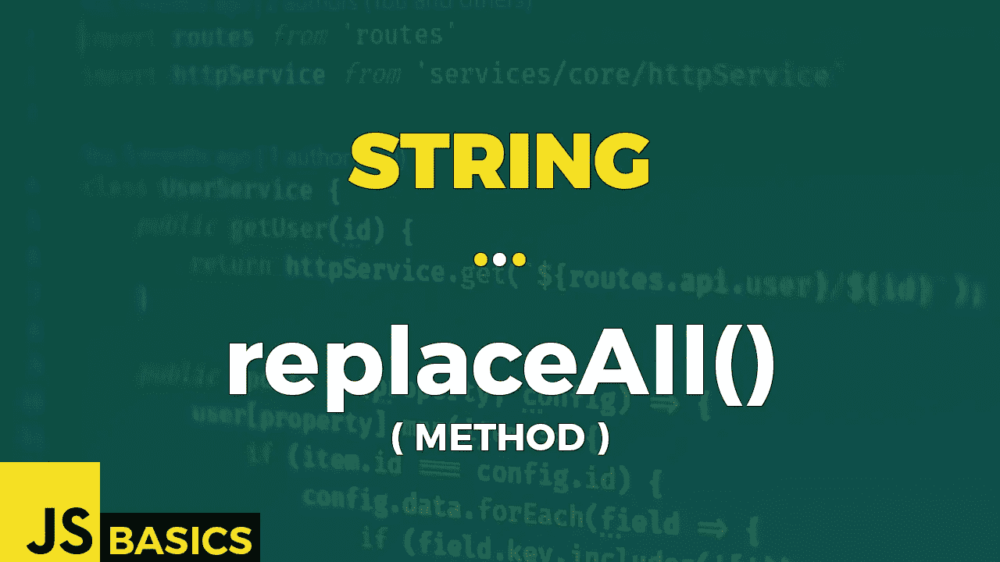

# Javascript String replaceAll()的基础知识(方法)

> 原文：<https://medium.com/nerd-for-tech/basics-of-javascript-string-replaceall-method-e53b0ce22a92?source=collection_archive---------20----------------------->



这篇文章是我在 youtube 上免费发表的关于网络开发基础的系列文章的抄本。如果你更喜欢看而不是读，请随时访问我的频道“Dev Newbs”。

你好，我的新手伙伴们！今天，我们将有一个小小的德雅武。我们要讲的是 replaceAll()方法，和 replace()方法几乎完全一样。当然也有一些例外。你会在今天的节目中发现这些。

replaceAll()方法返回一个新字符串，其中所有匹配的模式都被替换。模式是第一个参数，它可以是正则表达式或简单的字符串值。替换是第二个参数，它可以是一个简单的字符串值，也可以是为每个匹配调用的函数。如果正则表达式不包含全局标志，将引发 TypeError。

我们将重复上一篇文章中的第一个例子，来强调两个姐妹方法之间微妙但重要的区别。

```
const str = "The blue sweater itches. I'll wear a red t-shirt and a blue jeans.";let regExp = /blue/g;// PATTERN:     string
// REPLACEMENT: string
console.log("S  -> S  : " + str.replaceAll("blue", "green"));// OUTPUT:
// S  -> S  : The green sweater itches. I'll wear a red t-shirt and // a green jeans.// PATTERN:     RexExp
// REPLACEMENT: string
console.log("RE -> S  : " + str.replaceAll(regExp, "green"));// OUTPUT:
// RE -> S  : The green sweater itches. I'll wear a red t-shirt and // a green jeans.// PATTERN:     string
// REPLACEMENT: function
console.log
(
    "S  -> fn : " +
    str.replaceAll
    (
        "blue", 
        (x) => {
            return x.toUpperCase()
        }
    )
);// OUTPUT:
// S  -> fn : The BLUE sweater itches. I'll wear a red t-shirt and a // BLUE jeans.// PATTERN:     RexExp
// REPLACEMENT: function
console.log
(
    "RE -> fn : " +
    str.replaceAll(
        regExp, 
        function (x) 
        {
            return x.toUpperCase()
        }
    )
);// OUTPUT:
// RE -> fn : The BLUE sweater itches. I'll wear a red t-shirt and a // BLUE jeans.
```

“模式”和“替换”类型的值也有四种可用的组合。

在第一个例子中，我们寻找一个字符串“blue ”,并用字符串“green”替换它。找到的所有匹配项都将被替换。这是迄今为止这两种方法之间最重要的区别。

第二种情况是使用正则表达式找到一个匹配项，用简单的字符串值“green”替换。因为我们在正则表达式中使用了全局标志，所以我们将替换所有的匹配，而不仅仅是第一个。

第三种情况是一个简单的字符串“blue”被一个函数替换。我们的函数将任何匹配转换为所有大写字符。我们使用一个简单的字符串作为模式没有关系，所有的匹配都会被替换。

最后一种情况——第四种情况——是正则表达式匹配被函数替换。我们将用大写版本替换小写版本。

如果忘记将全局标志添加到正则表达式中，就会出现 TypeError。

```
try {
    let re = /(\w+)\s(\w+)/;
    let fullName = 'John Smith';
    let newstr = fullName.replaceAll(re, '$2, $1');
    console.log(newstr);  // Smith, John
}
catch(err){
    console.log(err);
}// OUTPUT:
// TypeError: String.prototype.replaceAll called with a non-global // RegExp argument at String.replaceAll (<anonymous>)try {
    let re = /(\w+)\s(\w+)/g;
    let fullName = 'John Smith';
    let newstr = fullName.replaceAll(re, '$2, $1');
    console.log(newstr);  // Smith, John
}
catch(err){
    console.log(err);
}// OUTPUT:
// Smith, John
```

TypeError 通知我们需要提供全局 RegExp。我们通过在表达式的末尾加上“g”来做一个。简单。现在成功了。

当您提供一个字符串作为参数时，您可以使用一些技巧。下面是例子 3 中的一些例子。

```
let myList = 'John Adam Peter Herb';// $$ -> inserts "$"
myList.replaceAll("Peter", '$$') // OUTPUT:
// John Adam $ Herb// $& -> inserts "matched substring"
myList.replaceAll("Peter", '$& $& $&') // OUTPUT:
// John Adam Peter Peter Peter Herb// $` -> inserts "the portion of the string that precedes the matched substring"
myList.replaceAll("Peter ", '$`')// OUTPUT:
// John Adam John Adam Herb// $' -> inserts "the portion of the string that follows the matched substring"
myList.replaceAll(" Peter", "$'")// OUTPUT:
// John Adam Herb Herb
```

您可以通过键入两次来输出“$”符号。或者可以多次插入匹配的字符串进行替换。如果这就是你所需要的，那么“$&”就是最好的选择。有时您希望子字符串位于匹配字符串的前面。在这种情况下，您可以使用“$ ` ”,这就是您得到的结果。或者，您可能希望在匹配的字符串后面有一个子字符串。在这种情况下，您可以使用“$ ”,这样就万事俱备了。我不完全确定你能以任何方式使用它，但至少现在你知道你能做到。耶！

最后一个例子将展示当您使用函数作为替换参数时可以使用的一些技巧。

```
let myBiggerList = 'John Adam Peter Herb Paul Marty';
let rgEx = /(P)([a-z]+)/gi;myBiggerList.replaceAll
(
    rgEx, 
    function
    (
        match, 
        p1, 
        p2, 
        offset, 
        str
    )
    {
        console.log(match);
        console.log(p1);
        console.log(p2);
        console.log(offset);
        console.log(str);
        console.log("");
    }
);// OUTPUT:
// Peter
// P
// eter
// 10
// John Adam Peter Herb Paul Marty
// 
// Paul
// P
// aul
// 21
// John Adam Peter Herb Paul Marty
```

基于您使用的模式，您可以获得一组替换函数可用的参数。第一个总是匹配的字符串，后面是不同数量的捕获组的匹配。然后你得到一个偏移量，它基本上是匹配开始处的一个索引值。最后你得到了原始字符串。

您不需要使用所有的参数，但是您需要记住，无论您实际上给它们起什么名字，它们都将按照这个顺序提供给您的函数。

和前面的方法一样，这真的很有趣。但不管怎样，我们已经走到了尽头。感谢您的关注，和往常一样，我们下次再见。