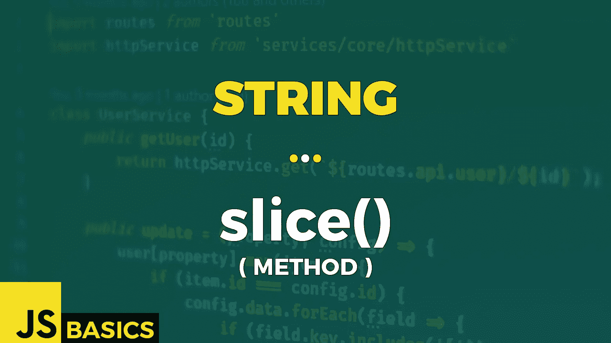

# Javascript String slice()的基础知识(方法)

> 原文：<https://medium.com/nerd-for-tech/basics-of-javascript-string-slice-method-79076eb1bac0?source=collection_archive---------14----------------------->



这篇文章是我在 youtube 上免费发表的关于网络开发基础的系列文章的抄本。如果你更喜欢看而不是读，请随时访问我的频道“Dev Newbs”。

大家好，欢迎回到下一集，我的开发者伙伴们！我们今天要切片切丁。今天的方法是 slice()，不要被误认为是另一个 slice()方法。哈哈！就像任何人都可以混淆他们，对不对？

slice()方法提取字符串的一部分，并在新字符串中返回提取的部分。第一个参数是必需的，指定提取发生的起始位置。第二个参数是可选的，指定提取结束的位置，但不包括该位置。如果我们省略这个参数，分片的子串从开始位置到字符串的结尾。

Pro 给你的提示是，你其实可以用一个负数从字符串的末尾进行选择。当您为开始位置或结束位置指定负数时，计数从结束位置开始。

让我们看看第一个例子中所有的大惊小怪是什么。

```
const str = "Hello Dev Newbs!";// length of the string
"Length: " + str.length                          // Length: 16// getting the whole string
str.slice()                                      // Hello Dev Newbs!// start slice at position 6 (7th character)
str.slice(6)                                     // Dev Newbs!// using negative start position 
// length + negative value = position
// 16 - 10 = 6 -> start slice at 
// position 6 (7th character)
str.slice(-10)                                   // Dev Newbs!// start slice at position 10 (11th character) 
// & end at position 14 (15th character)
str.slice(10, 15)                                // Newbs// using negative positions
// 16 - 6 = 10 -> start slice at 
// position 10 (11th character)
// 16 - 1 = 15 -> end slice at 
// position 15 (16th character)
str.slice(-6, -1)                                // Newbs
```

我们首先得到将要处理的字符串的长度。它有 16 个字符长。这个信息对后面的负面头寸很重要。

第一种情况是基本用法。如果我们没有指定任何内容，则使用整个字符串。这不是很有用，因为我们只想分割字符串的一部分，对吗？让我们修理它。

第二种情况从索引 6 开始，这意味着分片子串中的第一个字符是第 7 个字符。我们没有指定结束位置，所以我们采取了所有的休息，直到结束。

下一个例子是相同的结果，只是这一次，我们对起始位置使用了负值。你可以通过在字符串长度上加一个负值来计算出你得到的索引。

最后两种情况又是一样的。它们都获得相同的切片，只有第一个使用正索引作为开始和结束。第二种使用负值。然而，结果是一样的。

我想就这样了。我没什么可以给你看的了。我们可能会在输入中尝试一些愚蠢的参数。我们可以看到我们得到了什么。但就是这样！

```
// using boolean instead of integer -> start = 0, end = 1 
str.slice(false, true)                               // H// start index bigger than end -> nothing to slice
str.slice(6, 0)                                      // empty string// math equation as parameters -> start = 6, end = 15 
str.slice((4*true+true+15/3), Math.floor(11.4)+29/7) // Newbs// using global constants as zero value
str.slice(undefined, 5)                              // Hello
```

与其他方法一样，非整数值可以转换为整数值。第一种情况下的布尔值就是这样，它分割字符串的第一个字母。

如果我们试图用大于结束位置的起始位置切片，我们什么也得不到。这是显而易见的，但无论如何，在示例中看到它还是很好的…你知道，为了确认。

我们也可以使用任何类型的方程，而不是直接提供整数值。只要结果可以解释为整数，你就没问题。

最后，像 undefined 或 null 这样的常量也可以解释为零。我不推荐这样使用它们，但是如果有一些罕见的情况，你被迫这样做，这是可行的。

就这样，我们完成了这个方法。这是一个非常愉快的周末。

像往常一样，感谢您的关注，我会很快见到你。