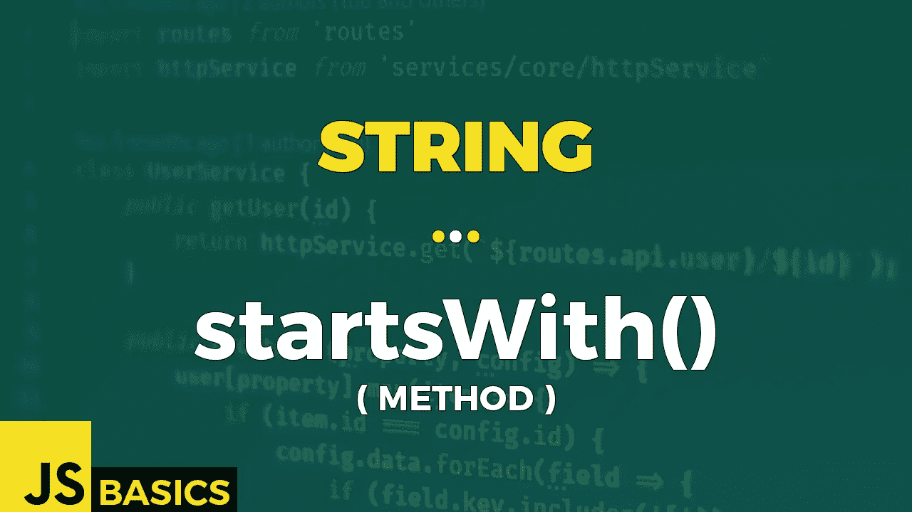

# Javascript 字符串 startsWith()的基础知识(方法)

> 原文：<https://medium.com/nerd-for-tech/basics-of-javascript-string-startswith-method-1a045dc35979?source=collection_archive---------9----------------------->



这篇文章是我在 youtube 上免费发表的关于网络开发基础的系列文章的抄本。如果你更喜欢看而不是读，请随时访问我的频道“Dev Newbs”。

你好，我的新手伙伴们！这将是你可能称之为“直截了当”的方法之一。你需要找出你的字符串是否以某种方式开始吗？那就别再找了。StartsWith()方法来了！

startsWith()方法确定提供的字符串是否以指定字符串的字符开头。如果字符串以字符开头，该方法返回 true，否则返回 false。当然，该方法是区分大小写的。

该方法有两个参数。First 是必需的，它指定要在起始位置搜索的字符。

第二个参数是可选的，默认情况下等于零。它指定开始搜索第一个参数值的起始位置。

说够了。我们编码吧。这是第一个例子。

```
const str = "Hello Dev Newbs! 😃";// starts with "Hello"
str.startsWith("Hello")                 // true// starts with "hello"
str.startsWith("hello")                 // false// starts with "Dev" - start searching at index 6
str.startsWith("Dev", 6)                // true
```

正如我之前提到的，这是一个非常简单的方法。所以不要指望任何严重的打击。我们需要考虑区分大小写，并且我们可以从不同的位置开始搜索，而不是从字符串的开头开始。

唯一具有挑战性的方面是要记住不是所有的字符都是由一个代码单元组成的。此方法适用于代码单元，而不是代码点。记住这一点，让我们看看第二个例子中的行为。

```
const emotions = "😃😁😆😅🥰...so many emotions, man...😱😵🤐🤬😭😤";// takes positions at index 0 & 1
emotions.startsWith("😃", 0)˛                    // true// "😃" consists of \uD83D (index 0) + \uDE03 (index 1)
emotions.startsWith("\uD83D", 1)                 // false
emotions.startsWith("\uDE03", 1)                 // true// takes positions at index 8 & 9
emotions.startsWith("🥰", 8)                     // true// starts at position 10
emotions.startsWith("...so many emotions", 10)   // true// takes positions at index 37 & 38
emotions.startsWith("😱", 37)                    // true// "😱" is equal to \uD83D + \uDE31
emotions.startsWith("\uD83D\uDE31", 37)          // true
```

正如我们在第一个案例中看到的，我们可以使用由多个代码单元组成的字符进行检查，没有任何问题。我们只需要指定正确的位置。

第二种情况表明，我们可以在第一个参数中使用 unicode 值，只要我们指定正确的位置，就可以很好地工作。我们检查了表情符号的第二个代码单元，所以我们需要从那个位置开始比较。一旦我们做到了，结果就是真的。

下一个案例是同样的事情，只是用蓝色。但有趣的是，在最后一种情况下，我们使用 unicode 值来指定整个表情符号。这当然行得通，结果也是真的。如果我们比较的字符串是使用 unicode 值创建的，并且我们使用表情符号作为第一个参数，结果将是相同的。对于 Javascript 来说，unicode 值和图形表示是一样的，所以我们使用哪一个并不重要。只要有匹配，我们就得到真实的结果。

好吧，这就是我们的好人方法开始于()。不太冒险，但是可靠，并且总是在那里供我们使用。

像往常一样，非常感谢您的关注。我将带着下一个方法很快见到你。