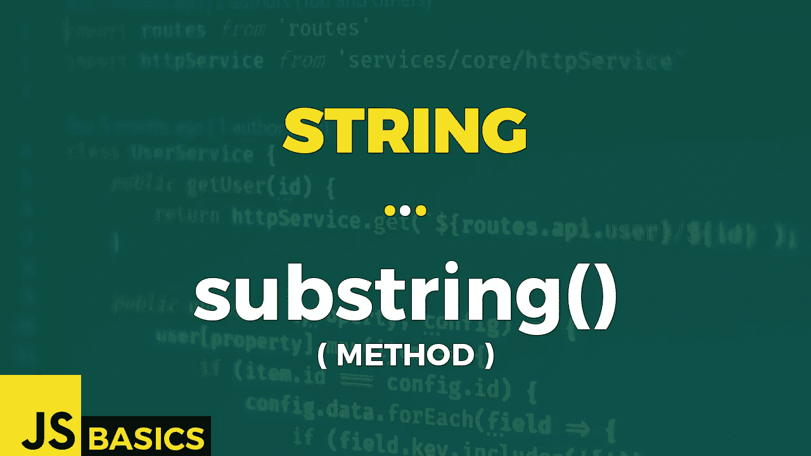

# Javascript 字符串 substring()的基础知识(方法)

> 原文：<https://medium.com/nerd-for-tech/basics-of-javascript-string-substring-method-1083c3d918e2?source=collection_archive---------13----------------------->



这篇文章是我在 youtube 上免费发表的关于网络开发基础的系列文章的抄本。如果你更喜欢看而不是读，请随时访问我的频道“Dev Newbs”。

向所有忠诚的开发新手问好！我将向你介绍一个字符串对象的新方法。但是它有一个陷阱。它几乎与另外两种已经存在的方法相同。我们已经谈过一个了。另一部不会有自己的剧集，因为它已经过时了。今天令人兴奋的事情在等着我们。准备好。

我们今天的方法是 substring()方法。此方法从两个指定索引之间的字符串中提取字符，并返回新的子字符串。

该方法有两个参数。第一个参数是必需的。这是提取开始的位置。第二个参数是可选的，指定结束提取的位置(直到，但不包括)。如果省略，则提取字符串的其余部分。

听起来很熟悉？应该是，因为到目前为止，这个定义 100%适合方法片()。好吧，那么到底区别在哪里呢？首先，当开始位置大于结束位置时，这个方法会交换两个参数。另一个区别是，如果开始或结束位置小于 0，它会自动默认为 0 值。

我将向您展示这些差异，但首先让我们来看看示例 1 中的基本用法。

```
const str = "Hello Dev Newbs!";// length of the string
"Length: " + str.length                    // Length: 16// getting the whole string
str.substring()                            // Hello Dev Newbs!
str.slice()                                // Hello Dev Newbs!// start extraction at position 6
str.substring(6)                           // Dev Newbs!
str.slice(6)                               // Dev Newbs!// start extraction at position 10 & end at position 14
str.substring(10, 15)                      // Newbs
str.slice(10, 15)                          // Newbs
```

slice()方法和 substring()方法之间的所有基本用法都是相同的。我将在第二个例子中向你展示它们之间的区别。

```
// start position is greater than end position
// swaps the two parameters
str.substring(9, 6)                           // Dev
// returns empty string
str.slice(9, 6)                               // empty string// negative value as position 
// defaults to value 0 for both parameters
str.substring(-6, -1)                         // empty string
// counts backwards from the end
str.slice(-6, -1)                             // Newbs // negative position & swapping at the same time
// change -1 -> 0 & swap (6,0) -> (0,6)
str.substring(6, -1)                          // Hello
// starts at 6 and ends at 15 (16 - 1)
str.slice(6, -1)                              // Dev Newbs
```

第一个不匹配是开始位置大于结束位置。对于 substring()方法，两个参数以这种方式交换和使用。没问题。对于 slice()方法，这意味着一个空结果。

另一个例子是使用负值。您可能会遇到不同的情况，但我将介绍两种最常见的情况。如果两个参数都是负的，那么 substring()方法会得到一个空字符串，因为两个值都默认为零。对于 slice()方法来说，这不是问题，它使用负值时不会出现问题。

最后一种情况是负位置作为第二个参数。这将导致 substring()方法首先将第二个参数的默认值设置为零，然后与第一个参数交换。相反，slice 只是使用第二个负参数来找到正确的结束位置。

我还提到了另一个类似的方法，它已经被否决了。这意味着它应该不再被使用，因为它最终将从实现中移除。

该方法的名称是 substr()，该方法基于两个参数返回一个子字符串。第一个是起始位置，第二个是要提取的子字符串的长度。第二个参数用法是其他两个方法之间的第一个明显区别，这两个方法将结束位置指定为第二个参数。

让我们看看当我们在示例 3 中提供相同的输入时，它是如何运行的。

```
// basic usage 
// starts at position 6, ends at position 9
str.substring(6, 9)                                // Dev
// starts at 6, returns next 9 characters
str.substr(6, 9)                                   // Dev Newbs// start position is greater than end position
// swaps the two parameters
str.substring(10, 6)                               // Dev
// starts at 9, outputs next 6 characters
str.substr(10, 6)                                  // Newbs!// negative value as start position 
// defaults to value 0 for start position
str.substring(-6, 5)                               // Hello
// counts from end backwards and returns 5 characters 
str.substr(-6, 5)                                  // Newbs
```

第一个可选的第二个参数的意义的明显区别显示了第一种情况。Substring()提取两个提供的参数值之间的子字符串。另一方面，substr()从第一个参数指定的位置开始，然后提取长度等于第二个参数的 substring。如果没有提供第二个参数，它将从起始位置到结尾提取子字符串。

第二种情况显示了第一个参数大于第二个参数时的差异。显然是有区别的，但与返回空字符串的 slice()不同，substr()使用第二个参数来指定子字符串的长度，因此第二个参数小于第一个参数不会引起问题，我们只是提取字符串的不同部分。

最后第三种情况强调了将负值作为第一个参数的不同方法。substring()将该值默认为零，而 substr()使用负值，没有任何问题，只是从该位置提取子字符串。

关于 substring()方法和不推荐的姐妹方法 substr()以及它们与 slice()方法的相似性，就说到这里。它们中的每一个都有自己独特的用例，而其他的都失败了，所以由您来决定何时使用哪一个。

一如既往的感谢大家的关注。我会用另一种方法很快见到你。