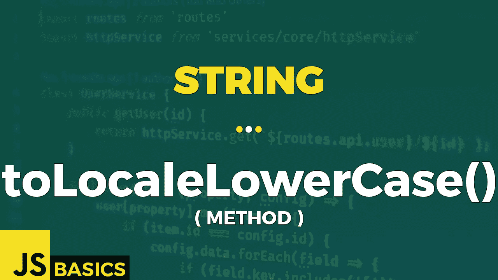

# Javascript 字符串的基础知识 toLocaleLowerCase()(方法)

> 原文：<https://medium.com/nerd-for-tech/basics-of-javascript-string-tolocalelowercase-method-552804b1f580?source=collection_archive---------18----------------------->



这篇文章是我在 youtube 上免费发表的关于网络开发基础的系列文章的抄本。如果你更喜欢看而不是读，请随时访问我的频道“Dev Newbs”。

你好，我的新手开发者伙伴们！我们进入了几乎没有人使用的奇怪方法的领域，但是不知何故，我们需要覆盖它们以使 String 对象的所有方法都完整。这里有一种方法。看哪！

toLocaleLowerCase()方法根据任何特定于区域设置的大小写映射，返回转换为小写的调用字符串值。

通常，此方法返回的结果与 toLowerCase()方法相同。但是，对于某些语言环境，如果发生与常规 Unicode 大小写映射的语言冲突(如土耳其语)，结果可能会有所不同。

locale 参数指示用于根据任何特定于区域设置的大小写映射转换为小写的区域设置。如果一个数组中给定了多个区域设置，则使用最佳的可用区域设置。

如果您没有提供任何区域设置作为第一个参数，它会根据主机的当前区域设置将字符串转换为小写字母。

```
const str = "İstanbul";// get default locale for my browser
"My default locale: '" + navigator.language + "'"// OUTPUT: My default locale: 'sk-SK'// my default (slovak) browser's locale
str.toLocaleLowerCase()                      // i̇stanbul// english US locale
str.toLocaleLowerCase('en-US')               // i̇stanbul// Turkish locale
str.toLocaleLowerCase('tr')                  // istanbul// compare the values of lowercase results with different locales
str.toLocaleLowerCase('en-US') === str.toLocaleLowerCase()// OUTPUT: truestr.toLocaleLowerCase() === str.toLocaleLowerCase('tr')// OUTPUT: falsestr.toLocaleLowerCase('tr') === str.toLocaleLowerCase('en-US')// OUTPUT: false
```

当我们输出转换成小写的结果时，我们得到了相同的字符串的可视化表示。然而，当我们比较彼此之间的结果时，我们发现土耳其版本并不等于其他两个版本。然而，它们是彼此平等的。

转换的结果也有可能是一个异常。准确地说，我们可以得到两种不同类型的异常。

第一个是 RangeError，当 locale 参数无效时抛出。第二个是 TypeError，如果 locales 数组中的项不是 string 类型。让我们在示例 2 中看看它们的作用。

```
let locales = ['tr-TR', 2];try {
    // RangeError
    console.log(str.toLocaleLowerCase('engl'));
} catch (err){
    console.log(err);
}// OUTPUT:
// RangeError: Incorrect locale information provided
// at String.toLocaleLowerCase (<anonymous>)console.log("---");try {
    // TypeError
    console.log(str.toLocaleLowerCase([2, 'en-US']));
} catch (err){
    console.log(err);
}// OUTPUT: 
// TypeError: Language ID should be string or object.
// at String.toLocaleLowerCase (<anonymous>)
```

我们得到一个 RangeError，因为提供的字符串“engl”不代表任何有效的区域设置。类似地，我们得到 TypeError，因为数字 2 不属于 locales 数组中允许的输入类型。

仅此而已。我把这一集做得又短又甜，因为我们还需要介绍另外 3 个相关的方法。如果你想知道我指的是哪些，就等下集吧。

一如既往，感谢您的关注。下一集再见。