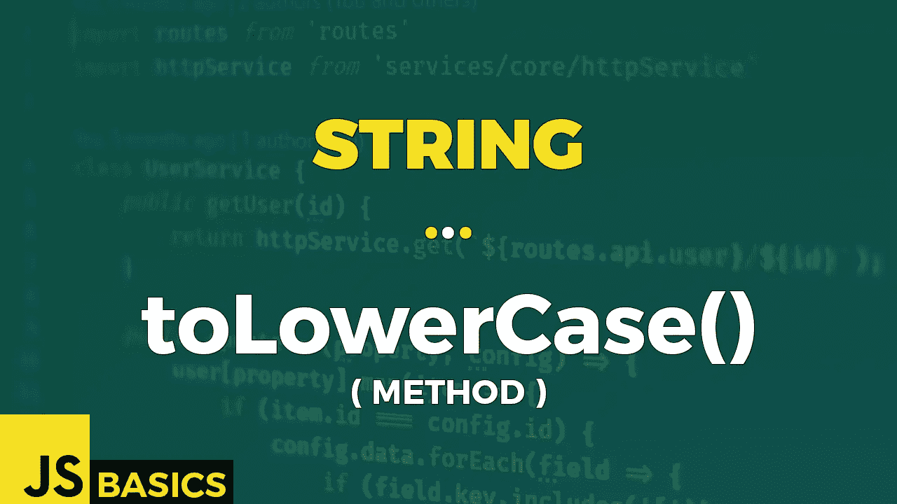

# Javascript String toLowerCase()的基础知识(方法)

> 原文：<https://medium.com/nerd-for-tech/basics-of-javascript-string-tolowercase-method-2c625b25a6ef?source=collection_archive---------12----------------------->



这篇文章是我在 youtube 上免费发表的关于网络开发基础的系列文章的抄本。如果你更喜欢看而不是读，请随时访问我的频道“Dev Newbs”。

你好，戴夫·纽布斯！这一天的方法会感觉像一个熟悉的。这是因为我们已经介绍了它的“地区”版本。现在是时候带着姐姐去兜风了。让我们把它做完。

toLowerCase()方法将字符串转换成小写字母。方法不会更改原始字符串。

这也是为数不多的没有任何输入参数的方法之一。多么清新。

该方法的返回值是一个字符串，表示转换为小写的原始字符串的值。

让我们看看例 1 中一些基本用法的例子。

```
const cities = "New York, Paris, Milan, Tokyo, ...";// use the method with variable containing string value
cities.toLowerCase()           // new york, paris, milan, tokyo, ...// use it directly with a string value
"ALPHABET".toLowerCase()       // alphabet// no lowercase - original value equals to converted value
let originalString = "hello there!";
let convertedString = originalString.toLowerCase();originalString === convertedString   // true// can't call with null / undefined
try{
    console.log(null.toLowerCase());
}
catch(error){
    console.log(error);
}// TypeError: Cannot read property 'toLowerCase' of nullconsole.log("- - -");try{
    console.log(undefined.toLowerCase());
}
catch(error){
    console.log(error);
}// TypeError: Cannot read property 'toLowerCase' of undefined
```

这是一种看似简单的方法。给它输入一个大写字母的字符串值，它们将被替换成小写字母。就像案例 1 和案例 2 一样。

如果原始字符串中没有大写字母，则返回的字符串是相同的。你可以看到，在下一个例子中，我创建了一个字符串，其中的字符要么是小写的，要么没有小写/大写版本。结果字符串与原始字符串相同。

最后两种情况包括当我们试图用“null”或“undefined”调用方法时抛出的 TypeError。在现实生活中不要这样做——检查字符串值是否存在。或者至少将它包含在 try/catch 块中。

好了，这就是我们用 toLowerCase()这样简单的方法所能做到的。感谢您的时间和关注。明天用下一种方法见。