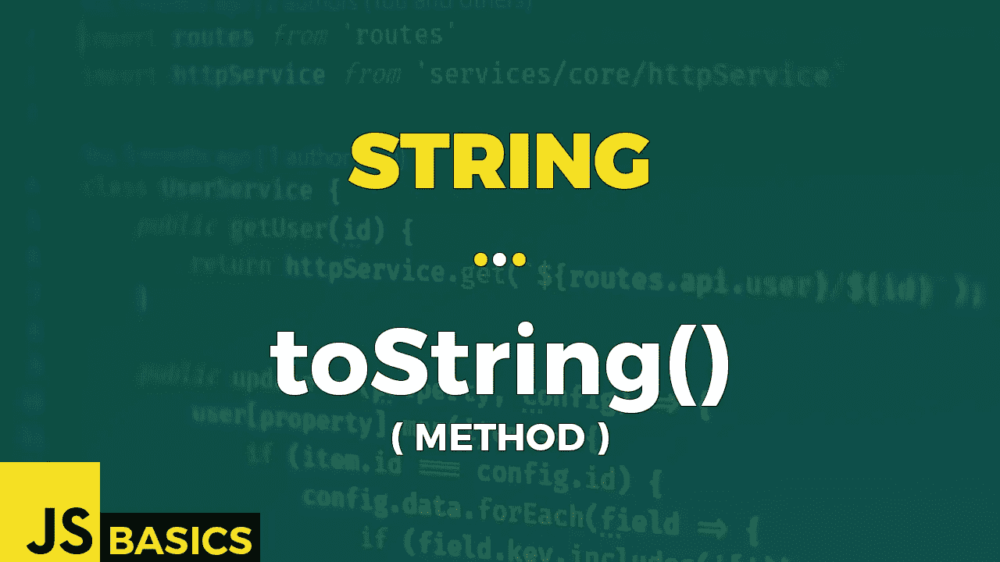

# Javascript 字符串 toString()的基础知识(方法)

> 原文：<https://medium.com/nerd-for-tech/basics-of-javascript-string-tostring-method-76453c4e7956?source=collection_archive---------8----------------------->



这篇文章是我在 youtube 上免费发表的关于网络开发基础的系列文章的抄本。如果你更喜欢看而不是读，请随时访问我的频道“Dev Newbs”。

嗨，我的开发伙伴们！我是雅各布，今天的方法叫做 toString()。在某些情况下，你会问自己:“为什么我甚至需要这个？”，但其他时候它实际上是有用的，你会这样:“啊，对…因为这个。”所以让我们一起弄清楚这个“这个”到底是什么。

toString()方法返回一个表示指定对象的字符串。String 对象实际上重写了 object 对象中同名的方法。这意味着 object 对象的原始 toString()方法不会被继承，而是使用该方法的字符串版本。

为了理解区别，我需要解释从 Object 对象调用原始方法的结果是什么。默认情况下，toString()方法由 object 的每个子对象继承。如果没有在自定义对象中重写此方法，toString()将返回“[对象类型]”，其中 type 是对象类型。

然而，对于字符串对象，toString()方法返回对象的字符串表示，其结果与我们使用 valueOf()方法的结果相同，顺便说一下，这将作为字符串对象的最后一个方法。

让我们在例 1 中全部检查一下。

```
// String object in variable
let strVar1 = new String("Hi Newbs!");
strVar1.toString()                                   // Hi Newbs!// primitive string value in variable
let strVar2 = "Hi Newbs!";
strVar2.toString()                                   // Hi Newbs!// explicitly declared string value
"Hi Newbs!".toString()                               // Hi Newbs!// confirmation that all the results are equal in both value & type
strVar1.toString() === strVar2.toString()            // true
strVar2.toString() === "Hi Newbs!".toString()        // true
"Hi Newbs!".toString() === strVar1.toString()        // true
```

前三种情况表明，如何指定字符串并不重要。它可以是字符串对象变量或原始字符串值，甚至是调用该方法的显式值。只要字符串值相同，结果仍然相同。

下面例子的确认部分证实了这一点，我比较了我们得到的 3 个结果的每个组合。值和类型总是相等的。

其他类型的内置对象有它们自己的方法版本，这正是第二个例子所展示的。此外还有一些错误案例。

```
let o = new Object();
o.toString()                // [object Object]let a = new Array(1, 2, 'yes', 'false', -45.47);
a.toString()                // 1,2,yes,false,-45.47let d = new Date();
d.toString()                // Wed Jun 23 2021 08:45:58 GMT+0200 ...let r = new RegExp();
r.toString()                // /(?:)/try {
    console.log(null.toString());
}
catch(err){
    console.log(err);
}// TypeError: Cannot read property 'toString' of nulltry {
    console.log(undefined.toString());
}
catch(err){
    console.log(err);
}// TypeError: Cannot read property 'toString' of undefined
```

默认情况下，对象方法 toString()返回方括号内的对象类型。其他对象，如 Array、Date 或 RegExp，有自己的重写方法实现，返回其他内容。例如，在 Array 的情况下，整个数组作为一个大字符串返回。Date 以特定格式返回当前日期时间。这种情况一直持续下去。如果你喜欢这类东西，你可以自己尝试每一个内置对象。

我想提到的最后一点是，你不能用“null”或“undefined”调用 toString()方法，因为它们是抛出 TypeError 的特殊类型的雪花。最好记住这一点。

好吧。这是字符串对象方法 toString()，这是我感谢你一直坚持到这一集结束。我会很快看到你的下一个。