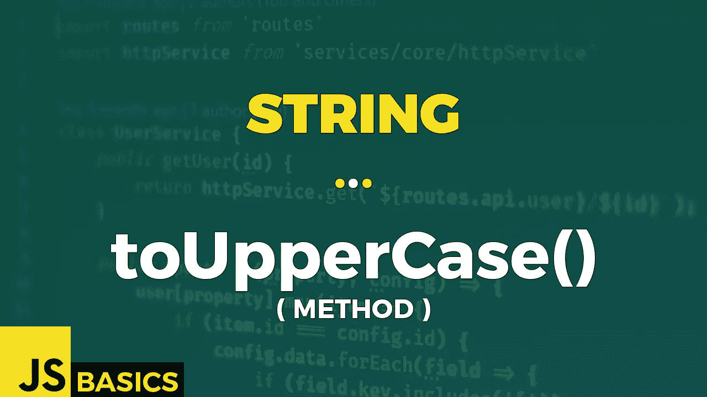

# Javascript 字符串 toUpperCase()的基础知识(方法)

> 原文：<https://medium.com/nerd-for-tech/basics-of-javascript-string-touppercase-method-90a749082dd?source=collection_archive---------16----------------------->



这篇文章是我在 youtube 上免费发表的关于网络开发基础的系列文章的抄本。如果你更喜欢看而不是读，请随时访问我的频道“Dev Newbs”。

你好，戴夫·纽布斯！方法将再次感觉像是我们已经讨论过的方法。这是因为我们已经介绍了它的“地区”版本。现在是时候带着另一个兄弟姐妹去兜风了。让我们完成它。

toUpperCase()方法将字符串转换成大写字母。方法不会更改原始字符串。

同样，这个方法根本没有任何输入参数。

该方法的返回值是一个字符串，表示转换为大写的原始字符串的值。

让我们看看例 1 中一些基本用法的例子。

```
const cities = "new york, paris, milan, tokyo, ...";// use the method with variable containing string value
cities.toUpperCase() // OUTPUT: NEW YORK, PARIS, MILAN, TOKYO, ...// use it directly with a string value
"alphabet".toUpperCase()// OUTPUT: ALPHABET// no lowercase - original value equals to converted value
let originalString = "HELLO THERE!";
let convertedString = originalString.toUpperCase();originalString === convertedString// OUTPUT: true// can't call with null / undefined
try{
    console.log(null.toUpperCase());
}
catch(error){
    console.log(error);
}// OUTPUT: 
// TypeError: Cannot read property 'toUpperCase' of nulltry{
    console.log(undefined.toUpperCase());
}
catch(error){
    console.log(error);
}// OUTPUT: 
// TypeError: Cannot read property 'toUpperCase' of undefined
```

我们可以很容易地将小写字符转换成大写，就像用例 1 和用例 2 一样。

如果我们有一个没有小写字母的字符串，原始字符串和转换后的字符串是相等的。

但是，在少数情况下，此方法会引发 TypeError。其中之一是当我们试图用“null”或“undefined”调用方法时。但除此之外，我们是黄金。

这是一个好的简单的字符串方法，叫做 toUppercase()。一如既往，感谢您的时间和关注。我会用下一种方法很快再见到你。