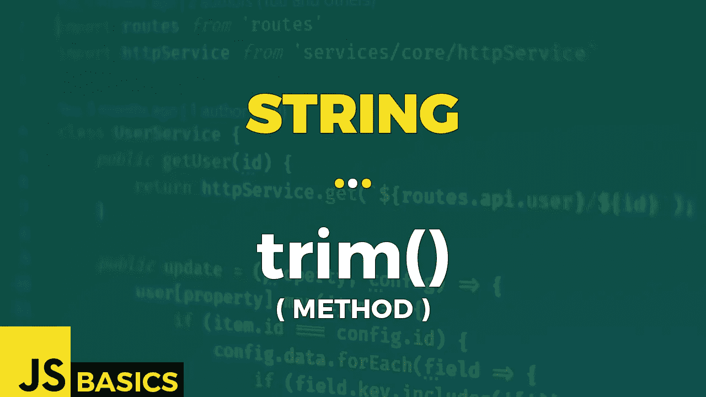

# Javascript String trim()的基础知识(方法)

> 原文：<https://medium.com/nerd-for-tech/basics-of-javascript-string-trim-method-d53972004e23?source=collection_archive---------7----------------------->



这篇文章是我在 youtube 上免费发表的关于网络开发基础的系列文章的抄本。如果你更喜欢看而不是读，请随时访问我的频道“Dev Newbs”。

嗨，开发新手们。我们正在慢慢接近这个系列的结尾。只需再介绍 4 种方法。其中一个是 trim()，它让我们可以处理掉所需字符串内容前后不必要的空格。让我们看看它是如何工作的。

trim()方法删除字符串两边的空白。我们上下文中的空白是所有的空白字符(空格、制表符、不间断空格等。)和所有行结束符(换行符、回车符等。).

该方法不会更改原始字符串，也没有任何参数。

返回值是一个字符串，表示去掉了两端空格的字符串。

让我们看看示例 1 中的方法。

```
const greeting = "     Dev Newbs!     ";// untrimmed original
"UNTRIMMED CONTENT: '" + greeting + "'"// OUTPUT: 
// UNTRIMMED CONTENT: '     Dev Newbs!     '// whitespace trimmed from beginning and end
"  TRIMMED CONTENT: '" + greeting.trim() + "'"// OUTPUT:
// TRIMMED CONTENT: 'Dev Newbs!'// empty string
"    EMPTY STRING: '" + "".trim() + "'"// OUTPUT:
// EMPTY STRING: ''// string with only whitespace
"ONLY WHITESPACES: '" + "\t\n  \r".trim() + "'"// OUTPUT:
// ONLY WHITESPACES: ''const alphabet = "\t\n   A   B \n  C   D   ...   \n";// untrimmed original
"UNTRIMMED CONTENT: \n'" + alphabet + "'"// OUTPUT:
// UNTRIMMED CONTENT: 
// ' 
//   A   B 
//  C   D   ...   
// '// whitespaces not at beginning or end are kept
"  TRIMMED CONTENT: \n'" + alphabet.trim() + "'"// OUTPUT:
// TRIMMED CONTENT: 
// 'A   B 
//   C   D   ...'try {
    console.log("        NULL: '" + null.trim() + "'");
}
catch(err) {
    console.log(err);
}// OUTPUT: 
// TypeError: Cannot read property 'trim' of nulltry {
    console.log("   UNDEFINED: '" + undefined.trim() + "'");
}
catch(err) {
    console.log(err);
}// OUTPUT:
// TypeError: Cannot read property 'trim' of undefined
```

我们可以看到，在第一种情况下，修剪完成后，从开始到结束的所有空白都消失了。但是我们可以用 trim()去掉的不仅仅是空格。第二个例子告诉我们，我们实际上删除了所有的空格，包括制表符和换行符。但只是从头到尾。如果它们在一个实际上有内容的字符串体中，它将被保留。

另一方面，如果我们有一个空字符串或者一个只包含空格的字符串，我们得到的结果是一个空字符串。

最后一种情况是在“空”、“未定义”或其他特殊对象上使用 trim。如果您尝试这样做，将会得到一个 TypeError。这是有道理的，因为那里没有什么要修剪的。

好了，这就是 trim()方法。字符串内置对象的最后一个方法之一。我向你的坚持和奉献精神致敬。很快就能看到剩下的一些方法了。