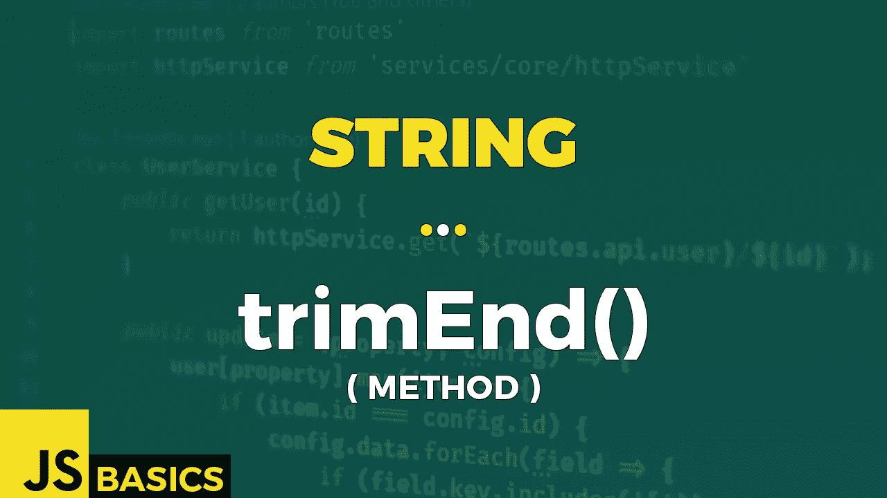

# Javascript String trimEnd()的基础知识(方法)

> 原文：<https://medium.com/nerd-for-tech/basics-of-javascript-string-trimend-method-cb4babcb851f?source=collection_archive---------20----------------------->



这篇文章是我在 youtube 上免费发表的关于网络开发基础的系列文章的抄本。如果你更喜欢看而不是读，请随时访问我的频道“Dev Newbs”。

你好，戴夫·纽斯。还有 3 种方法要介绍。今天，我们来看看 trim()方法的一个懒惰兄弟，它只从字符串末尾开始修剪空白。让我们开始吧。

trimEnd()方法删除字符串末尾的空格。我们上下文中的空白是所有的空白字符(空格、制表符、不间断空格等。)和所有行结束符(换行符、回车符等。).

该方法还有一个别名 trimRight()，可以互换使用。

TrimEnd()不改变原始字符串，也没有任何参数。

返回值是一个字符串，表示去掉了末尾空格的字符串。

让我们看看它在示例 1 中是如何工作的。

```
const greeting = "     Dev Newbs!     ";// untrimmed original
"UNTRIMMED CONTENT: '" + greeting + "'"// OUTPUT: 
// UNTRIMMED CONTENT: '     Dev Newbs!     '// whitespace trimmed from beginning and end
"  TRIMMED CONTENT: '" + greeting.trimEnd() + "'"// OUTPUT:
// TRIMMED CONTENT: '     Dev Newbs!'// alternative method name
" ALTERNATIVE NAME: '" + greeting.trimRight() + "'"// OUTPUT:
// ALTERNATIVE NAME: '     Dev Newbs!'// empty string
"    EMPTY STRING: '" + "".trimEnd() + "'"// OUTPUT:
// EMPTY STRING: ''// string with only whitespace
"ONLY WHITESPACES: '" + "\t\n  \r".trimEnd() + "'"// OUTPUT:
// ONLY WHITESPACES: ''const alphabet = "\t\n   A   B \n  C   D   ...   \n";// untrimmed original
"UNTRIMMED CONTENT: \n'" + alphabet + "'"// OUTPUT:
// UNTRIMMED CONTENT: 
// ' 
//    A   B 
//   C   D   ...   
// '// whitespaces in "the middle" are kept
"  TRIMMED CONTENT: \n'" + alphabet.trimEnd() + "'"// OUTPUT: 
// TRIMMED CONTENT: 
// ' 
//    A   B 
//   C   D   ...'try {
    console.log("        NULL: '" + null.trimEnd() + "'");
}
catch(err) {
    console.log(err);
}// OUTPUT:
// TypeError: Cannot read property 'trimEnd' of nulltry {
    console.log("   UNDEFINED: '" + undefined.trimEnd() + "'");
}
catch(err) {
    console.log(err);
}// OUTPUT:
// TypeError: Cannot read property 'trimEnd' of undefined
```

在第一种情况下，我们可以看到，在三月结束后，末尾的所有空白都消失了。此外，该方法的另一个名称会得到相同的结果。

如果我们有一个空字符串或者一个只包含空格的字符串，我们得到的结果是一个空字符串。

我们当然可以不仅仅用 trimEnd()去掉空格。另一个例子告诉我们，我们实际上删除了所有的空格，包括制表符和换行符。但只是从最后开始。

最后一个案例是在“null”、“undefined”或其他特殊对象上使用 trimEnd()。如果您尝试这样做，将会得到一个 TypeError。

TrimEnd()完成。只剩下少数了。像往常一样，感谢您的关注，我将很快看到你的下一个方法。