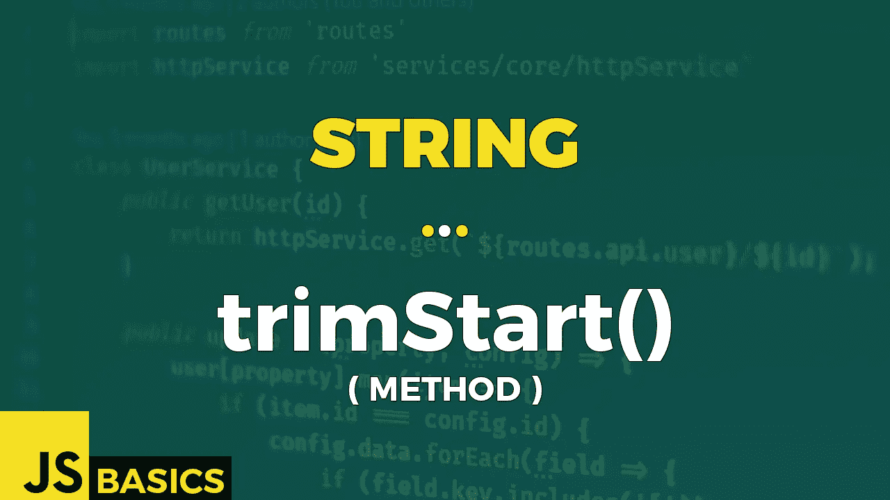

# Javascript String trimStart()的基础知识(方法)

> 原文：<https://medium.com/nerd-for-tech/basics-of-javascript-string-trimstart-method-cb82807acc82?source=collection_archive---------17----------------------->



这篇文章是我在 youtube 上免费发表的关于网络开发基础的系列文章的抄本。如果你更喜欢看而不是读，请随时访问我的频道“Dev Newbs”。

你好，戴夫·纽斯。只需再介绍两种方法。今天，我们来看看 trim()方法的另一个懒惰兄弟，它只从字符串的开头开始修剪空白。哇，这个 trim()有一些懒惰的家庭成员。但是不管怎样，让我们快速地讨论一下。

trimStart()方法删除字符串开头的空格。我们上下文中的空白是所有的空白字符(空格、制表符、不间断空格等。)和所有行结束符(换行符、回车符等。).

该方法还有一个别名 trimLeft()，可以互换使用。

TrimStart()不改变原始字符串，也没有任何参数。

返回值是一个字符串，表示从开头删除了空格的字符串。

让我们在例 1 中看到它的重量。

```
const greeting = "     Dev Newbs!     ";// untrimmed original
"UNTRIMMED CONTENT: '" + greeting + "'"// OUTPUT: 
// UNTRIMMED CONTENT: '     Dev Newbs!     '// whitespace trimmed from the beginning only
"  TRIMMED CONTENT: '" + greeting.trimStart() + "'"// OUTPUT:
// TRIMMED CONTENT: 'Dev Newbs!     '// alternative method name
" ALTERNATIVE NAME: '" + greeting.trimLeft() + "'"// OUTPUT:
// ALTERNATIVE NAME: 'Dev Newbs!     '// empty string
"    EMPTY STRING: '" + "".trimStart() + "'"// OUTPUT:
// EMPTY STRING: ''// string with only whitespace
"ONLY WHITESPACES: '" + "\t\n  \r".trimStart() + "'"// OUTPUT:
// ONLY WHITESPACES: ''const alphabet = "\t\n   A   B \n  C   D   ...   \n";// untrimmed original
"UNTRIMMED CONTENT: \n'" + alphabet + "'"// OUTPUT:
// UNTRIMMED CONTENT: 
// ' 
//    A   B 
//   C   D   ...   
// '// whitespaces in "the middle" are kept
"  TRIMMED CONTENT: \n'" + alphabet.trimStart() + "'"// OUTPUT:
// TRIMMED CONTENT: 
// 'A   B 
//   C   D   ...   
// 'try {
    console.log("        NULL: '" + null.trimStart() + "'");
}
catch(err) {
    console.log(err);
}// OUTPUT:
// TypeError: Cannot read property 'trimStart' of nulltry {
    console.log("   UNDEFINED: '" + undefined.trimStart() + "'");
}
catch(err) {
    console.log(err);
}// OUTPUT:
// TypeError: Cannot read property 'trimStart' of undefined
```

在第一种情况下，我们可以看到从字符串开始的所有空格都消失了。此外，该方法的另一个名称会得到相同的结果。

如果我们有一个空字符串或者一个只包含空格的字符串，我们得到的结果是一个空字符串。

我们当然可以用 trimStart()去掉不仅仅是空格。另一个例子告诉我们，我们实际上删除了所有的空格，包括制表符和换行符。但只是从一开始。

最后一个案例是在“null”、“undefined”或其他特殊对象上使用 trimStart()。如果您尝试这样做，将会得到一个 TypeError。

这就结束了 trimStart()。一如既往，非常感谢您的关注。明天带着弦论系列的最后一个方法再见。