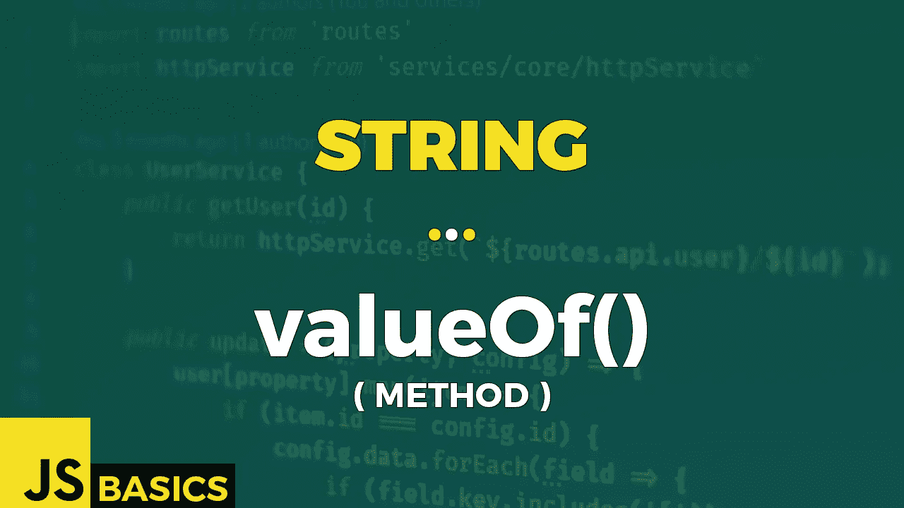

# Javascript 字符串 valueOf()的基础知识(方法)

> 原文：<https://medium.com/nerd-for-tech/basics-of-javascript-string-valueof-method-6581601d7983?source=collection_archive---------15----------------------->



这篇文章是我在 youtube 上免费发表的关于网络开发基础的系列文章的抄本。如果你更喜欢看而不是读，请随时访问我的频道“Dev Newbs”。

各位开发者朋友，你们好！我是 Jacob，这是 String 内置对象系列的最后一个方法。强迫自己按时完成下一篇文章并不总是容易的——尤其是因为几乎没有人看它们。但是如果你想成功，你不能放弃，所以我没有，我们在这里。今天的方法叫做 valueOf()，这将是我们系列的一个很好的结尾。让我们开始吧！

valueOf()方法返回一个字符串对象的原始值。

它基本上等同于另一个名为 toString()的字符串方法。它没有任何输入参数，所以它自动成为我的最爱。

通常，这个方法由 JavaScript 本身在内部调用，而不是在代码中显式调用。但是这并不意味着我们不会在我们的例子中测试它。哦不！恰恰相反。所以让我们开始吧。

让我们看例子 1。

```
// String object in variable
let strVar1 = new String("Hi Newbs!");
strVar1.valueOf()                                 // Hi Newbs!// primitive string value in variable
let strVar2 = "Hi Newbs!";                        // Hi Newbs!
strVar2.valueOf()// explicitly declared string value
"Hi Newbs!".valueOf()                             // Hi Newbs!// confirmation that all the results are equal in both value & type
strVar1.valueOf() === strVar2.valueOf()             // true
strVar2.valueOf() === "Hi Newbs!".valueOf()         // true
"Hi Newbs!".valueOf() === strVar1.valueOf()         // true
```

前三种情况表明，如何指定字符串并不重要。它可以是字符串对象变量或原始字符串值，甚至是调用该方法的显式值。只要字符串值相同，结果仍然相同。

下面例子的确认部分突出了这一点，我比较了 3 个结果的每个组合。值和类型总是相等的。

我想提的一点是，你不能用你想到的任何东西调用 valueOf()方法。例如，如果你使用“null”或“undefined ”,它们将抛出 TypeError。记住这一点。

```
try {
    console.log(null.valueOf());
}
catch(err){
    console.log(err);
}// OUTPUT:
// TypeError: Cannot read property 'valueOf' of nulltry {
    console.log(undefined.valueOf());
}
catch(err){
    console.log(err);
}// OUTPUT:
// TypeError: Cannot read property 'valueOf' of undefined
```

这就是了。字符串对象的最后一个方法完成。唯一要做的就是感谢你，如果你一直看着，并且坚持到这个系列的最后。但是不要害怕——这并不是真正的结束。我锁定了另一个值得报道的对象。你自己猜是哪个，我给你个惊喜。

一如既往——谢谢你的关注和你花时间看我用英语喃喃自语。我将带着一系列新的 JS 基础知识与您见面。