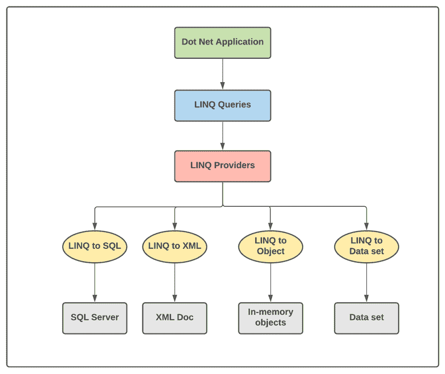

# LINQ 基础知识

> 原文：<https://medium.com/nerd-for-tech/basics-of-linq-27777bc436b8?source=collection_archive---------26----------------------->

使用. NET 应用程序既有挑战性，又有利可图。这可能是有利可图的，因为它允许您轻松开发功能强大的应用程序。

另一方面，这也很有挑战性，因为您需要从多个来源获取数据，例如

从多个来源获取所有这些数据是一个繁琐的过程。您需要使用不同的工具从每个流程中获取数据。现在，如果我们说您可以使用一个工具从多个来源查询数据，而不是对不同的来源使用不同的工具，那会怎么样呢？这就是 LINQ 帮忙的地方。这是一个单一的平台，允许您执行许多功能。

在这篇博客文章中，让我们看看 LINQ 的基本知识，也了解一下它的工作原理、优点和缺点。

**目录**

1.  什么是 LINQ？
2.  LINQ 比其他地方好在哪？
3.  LINQ 有哪些不同的类型？
4.  LINQ 的优势
5.  LINQ 的缺点
6.  裁决

# 什么是 LINQ？

在 C#和 VB.NET 中，LINQ 是一个查询语法工具。它主要用于从 XML 文档、web 服务、泛型等不同来源和格式检索数据。它主要用于获取标准化查询语言(如 C#和 VB.NET)中的查询。开发人员可以使用 LINQ 来查询任何数据源并与之交互。

这里有一个例子可以让你更好地理解这个概念

*   SQL(结构化查询语言)用于专门从数据库平台获取数据。它不能用于从任何其他来源获取数据。
*   但是 LINQ(语言集成查询)可以从一组不同的数据源获取数据，如 ADO.Net 数据集、XML 文档、web 服务和所有其他数据库服务。

总之，LINQ 允许你从一个来源获得所有的信息，而不是对每个来源使用不同的语言。

# LINQ 比其他地方好在哪？

每一个 LINQ 查询总是将结果作为对象返回。这个因素将为你节省大量处理数据的时间和资源。默认情况下，LINQ 使您能够将所有查询转换为对象。

使用这种方法，您不需要担心将不同的格式转换成单一的对象格式。在这个过程中，你可以和 LINQ 一起节省很多时间。

看一看 LINQ 的建筑范例

这个 LINQ 建筑完美地解释了它的工作原理和过程。如果您查看底部的行，有四个不同的服务器/数据源。每个数据源都连接到一个 LINQ 提供者，该提供者将数据转换成数据库可以理解的形式。

LINQ 提供程序将数据转换成各种格式，如 SQL、XML 和数据集，以便数据库理解。这些 LINQ 提供程序连接到。NET 应用程序，它提供了对源代码的所有查询。

LINQ 现在允许你用一种语言从所有来源获得查询，而不是对每个来源使用不同的语言。

# 有哪些不同类型的 LINQ 可供选择？

既然你对 LINQ 有了很好的了解，让我们来看看不同类型的 LINQ。

# LINQ 的优势

# 编译时错误检查

LINQ 有一套功能，允许它在编译过程中识别错误。使用 LINQ 时，语法高亮和智能感知等内置功能使这成为可能。

# 使用 LINQ 查询多个数据源

到目前为止，您可能已经理解了 LINQ 允许您从多个来源编译数据。这可以包括从关系数据库到 XML 的一切，这是 LINQ 的最大好处之一。

# 复杂的问题很容易调试

LINQ 允许你将复杂的查询转换成简单的查询。一旦它被转换成简单的东西，调试就变得容易了。使用 LINQ，消除任何错误变得非常容易和高效。

# 容易理解

LINQ 很容易理解，任何开发人员都可以很好地了解一切是如何工作的。设置它来查询不同来源的数据很容易。维护没有任何错误的代码也很容易。

# LINQ 表达式是强类型的

强类型表达式确保在编译时而不是运行时访问值总是正确的。这允许您在编译时捕获类型不匹配错误。

# LINQ 的缺点

# 您可能会经历性能下降

当查询编写不当时，整个系统的性能会下降。在 LINQ，这是一个特别普遍和复杂的问题。

# 任何更改后都需要部署 DLL

这也被认为是 LINQ 的一大缺点。每次在查询中进行一些更改时，都需要部署 DLL。这可能会花费很多时间，尤其是在测试查询时。

# 您不能使用缓存执行

与 SQL 不同，对于 LINQ，您不能使用缓存执行计划。这是许多开发者抱怨的一个主要缺点。

# 裁决

即使与其缺点相比，LINQ 仍然是从多个来源获取查询的可靠选择。然而，如何最有效地使用 LINQ 取决于用户。虽然对于某些类型的应用程序来说，这可能是一个很好的选择，但对于其他类型的应用程序来说，这将是一个糟糕的选择。所以，要明白自己的目标，明智的选择。

*原载于*[*https://www . partech . nl*](https://www.partech.nl/nl/publicaties/2021/03/basics-of-linq)*。*