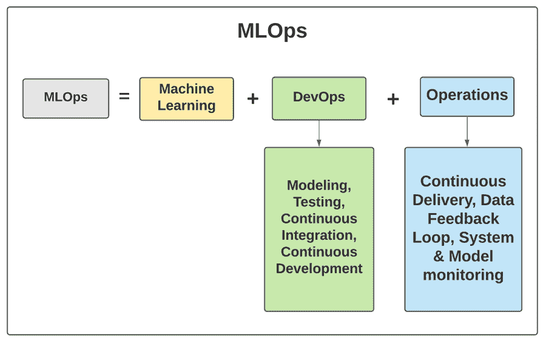

# MLOps 的基础

> 原文：<https://medium.com/nerd-for-tech/basics-of-mlops-2877e77c6766?source=collection_archive---------21----------------------->

MLOps 是在机器学习应用中解决发展问题的概念。

它是机器学习在商业环境中的结合。换句话说，这是一个将机器学习应用于业务关键领域运营的过程。

MLOps 涉及在您的组织中实现机器学习所需的东西的集合。集合可以是人、思维模式、文化、技术、流程和系统。

在这篇文章中，让我们了解什么是 MLOps，以及它如何对您的组织有用。

**目录**

1.  什么是 MLOps？
2.  在您的组织中建立 MLOps 文化需要什么？
3.  实施 MLOps 的合适基础设施
4.  自动化流程的正确计划
5.  测量应用质量的正确分析工具
6.  在您的组织中实现 MLops 文化的最佳实践

# 什么是 MLOps？

在解释什么是 MLops 之前，我们需要了解 DevOps 的基础知识。

开发运维是提高组织高速交付应用能力的过程。DevOps 不仅关注交付速度，还关注提高组织提供的服务/产品的质量。

当传统的组织模式以龟速走向开发时，DevOps 促进了更快的测试、优化和执行。DevOps 的速度允许组织为他们的客户创建产品/服务。开发运维的速度也允许创新，并迫使组织交付客户想要的东西，而不是相反。

MLOps 是建立在 DevOps 基础上的概念。它迫使组织不断创新他们的产品以满足客户的需求。就像 DevOps 一样，MLOps 也专注于以极快的速度进行优化和创新。

但这里唯一的区别是，它包括机器学习，以加快创新过程。MLOps 需要数据科学家在您的业务中筛选数据集，并围绕数据集构建模型。

它涉及组织内部的数据科学家、ML 工程师和 It 专业人员之间的协作。从开发到部署，他们一起工作来实现机器学习。

# 在您的组织中建立 MLOps 文化需要什么？

MLOps 不是组织中一个人就能完成的。这是一种文化转变，你的所有员工都必须考虑到这一点。以下是在您的组织中实施 MLOps 文化所需的一些东西。

1.  针对 MLOps 模式培训员工的基础设施和资源
2.  一个专用的分析平台，在流程的各个阶段测量您的应用程序的质量。
3.  精心设计的计划，用于版本管理、验证和部署 MLOps 应用程序
4.  检查应用程序交付和部署的自动化流程。
5.  帮助员工实施 MLOps 文化的工具和数字设备。
6.  灵活的团队可以在 MLOps 环境中设计和开发应用程序。

# 实施 MLOps 的合适基础设施

机器学习环境所需的基础设施是非常动态的。有时候你需要大量的内存来批量完成进程。其他时候，您可能需要一个延迟非常低的处理单元。MLOps 环境中的基础架构变化非常快。

在 MLOps 环境中，不同版本所需的软件也可能不同。每个版本可能依赖于不同的语言。因此，您需要确保您拥有合适的基础架构和 IT 软件来培育 MLops 环境。但是，只要您的环境需要，您就可以租用计算能力。

# 自动化流程的正确计划

MLOps 专注于高频率地部署新版本。这需要一套适当的规则和测试策略。这些规则确保当系统以最高效率运行时，您不会破坏系统。

在规则之后，您需要自动化流程来帮助应用程序的部署。我们所说的自动化并不意味着任何太复杂的东西。自动化也可能意味着每个阶段需要遵循的一些期望的步骤或清单。假设您的应用程序有问题或错误。这里有一些可以系统遵循的步骤-

1.  分析问题的根本原因
2.  通过对根本原因进行返工来解决问题
3.  将代码部署到最终版本中
4.  通过一组预先确定的测试对新版本进行验证
5.  检查错误是否仍然存在
6.  如果错误/问题仍然存在，请转到步骤 1
7.  如果错误/问题已经结束，请将其上线

这可以是一个示例清单，以确保程序中的错误得到纠正。

# 测量应用质量的正确分析工具

在 MLOps 环境中，始终如一地衡量每个版本的性能至关重要。当模型被部署后，有一百件事情可能会出错。因此，有必要实现一个分析工具来了解版本是如何工作的。

这里有一些问题，你可以用专门的分析工具来回答

1.  与测试中预测的性能相比，该版本的性能如何？
2.  如果性能很好，我们可以运行哪些测试来改进它？如果性能不好，我们可以做些什么来修复它？

3.模型的总体输出是否在预测输出的范围内？

4.该版本的工作和反应是否与培训/测试期间一样？

5.如果是的话，我们下一步可以对它做什么测试？
如果没有，我们可以改变/更新什么，使其像培训期间一样工作？

有更多这样的问题，你总是可以用分析工具来回答。您对应用程序的性能度量得越多，随着时间的推移，它就会变得越好。

# 在您的组织中实现 MLops 文化的最佳实践

1.  成功的 ML 产品需要团队的努力。
2.  ML 产品必须有一个明确的目标
3.  它应该有一套预先确定的 KPI 来衡量产品的成功
4.  尽早确定验证数据集所需的资源
5.  以实验的心态开始并前进
6.  集装箱化是你在发展过程中最好的朋友

# 裁决

部署 MLOps 不仅仅是在您的组织中雇佣一群数据科学家。这是您的组织需要从整体上认识到的一个步骤。这才是让你在 MLOps 中获得成功的真正原因。

*原载于*[*https://www . partech . nl*](https://www.partech.nl/nl/publicaties/2021/03/basics-of-mlops)*。*