# 数据科学的概率基础

> 原文：<https://medium.com/nerd-for-tech/basics-of-probability-for-data-science-fe6632cdb392?source=collection_archive---------5----------------------->

## 我的数据科学之旅(第二部分)

数据科学领域围绕着概率和统计。因此，对这些概念有一个坚实的理解是至关重要的。

纳赛尔·塔米米在 [Unsplash](https://unsplash.com?utm_source=medium&utm_medium=referral) 上的照片

# 机器学习为什么要概率？

概率是不确定性的科学。每当对事件发生有疑问时，概率概念被用来估计事件发生的可能性。

1.  分类问题需要概率来预测哪个输出。
2.  很少有模型是基于概率设计的(线性回归、逻辑回归、简单偏差)。
3.  模型使用基于概率的迭代算法进行训练(最大似然估计，期望最大化)。
4.  模型用概率度量(对数损失，Roc-Auc)进行评估。

# 机器学习的不确定性

机器学习涉及许多不确定性。

1.  **观测数据中的噪声:**数据的可变性，也称为异常值、错误或错别字。就是离均值那么远的值。这将影响整个发行。
2.  **不完全覆盖:**观察到的数据是相对于整个总体的样本。收集、观察到的数据可能是随机的，但它仍然没有涉及人口的所有方面。
3.  **模型并不完美:**模型中总会存在误差(偏差和变异)，影响预测。

概率用于管理不确定性。

# 概率空间

这里有三个主要组件样本空间、事件和概率度量。

1.  **样本空间:**样本空间是所有可能结果的集合，或者是所有可能元素的集合，比如一个硬币 S={H，T}的样本空间(硬币会显示正面或者反面)。
2.  **事件**:事件是样本空间的子集。它表示有利的结果。对于掷硬币来说，得到正面的事件是{H}。
3.  **概率度量:**这是分配给事件的值，描述了事件发生的概率。该值的范围从 0 到 1，其中 0 表示该事件没有发生的可能性，1 表示该事件肯定会发生。得到 head 的概率是 0.5(事件/样本空间)或者(有利结果/所有结果){H}/{H，T}=1/2。样本空间中所有事件的概率之和为 1 {H，T} = {0.5，0.5}。

# 随机变量

随机变量是可以测量或计算的偶然事件的结果。简而言之，它是一个变量，其值取决于事件的结果——两种 RV。

1.  **离散随机变量:**有一组有限结果的变量。例如，掷骰子随机变量是{1，2，3，4，5，6} *随机变量不是样本空间。它只显示实际值可以取多少。假设你掷出一个 6，那么 RV 就是 6。*
2.  **连续随机变量:**一个有无限组结果的变量，如{学生身高}。

# 概率规则

如果 A 是一个事件，那么 P(A)是该事件发生的概率。P(A)=有利结果/所有结果。

两个单独事件同时发生的概率是 P(A)*P(B)。这就是乘法原理(**、**的意思是**乘以**)。也叫两个事件 P(A∩B)的交集。

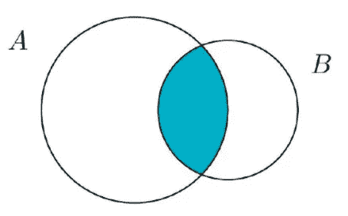

交集

这两个事件中任何一个发生的概率是 P(A)+P(B)。这就是加法原理(**或**表示**加**)。它也被称为两个事件 P(A∪B)的并。

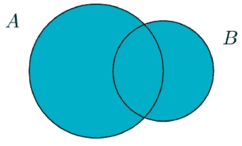

联盟

**规则 1:** 对于任意事件 A，0 ≤ P(A) ≤ 1。

**规则二:**所有可能结果的概率之和为 1。

**规则三(补码规则):** P(非 A) = 1 — P(A)。

**法则四:**不能同时发生的两件事叫做不相交或互斥。

**法则五:** P(A 或 B) = P(A) + P(B) -P(A 和 B)。

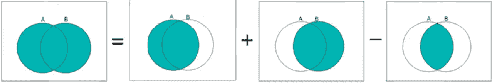

P(A 或 B) = P(A) + P(B)-P(A 和 B)

# 预期

它是随机变量中所有可能值的概率加权平均值。E[X]=∑x.P(x)(所有结果*结果概率之和)。它可以解释为来自给定分布的许多独立样本的长期平均值。

简而言之，当独立样本的数量增加时(100 次掷骰)，所有 100 个结果的平均值将接近预期值。

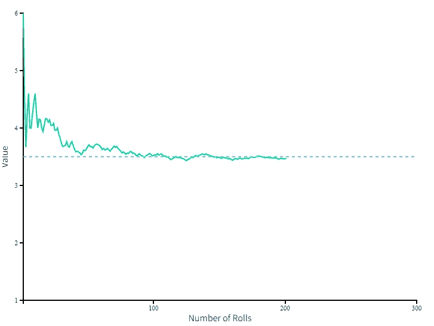

所有辊的平均值将等于预期值

期望值是随机变量的平均值。

E(X+Y)=E(X)+E(Y)

E(X*Y)=E(X)*E(Y)

# 期望的含义

让我们举一个彩票的例子，一张彩票花费 10 美元赢得 1000 万美元。中 100 美元的几率有 50%对你来说值 50 美元(0.5*100)，那么彩票中奖的概率就是 0.0000001。预期值为(0.0000001 x 10，000，000) = $1。这是你拥有一张票的价值，但你要花 10 美元才能买到。那么值得买吗？所有事件都有一定的风险和价值。

# 随机变量的方差

期望提供了一种对中心性的衡量。随机变量的方差量化了随机变量分布的范围。var(X)= E[(X E[X])]。

# 三种概率

1.  **联合概率**:两个事件一起发生的概率 P(AandB)。
2.  边际概率:一个事件发生的概率，与另一个变量的结果无关。
3.  **条件概率**:一个事件在第二个事件存在的情况下发生的概率。

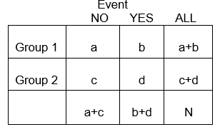

描述这里 N=1 的概率的交叉表

这里 a，b，c，d 都是联合概率为 P(Group1 和 No)=a(两个事件一起发生)。

a+b 和 c+d 是余量概率，因为概率(是或否)不影响，它只告诉组 1 和组 2 的概率，所以 P(组 1)=a+b。

# 概率分布

*概率分布*是一个函数，它描述了获得随机变量可能取值的可能性。

三种类型的分布:

1.  均匀分布
2.  离散分布
3.  连续分布

# 均匀分布

所有的结果都有相同的发生概率。

例如，骰子的概率分布。

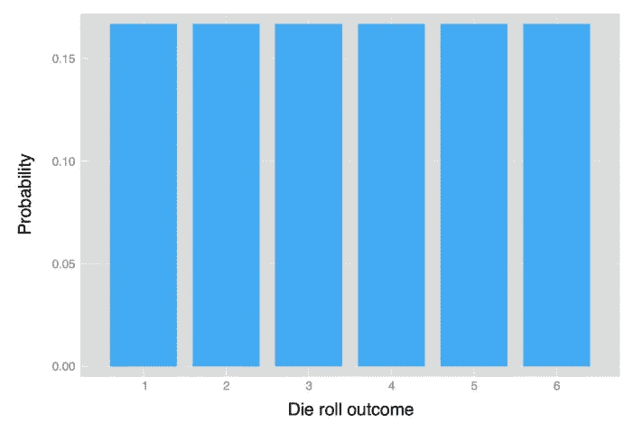

模具的分布(均匀分布)

# 离散分布(概率质量函数)

有有限多个结果的分布。

# 1)伯努利分布:

一种事件的分布，只包括一次试验，该试验有两种结果，例如，掷硬币，只猜一个对或错的问题。

(x~B(n=1，p))*n =试验次数，p =概率。*

结果= P(成功)或(1-P)(失败)

这个分布的方差是成功的概率*失败的概率。

期望值(平均值)= P

方差= P(1-P)

标准偏差= √P(1-P)

二项分布

# 2)二项式分布

一个事件的分布包括 n 次试验，每次试验有两种结果，例如，抛 10 次硬币，猜中所有对或错的问题。

(x~B(n=1，p))

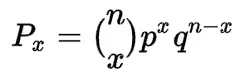

二项式分布公式

p =成功的概率

q =故障概率

n =试验总数，x =试验次数

期望值(平均值)= P*n

方差= P(1-P)

标准偏差= √P(1-P)

比如 10 个硬币抛 5 个头的概率是多少？

p=0.5(人头)，q=0.5，n=10，x=5 那么 P(5 heads)=252*0.5⁵*0.5⁵=0.24

或者 24 %的几率在 10 次投掷中得到 5 次正面。

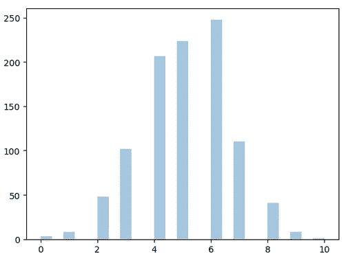

二项分布

# 3)超几何分布

考虑从一盒不同颜色的弹珠中抽出一颗蓝色弹珠的事件。抽到蓝球的事件就是成功，没抽到就是失败。每次抽中一个弹球，它不会被放回盒子里，因此这影响了在接下来的试验中抽中一个球的概率。超几何分布模拟了 n 次试验中 k 次成功的概率，其中每次试验都是在没有替换的情况下进行的。这与二项式分布不同，在二项式分布中，概率在整个试验过程中保持不变。

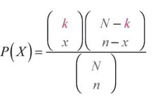

超几何分布公式

k =人群中感兴趣的项目

n =人口规模

n =样本量

x =从 n 中选择的项目

期望值(平均值)= n*k/N

方差=[*N***k**(*N*-*k*)*(*N*-*N*)]/[*N*2 *(N-1)]

标准差=√[*N***k**(*N*-*k*)*(*N*-*N*)]/[*N*2 *(*N*-1)]

一手 5 张扑克牌中的 2 张黑桃。

N=52，k=13，N=5，x=2 => 0.274

# 4)负二项分布

检查我们需要进行多少次伯努利试验才能获得第 n 次成功。期望的结果是预先指定的，我们继续实验，直到它实现。

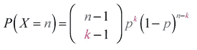

负二项分布公式

n =试验次数，k =成功次数

p =成功的可能性

例如，反复投掷硬币，直到头第六次出现。这种情况在第 15 次投掷时发生的概率是多少

p(x = 15)=(145)(0.5)⁶(1–0.5)⁹= > 0.06109 第 15 次投掷在第 6 次投掷中的机会

mean=6/0.5 = 12 ( *需要尝试 12 个事件，以获得第 6 个头的事件*在*第 15 次投掷中)*

期望值(平均值)= r/p

差异= r/p

标准偏差= √r/p

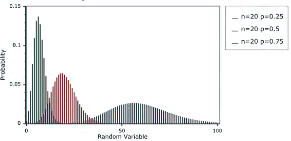

负二项分布

# 5)几何分布

几何分布是 n 次伯努利试验中第一次成功所需试验次数的分布。

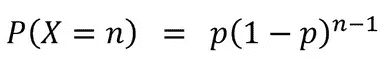

几何分布公式

n =试验次数

p =概率。成功的象征

例如，如果 30%的成年人接受过 CPR 培训，那么第 6 个被取样的人将是第一个接受过 CPR 培训的人(或取样时第一个成功的人)的概率是多少

p(x=6)=0.3*(0.7)⁵ => 0.0504

mean=3.3 => 4 *(需要进行事件，以便在特定事件中，第 6 个被抽样的人将是第一个成功的)*

期望值(平均值)= 1/p

方差= 1-p/p

标准差=√1-峰峰值

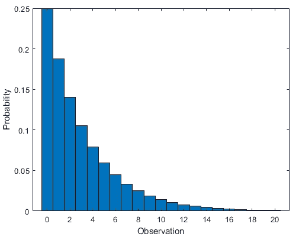

几何分布

# 6)泊松分布

处理某个时间间隔内事件发生的频率，而不是事件是否会发生。

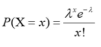

泊松分布

期望值(平均值)= λ

方差= λ

标准偏差= √λ

假设:

1.  事件发生的速率是恒定的。
2.  每个事件都是独立的，不影响其他事件。

例如，在 1 天内，询问 4 个问题。7 题会被问到的概率是多少？*(这不是一个问题会不会被问的概率)*

λ=4，x=7 = 0.06 或 6%的概率

随着λ的增加，分布将开始类似于正态分布

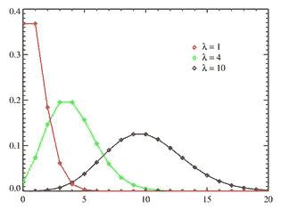

泊松分布

# 7)多项式分布

二项分布的推广

二项式:两个事件(成功或失败)

多项式:多个事件

# 连续分布(概率密度函数)

无限样本空间无法记录每个不同值的频率。

# 1)正态分布(高斯)

具有钟形曲线的连续分布。

例如所有成年人的身高

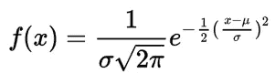

正态分布(高斯)

期望值(平均值)= μ

方差= σ

标准偏差= σ

它是最重要的概率分布，因为它符合许多自然现象。分布关于平均值是对称的，并且比远离平均值的数据出现得更频繁。

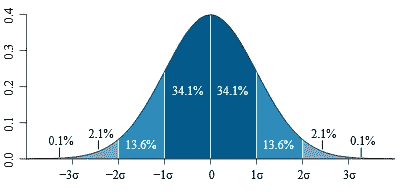

正态分布

μ 1σ=68 %这表明 68 %的数据在 1σ之间

μ 2σ=95 %这表明 95 %的数据在 2σ之间

μ 3σ=99.7%这表明 99.7%的数据在 3σ之间，依此类推，4、5、6σ…

# 2)学生 t 分布

一个具有宽尾的正态分布，学生 t 分布在样本量较小，且总体方差未知时使用(*当样本小于 50 个观测值时)。*

正态分布使用 z 统计

学生 t 分布使用 t 分布统计

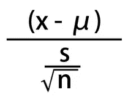

s =方差

期望值(平均值)= μ

方差= s *k/k-2

标准差= √s *k/k-2

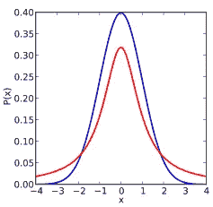

t 分布(红色)与正态分布(蓝色)

# 3)卡方分布

卡方检验观察分布与理论分布的拟合优度(Z ->正态分布，然后 Z->卡方分布，d.o.f=1) d.o.f 是独立正态分布相加的数量。

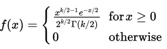

卡方分布公式

期望值(平均值)= d.o.f

方差= 2*d.o.f

标准偏差= √2*d.o.f

卡方检验主要用于检查拟合度(*观察值与理论值*)以及独立性测试。

## 拟合优度

例如，75 名学生中，11 名是左撇子。这个样本符合 12%是左撇子的理论吗？

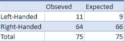

观察值和期望值的交叉表

期望值和观测值有多远？

预期(左撇子)= 75 的 12%

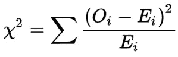

Oi =观察到的

Ei =预期

H0:理论是正确的(12%左撇子)= 0.12

H1:理论是错误的(x%左撇子)≠ 0.12

自由度=(行数-1 )*(列数-1)，显著性=0.05

chi2 =(11–9)/9 = 0.505，从表中我们得到 3.84

如果 Chi2 > 3.84(来自表中的值)，则 H0 被拒绝，因为 Chi2 < 3.84 H0 is accepted ( 12% are left-handed or there is not enough evidence to prove the proportion of left-handed is other than 12%)

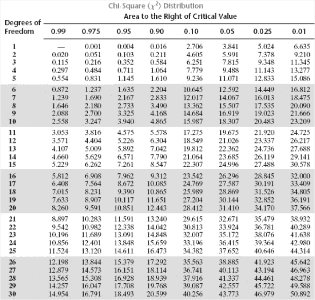

For DOF of 1 and Critical value of 0.05, the value is 3.84

## Test for Independence

e.g., 120 people are surveyed to check their preferred social media. Is social media preference independent of gender?

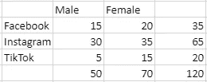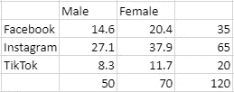

The observed value is converted to the expected value by multiplying the marginal probability and divide by the total.

E for 15=(50*35)/120=14.6

DOF=2 , significance value = 0.05

H0: independent

H1: dependent

Chi2=(15–14.6)²/14.6+(30–27.1)²/27.1+…. =2.84

Reject if Chi2> 5.991，H0 被接受为社交媒体，性别独立。

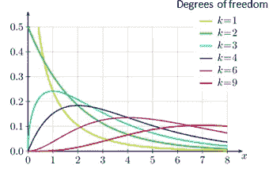

卡方分布

# 4)指数分布

指数分布是泊松点过程中事件之间时间的概率分布。泊松分布的逆分布，

p(x)=1- e^(-x/μ)

λ=1/μ(速率参数)

x =随机变量

在泊松分布的次数中，一只萤火虫在 10 秒内发光，对于指数分布来说这是萤火虫发光之间的时间。

例如，萤火虫在 10 秒内发光 2 次(泊松分布)。萤火虫在接下来的 5 秒内发光的概率(指数分布)

λ=2，μ=1/2，=>0.99995460007 或 99.99%的几率萤火虫会在接下来的 5 秒内发光

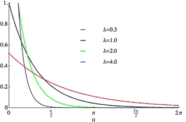

指数分布

# 累积分布函数

随机变量 x 的 CDF 是所有小于或等于 x 的概率之和，例如，掷出一个小于或等于 4 的骰子的概率与掷出 1、+掷出 2、+掷出 3、+掷出 4 的概率相同。

P(x <4)=P(x=1)+P(x=2)+P(x=3)+P(x=4).

0.16+0.16+0.16+0.16=0.66.

similarly, the probability of rolling a six or less will be 1 as there is no way of rolling greater than 6.

CDF is used to calculate the cumulative probability for a given x-value. The. CDF determines the probability that a random observation is taken from the population will be less than or equal to a certain value.

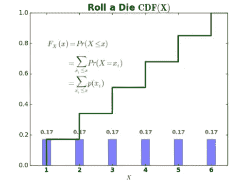

Probability Mass Function and Cumulative Distribution Function

# Conditional probability

The probability of an event *A* ，假设另一个 *B* 已经发生。抽到蓝球的事件就是成功，没抽到就是失败。每次抽中一个弹球，它都不会被放回盒子里，因此这影响了在接下来的试验中抽中一个球的概率。

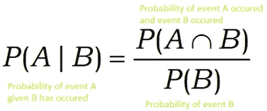

# 贝叶斯定理

贝叶斯定理是在没有联合概率(*两个(或更多)同时发生的事件的概率，例如 P(A 和 B)* )的情况下计算条件概率的一种原则性方法。贝叶斯定理说，如果我们知道 P(A|B ),那么我们可以确定 P(B|A ),假设 P(A)和 P(B)是已知的。

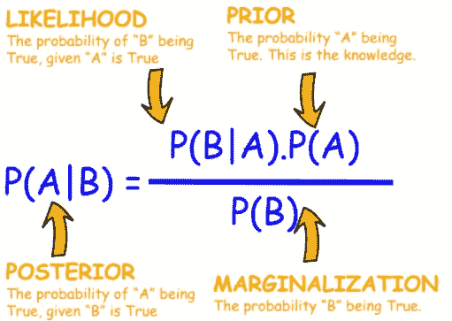

例如，1%的人口患有 X 疾病。筛查测试能准确检测出 90%的患病者。该测试还显示了 15%没有患病的人患有这种疾病(假阳性)。假设一个人进行了疾病筛查，结果呈阳性。他们拥有它的可能性有多大？

p(x)=患病的概率，p(+ve)=检测呈阳性的概率，p(x’)=未患病的概率

p(x)=0.01，p(+ve/x)=0.9，p(+ve/x')=0.15，p(x/+ve)=？

p(x/+ve)=p(+ve/x)p(x)/p(+ve)

p(x/+ve)=0.9*0.01/0.1575 = 0.057 或 5.7%如果测试显示+ve，则实际患有该疾病

p(+ve)=是概率测试显示+ve

*Total +ve =[(实际患病的 1%人口的 90%测试显示+ve)+(未患病的其余 99%人口的 15%测试显示+ve)]*

合计+ve =(0.9×0.01)+(0.99×0.15)= 0.1575

感谢您的阅读！

参考

 [## 从机器学习开始——机器学习掌握

### 我最常被问到的问题是:“我该如何开始？”我对获得…的最佳建议

machinelearningmastery.com](https://machinelearningmastery.com/start-here/#probability)  [## 视觉理论

### 概率和统计的直观介绍。

seeing-theory.brown.edu](https://seeing-theory.brown.edu/)  [## 理解概率和统计:数据科学家的概率基础

### 为统计学家解释概率的关键概念

towardsdatascience.com](https://towardsdatascience.com/understanding-probability-and-statistics-the-essentials-of-probability-for-data-scientists-459d61a8da44) 

图片->谷歌