# 数据科学统计学基础

> 原文：<https://medium.com/nerd-for-tech/basics-of-statistics-for-data-science-46d4aa94a112?source=collection_archive---------9----------------------->

我的数据科学之旅(第 3 部分)

统计学是一门关于数据的收集、组织、分析、解释和表达的学科。

# 为什么数据科学需要统计学

收集的数据都是原始数据，原始数据并不能提供有意义的信息。这就是为什么我们需要统计学来收集、组织和分析数据。在统计学中，一些基本的问题，比如哪个观察值出现的最多？两个实验有区别吗？收集的样本是否代表总体？获得的结果是否足够重要，足以产生影响？这些问题可以通过统计学来回答，并将原始数据转化为有意义的信息。

# 描述和推断统计

描述性统计从数量上描述或总结了数据。它提供数据的平均值、中值和众数。描述性统计使用图形表示来显示分布，并说明每个变量是如何相互关联的。

推理统计学允许从数据中做出预测(“推理”)。使用推断统计，从样本中提取数据，并对总体进行概括。

数据分为**总体**和**样本**。群体是所有感兴趣项目的集合。样本是人群的子集。样本数据可以进一步分类为**随机样本**或**代表性样本。**随机样本是总体中的随机子集，而代表性样本准确地代表总体参数。数据也分为**数值型**和**分类型。**

# 测量水平

数据分为定性(分类)和定量(数字)

定性的:名词性的，序数的

定量:间隔，定量

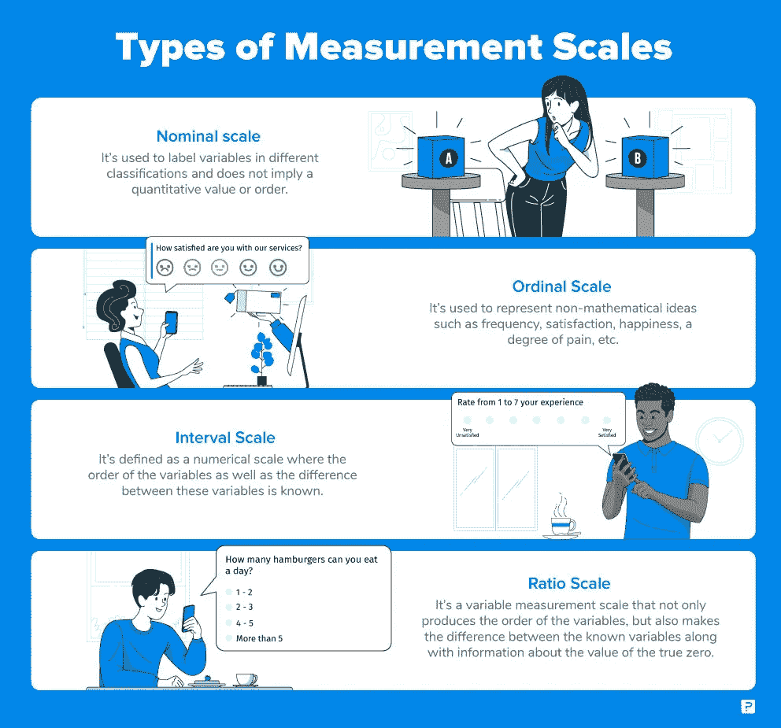

# **分类数据的表示**

1.  频率分布数据
2.  条形图
3.  圆形分格统计图表
4.  帕累托图

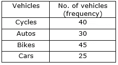

频率分布数据

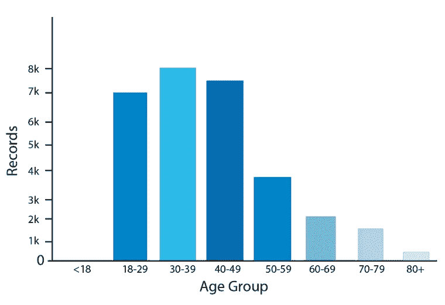

条形图

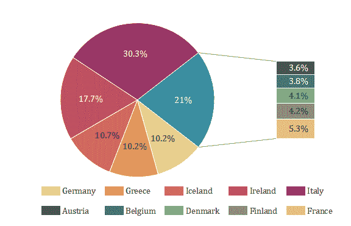

圆形分格统计图表

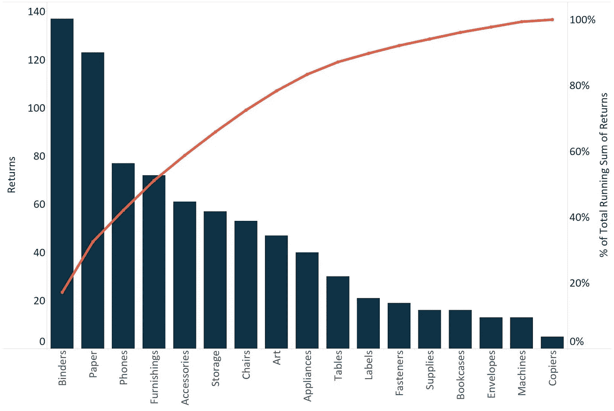

帕累托图

帕累托图包含条形图和折线图。条形代表每个元素的值，直线代表累计总数。帕累托原则指出，80%的效果来自 20%的原因，例如，软件开发人员修复了 20%的错误，这就解决了 80%的问题。

# **数值数据的表示**

1.  柱状图
2.  交叉表
3.  箱形图
4.  散点图

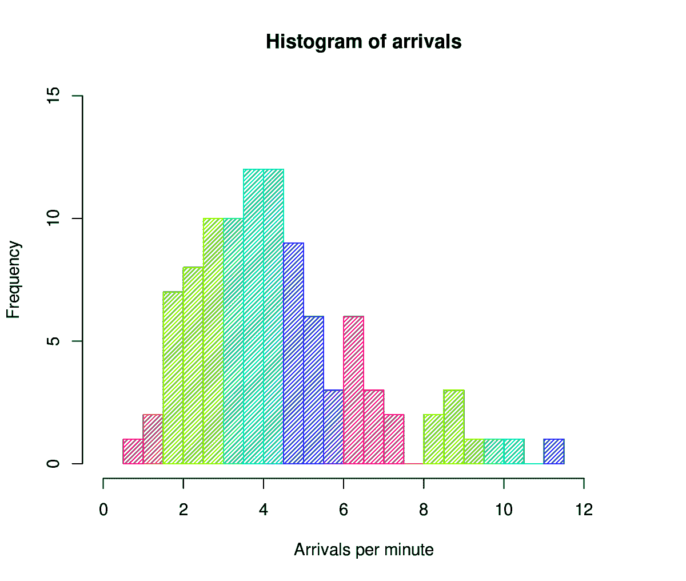

间隔宽度=(最大数量-最小数量)/所需间隔的数量

(10，20)范围从 10 到 20 的区间将包括从 11 到 20 的值，10 将不包括在此区间中。它将预设在[0，10]中。第一个区间将由两个结束值组成。

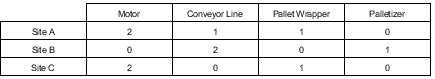

交叉表

箱形图

箱线图通过四分位数描绘了数字数据。

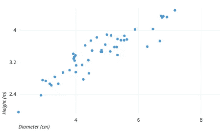

散点图

# **集中趋势**

随机变量的值围绕其平均值、众数或中位数聚集的趋势。

## **集中趋势的度量**

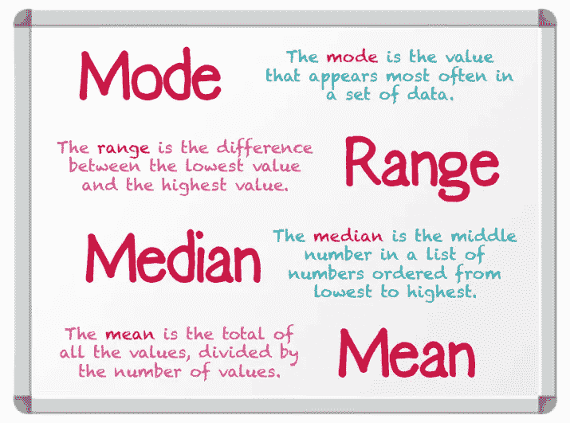

## **偏斜度**

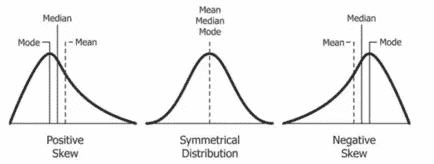

右偏斜或正偏斜是指:均值>中值>众数

左偏斜或负偏斜是指:众数>中位数>平均数

## **方差**

方差是数据点围绕平均值的离差

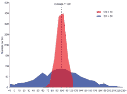

低方差(红色)与高方差(蓝色)

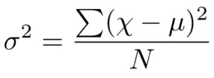

人口方差公式

σ=方差，N =总点数

μ=平均值，x =数据点

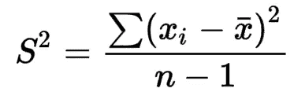

样本方差公式

# 变异系数

变异系数是相对标准差；通过**标准差/均值计算。**用于比较不同尺度上的数据分布。

例如，以美元和₹为单位的比萨饼价格，假设比萨饼的标准价格是美元=3.27，比萨饼的标准价格是₹=61.56

计算出变异系数为$=0.60 后，对于₹=0.60(标准差/平均值)，注意两者的差异是相同的。只是规模不同而已。我们可以在不同的尺度上比较两个数据。

# 协方差

协方差是变量之间关系的度量

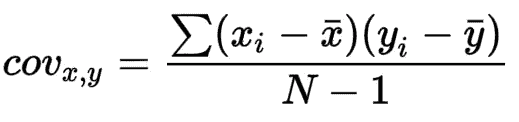

N-1 代表样本，N 代表分母中的总体

x，y 的 x̅ y̅=mean

*   **正协方差**:表示两个变量趋向于同向移动。
*   **负协方差**:这揭示了两个变量趋向于反向运动
*   **中性协方差:**两个变量都是独立的

# 相关系数

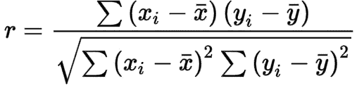

皮尔逊相关

x，y 的 x̅ y̅=mean

相关系数调整协方差，以便两个变量之间的关系易于直观地解释。

协方差:0、+ve 或-ve(通过协方差，您可以知道这两个变量是如何相关的，无论它是同向移动还是反向移动，它不会告诉您关系的大小)

相关系数:-1≤x≤1

相关性为 1 表示整个可变性 1 变量由另一个变量解释(例如，房屋大小和价格为大小增加/减少价格也为增加/减少)

相关性-1 表示整个可变性 1 变量由另一个变量解释(冰淇淋和雨伞在夏季和雨季销售，在夏季销售增加，雨伞销售减少，反之亦然，在雨季)

相关性为 0 表示两个变量是独立的(例如，不同国家的房价和咖啡价格)

相关性 0.x =一个变量将解释 x %的另一个变量方差

## 相关类型

1.  **Pearson 相关性:**Pearson 相关性衡量两个变量之间线性关联的强度和方向。它们用于连续数据*(上述公式)。*
2.  **斯皮尔曼相关:**斯皮尔曼相关是皮尔逊相关的非参数版本。spearman 相关性衡量两个排序变量之间单调关联的强度和方向。(通过将最高值指定为等级 1 来指定等级，第二高的值排名第二，依此类推)，在已排名的变量上找到相关性。Spearman 相关可应用于顺序数据和连续数据。范围[-1 到 1]。(单调关系:如果一个变量增加/减少，另一个变量不会减少/增加)

斯皮尔曼相关公式

di =两个等级之间的差异

n =观察次数

# 原因

两个事件相互关联，但互不因果。

例如，当阳光充足时，安迪得到 A+，阳光充足与 A+相关，但阳光充足不会导致 A+

# 分位数和百分位数

分位数是将概率分布的范围分成具有相等概率的连续区间的切割点

百分位数是一个分数，在其频率分布中低于该分数的给定百分比

例如，中值是分位数；它将数据一分为二(50%分位数)中值或 50%分位数是 4.5 这是百分位数(分位数给出的值是百分位数，分位数用于查看 25%、50%或 75%在分布中所占的值)

**5 点总结**

*   **第 1 个四分位数**:第 25 个百分位数。
*   **中位数(第二个四分位数)**:样本中的中间值，也称为第 50 百分位或第二个四分位数。
*   **第三个四分位数**:第 75 个百分位数。
*   **最小值**:样本中最小的观察值。
*   **最大值**:样本中最大的观察值。

# 推论统计

## z 统计

标准化:改变分布中的每个元素，以获得具有相似特征的新分布。把不同的变量放在同一个尺度上

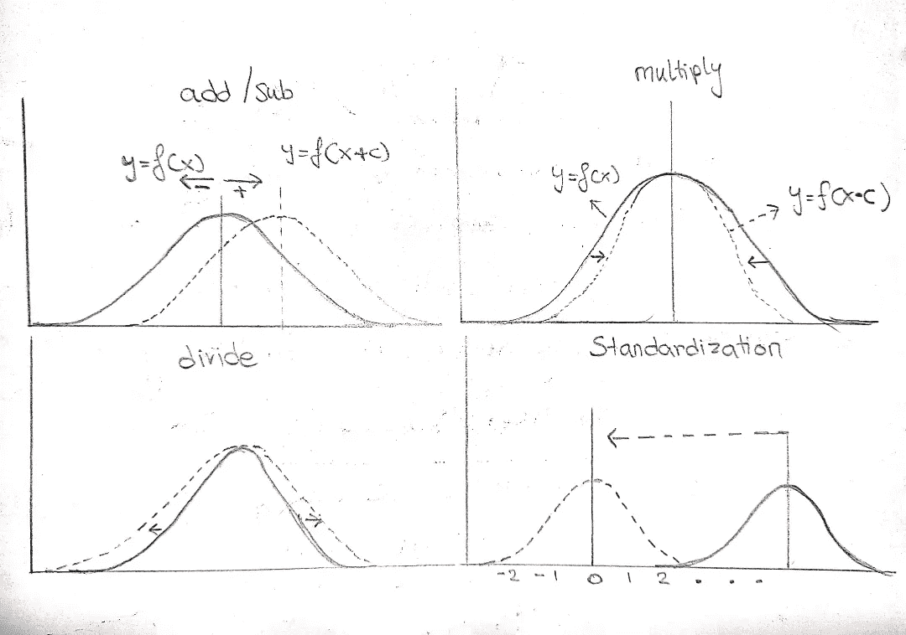

标准正态分布→平均值为 0、标准差为 1 的正态分布

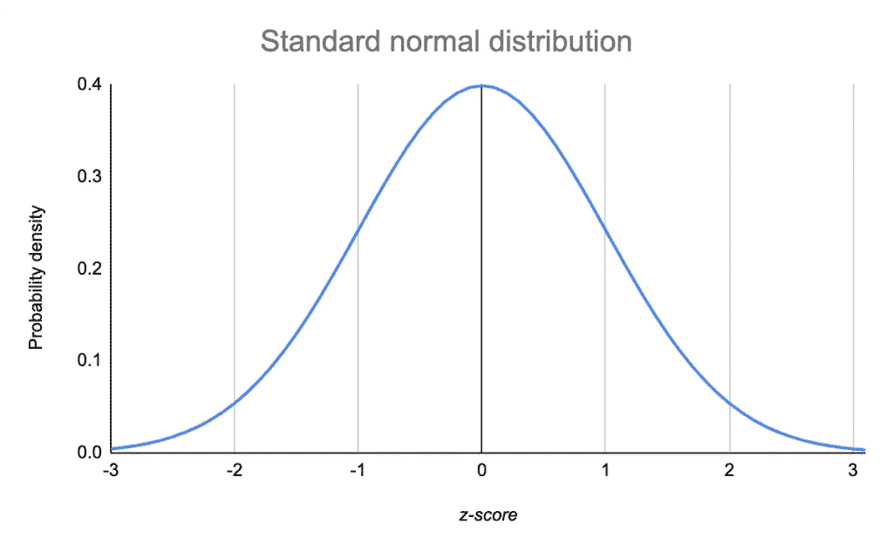

上图 x 值的标准正态分布，增加或减少 1 被视为 z 得分。Z 得分表示观察值偏离中心(平均值)多少个标准偏差(例如，Z=-2 表示观察值向左偏离 2 个标准偏差，Z=1.5 表示观察值向右偏离 1.5 个标准偏差)。

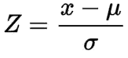

z 统计

x =数据点

μ=平均值，σ=标准差。偏差(总体)

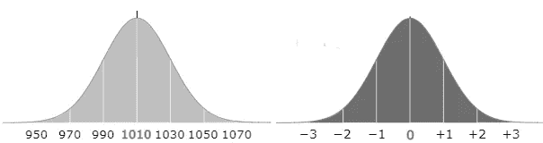

左正态分布(μ=1010，σ=20)→右标准正态分布(μ=0，σ=1)

1010–1010/20 →0

1030–1010/20→1

990–1010/20→ -1

现在 p(x<980)，观察值位于小于 950 的区域的概率是多少，转换为 z. p(z< -1.5)

为了计算面积，我们需要查看 z 表

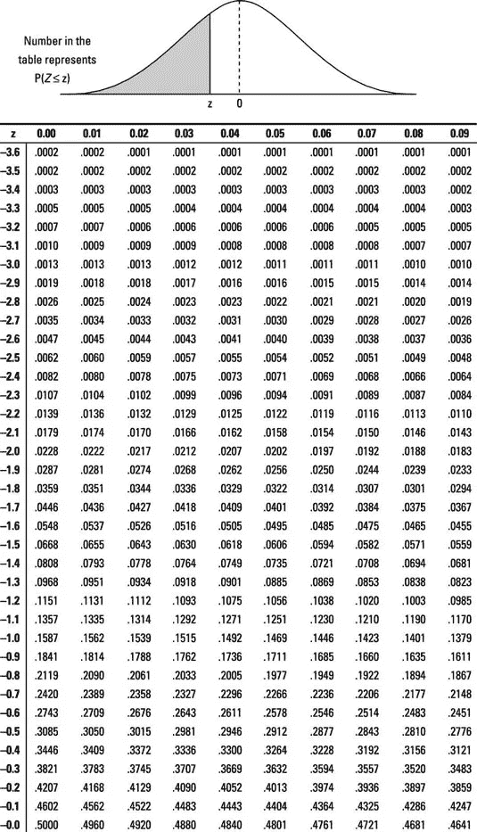

当 Z 值在左半部分时，用于计算左边的面积

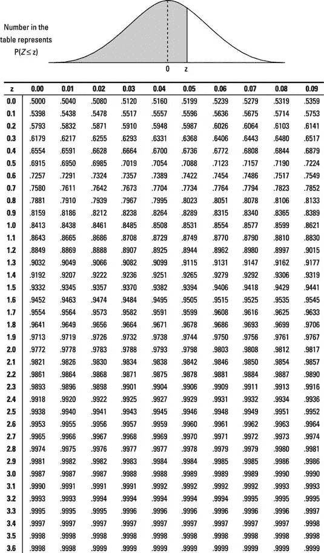

当 Z 值在右半部分时，用于计算左边的面积

p(z

## t 统计

与 Z 统计类似，由于样本数量少，总体方差未知，因此使用样本方差代替总体方差。

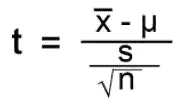

t 分布也用这个公式标准化

x̅=smaple 点

μ=平均值，n =总点数

s =标准偏差(样本)

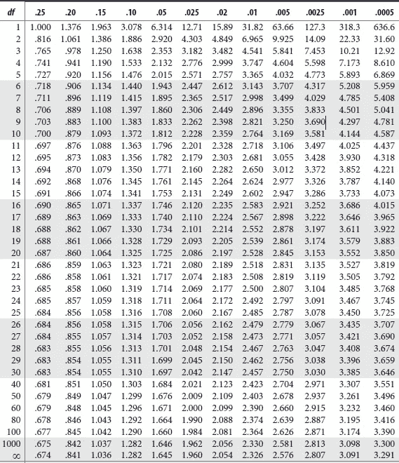

df 是 n-1

## 中心极限定理

无论基础分布如何，抽样分布都将近似正态分布。样本是从总体中用替换物取得的。

原始分布→均值= μ，方差=σ2

抽样分布→均值= μ，方差=σ /n 其中 n 是从总体中抽取的样本数，n 应大于 30。标准误差由√σ2/n 给出(标准误差随着 n 的增加而减小)

# **置信区间**

不是说平均值是 22.50(点估计)，而是说平均值在 20–25 之间(置信区间)。置信区间量化了估计总体变量的不确定性，如均值或标准差

信心程度

90%的置信度→ α=10%

95%的置信度→ α=5%

99%的置信度→ α=1%

较低的置信水平提供了较宽的区间，90%的置信水平表示点估计值有 90%的机会位于区间之间，计算置信区间的公式如下

[点估计可靠性因子×标准误差]

如果总体方差已知，可靠性因子= Z(α/2)，如果不已知，则为 T(DOF，α/2) (DOF 自由度((行数)*(列数))-1)

# 一个样本的置信区间

例如，假设在 95%的置信水平下，数据具有 50 个样本，平均值为 70，标准偏差为 20

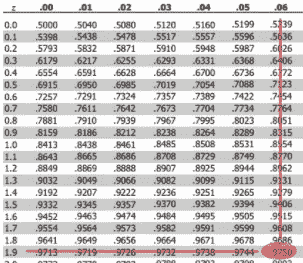

可靠系数(Zα/2) α=5% →0.05/2=0.025

Z 0.025 = 1.96 (Z 表)(1–0.025 = 0.975)

对于 z-表 1.9+0.06 中的 0.975

Z0.025=1.96

标准误差=20/√50 = 2.828，2.828×1.96 =5.542

置信水平为 95%时，置信区间=[70±5.542]→[75.572，64.458]

如果置信区间不包括零假设值，则假设在统计上是显著的

# 两个总体的置信区间

分别来自相应人群的两个样本可归类为:

1.  相关:两个样本都是相关的，例如，培训计划评估从同一组人员中获取前测和后测分数。
2.  独立:两个样本都是独立的，例如，100 名女性的随机样本和 100 名男性的随机样本。结果将是两个彼此独立的样本。

独立样本可以进一步分为 3 类。

1.  已知总体方差的两个样本
2.  总体方差未知但假设相等的两个样本
3.  总体方差未知但假设不相等的两个样本

## **从属样本**

CI=Xd z(α/2)×σ/√n (Xd=两个样本差值的平均值，z =可靠性因子，σ/√n =标准误差)

CI=Xd t(DOF，α/2)×s/√n-1(如果样本少于 30，则使用 t 统计量代替可靠性因子的 z 统计量)

例如，比较训练计划前后的收缩压

假设零假设:两个平均值之差为 0

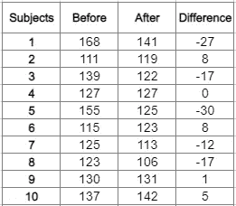

1.  发现两个值的差异
2.  计算差值的平均值(Xd)
3.  然后是 Xd 的差和 X̅d 的差的均值
4.  Xd=-81/10 →-8.1

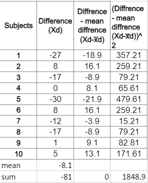

5.σ=1848.9/14(样本σ除以 n-1，总体σ除以 n)

6.标准误差= 34.08

7.t 统计=对于 95%置信度为 2.145

8.置信区间=8.1 2.145×34.08

9\. [-81.2 — 65.00]

由于零假设值在置信区间内，我们可以接受零假设，即训练前后的血压没有统计学上的显著差异。

## 独立样本。

## 独立样本，已知总体方差

工程学生和管理学生的分数，找出工程学生和管理学生分数差异的 95%置信区间。

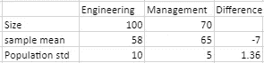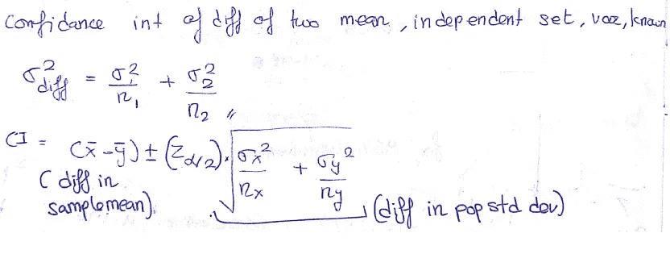

差异的方差→ 1.36

CI=-7 1.96*1.36

CI=[-9.66，-4.34]

95%确信工程和管理的分数差为[-9.66，-4.34]，区间为负，因为如果我们认为 x̅是管理专业，y̅是工程师，则工程专业学生的分数低于管理专业，置信区间为[9.66，4.34]

## 独立样本，未知总体方差，但假设相等

城市 A 和城市 B 的苹果价格，这里的人口方差是未知的，因为我们无法获得整个城市的苹果价格，并且只能从少数商店收集样本，所以人口方差是未知的，并且假设是相等的。

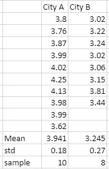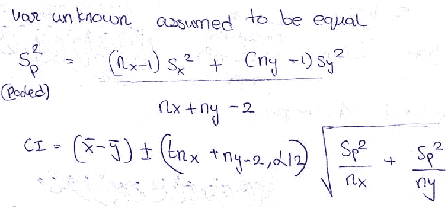

Sx，Sy =样本标准 nx，ny =样本量

注:由于没有关于总体方差的信息，可靠性系数中使用了 T 统计量

CI =(3.94–3.25)+-2.12 √( 0.05/10+0.05/8)

CI=[0.47，0.92]

## 独立样本，未知总体方差，假设不相等

在前面的例子中，我们可以比较一个镇上的苹果和橘子，而不是比较两个城市的苹果。由于我们比较苹果和桔子，它们的价格和需求不同，所以我们不能假设总体方差相等。

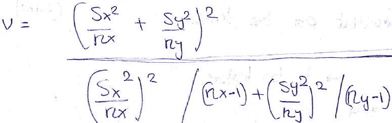

# 假设检验

该假设是关于一个总体参数的声明

H0:零假设:有待检验的观点

H1:替代假设:一个与零假设相矛盾的想法

例如，假设学生的平均年龄是 23 岁

H0: μ=23

H1: μ≠23

显著性水平→α(如果为真，则拒绝零假设的概率)

使用 Z 检验或 T 检验来检验假设。

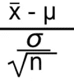

x̅=sample 意思是

μ=假设平均值

σ/√n =标准误差

## 零假设的拒绝区域

拒绝区域是零假设被拒绝的区间。

**两条尾巴测试**

H0: μ=23

H1: μ≠23(备选假设可以是>或< 23 )

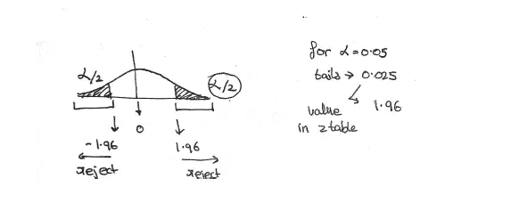

**单尾检验**

H0: μ≥23

H1: μ <23 ( the alternate hypothesis can< 23 )

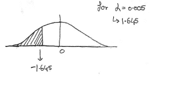

The alternate hypothesis decides the one tail or two-tail test if H1≠ , then it is a two-tail test if H1< then it is one tail test(left tail test) and if H1>然后就是(右尾测试)

例如，

假设一个群体的平均体重为 168 磅(群体平均值)，标准差为 3.9(群体方差)。一位营养学家认为平均体重是不同的，所以她抽样了 36 个人的体重为 169.5 磅。有 95%的把握。这足以去掉 36 个组的平均值吗

H0: μ=36

H1: μ≠36(双尾检验)

x̅=169.5，n=36，σ=3.9，μ=168，α= 1–0.95 = 0.05

Zc(临界值)= Zα/2→Z0.025→1.96(取自 Z 表的值)和-1.96，因为双尾

z(测试统计)=(169.5–168)/(3.9/√36)

Z=2.31

## **有两种方法可以检查零假设是被接受还是被拒绝**

1.  -Zc <z since="">1.96 已经进入拒绝区域，因此拒绝了零假设。</z>
2.  P 值= P 值告诉我们，如果零假设为真，我们是否不太可能在 H1 方向观察到这样的检验统计。因此，如果 P 值< α, then the null hypothesis is rejected if P-value > α，则接受零假设

## 单尾检验的 P 值

1.  左尾检验 P =(Z 的面积值(检验统计))
2.  右尾检验 p = 1-(Z 的面积值(检验统计))

## 双尾检验的 P 值

1.  对于双尾检验，如果(Z 的面积值)是< 0.5, then P=2×(area value of Z)
2.  If the (area value of Z ) is > 0.5，那么 P =((1-(Z 的面积值))×2

Z 的面积值→上例中 Z=2.31

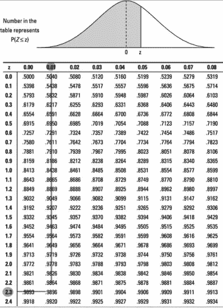

Z=2.31 的面积值是 0.9896

因为这是一个双尾检验，0.9896 > 0.5

p =((1–0.9896))×2 = 0.0208

0.0208<0.05(α)

H0 被拒绝了

如果总体方差未知，则在上述示例中使用 T 统计量而不是 Z 统计量。如果总体方差未知，则使用样本标准差。假设样本标准差=3

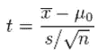

H0: μ=36

H1: μ≠36(双尾检验)

x̅=169.5，n=36，s=3，μ=168，α= 1–0.95 = 0.05

t =(169.5–168)/(3/√36)= 3

自由度= 36–1 = 35

α=0.05

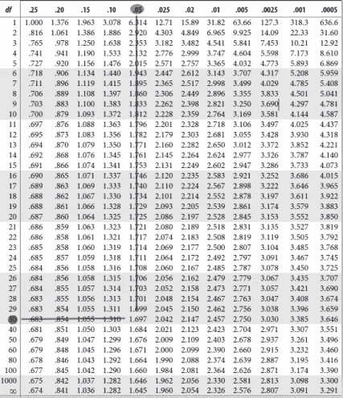

双尾检验

TC =-1.697–1.697

因此 H0 被拒绝了

## 多总体假设检验

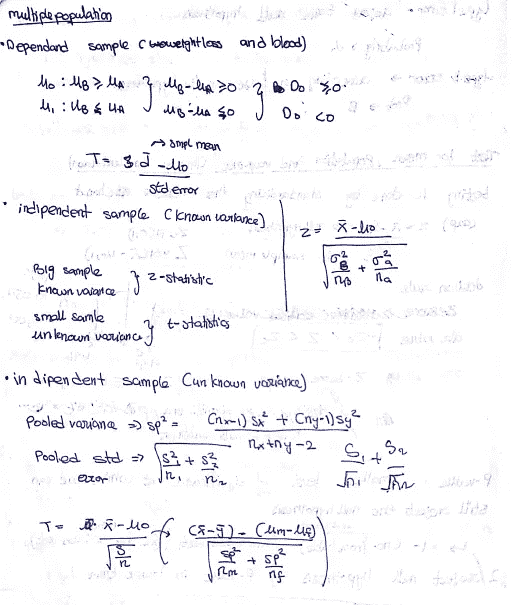

# p 值

P 值是随机机会产生的数据或其他相等甚至更少的数据的概率。

比如两次抛硬币结果是人头，硬币对人头有什么好处吗？

H0:硬币没什么区别，可能是第三个项目

H1:得到人头的概率是>

投掷两枚硬币{HH，HT，TH，TT}

得到两个头的概率=0.25

2 个头的 P 值=计算 P 值的 3 个零件

1.  事件的概率{H，H} =0.25
2.  相似概率={T，T} = 0.25 的事件
3.  概率大于 P 值= 0 的事件，因为不存在概率大于 0.25 的事件

{H，H}的 p 值= 0.25+0.25+0=0.5

## 分布的 p 值

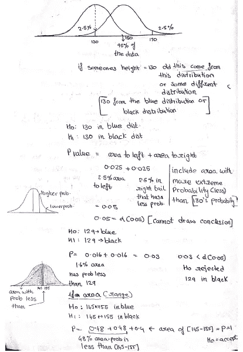

双尾检验的 P 值

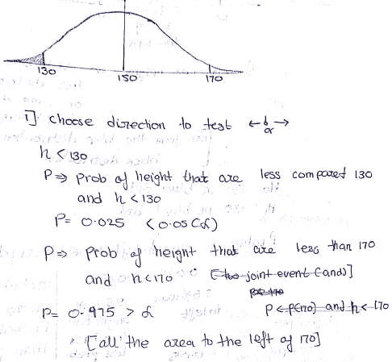

单尾检验的 P 值

# 如何决定拒绝或接受零假设

# 临界区域法

拒绝区域是曲线下的区域(零假设不太可能出现的一端)。点 Zc 是分开接受区域和拒绝区域的分界点。Zc 值或拒绝面积取决于 0.05 的α(显著性水平)，这表明接近末端的 0.05 的面积是不显著的。类似地，0.10 的α表示 0.10 到末端的区域不重要。Zc 是使用 Z 或 T 分布表找到的，左尾和右尾是不同的表。

z 是标准化测试统计量。如果它穿过 Zc 或处于拒绝区域，则拒绝零假设。

## **单尾检验**

1.  左尾:临界值(α=0.05(面积)那么 Zc(0.05)=0.05→-1.645 所以如果 Z
2.  Right Tail: Two ways to find Zc. 1 ) Find Zc for left tail due to symmetry Zc for right will be the same as Zc for left with +ve sign or 2 ) Zc(0.05) = 1–0.05=0.975→1.96

## Two-Tailed Test

Since its a Two Tail test, the rejection region will be α/2 for the left side and α/2 for the right side to calculate Zc for α of 0.05 on the left side Zc(0.025)→-1.96, since the normal distribution is symmetric the Zc(0.025) for the right side→1.96, to accept Null Hypothesis -Zc

# P-Value

The probability of obtaining a result at least as extreme as the current one, assuming null is true. In simple terms, **P 值告诉我们如果零假设为真有多大可能得到这样的结果。**

让我们取一个μ=70 的人口数据，现在你想测试μ是否真的是 70 或者(，≦)，我们不能检查整个人口中的每个观察值。因此，我们取一个样本，假设样本 s1，现在假设对 s1 进行采样和计算，它显示了与总体数据相似的参数μs1=70。

现在，P 值表示获得与 s1 具有相似特征的另一个样本的概率。让我们保持 P 值为 0.18。这告诉我们，我们有 18%的机会获得与 s1 具有相似特征的另一个样本 s2。

P 值的范围可以从 0%到 100%，P 值本身不能说明太多，例如，P= 0.18 表示 18%的机会，P=0.50 表示 50%的机会，这是我们将 P 值与显著性水平α进行比较的地方，如果 P α，则接受零假设。

感谢您的阅读

参考

 [## 从机器学习开始——机器学习掌握

### 我最常被问到的问题是:“我该如何开始？”我对获得…的最佳建议

machinelearningmastery.com](https://machinelearningmastery.com/start-here/#statistical_methods) 

图片→谷歌