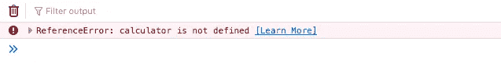
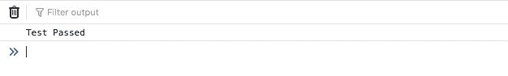

# 测试驱动开发的基础

> 原文：<https://medium.com/nerd-for-tech/basics-of-test-driven-development-5cf44759077e?source=collection_archive---------11----------------------->


安吉丽娜·利特温在 Unsplash 上的照片

我想给你一个关于 TDD 的简介，用几句话来理解这个方法论。

测试驱动开发或 TDD 是关于在开发之前编写测试的。这是一种文化，它意味着为每一个功能开发测试，保护软件过程在完成期间和完成之后不会失败。

# 利益

*   **任何变化都不小:**任何变化都不小:任何变化，对于更小的，可以看，可以在应用程序中产生错误，测试屏蔽的那种。
*   **重构时的信任:**重构有时意味着我们要对代码进行艰难的修改，顺便说一句，总是存在对应用程序失败的恐惧。一组好的测试保护我们免受更重要的功能的影响。
*   **QA 团队有限公司:**拥有一套好的自动运行的测试可以给我们的资源带来很好的优化，我们可以用它来开发复杂功能的测试。

# 逐步地

为了开发这种方法的一个例子，我们将得到一个木雕师的工作。

*   **首先，测试:**在对雕塑进行任何修改之前，有必要对毛坯上的作品进行测量和规划。顺便说一句，在他的脑海中想象一下这个作品会是什么样子是可能的。
*   **雕刻物品:**因此，雕塑家开始雕刻物品。
*   **打磨:**雕塑家一旦完成了修改，就需要对作品进行打磨，每次修改都要更加精准。
*   **重复前面的步骤:**这个方法论构成了一个进化的过程；因此，重复对于所有项目的开发都是必要的。

在构建产品之前，软件开发可能需要许多规范。使用 TDD 方法，我们可以保证每个记录的步骤，以及过程的每个阶段都受到保护。

TDD 也给开发人员带来了从一个明确的目标开始，并编写直接符合规范的代码的能力。

我将向您展示一个 javascript 示例(对于不了解 javascript 的人来说，阅读步骤就可以理解这个示例)。

# 使用 Javascript 的 TDD 方法

然后我们要开发一个叫做乘法的小功能，它是计算器的一部分。因此，请记住使用 TDD 方法进行测试的步骤。

1.  先测试。
2.  测试抛出错误。
3.  完成开发功能的测试。
4.  改善功能。
5.  重复，直到你得到良好的发展。

# 示例:

1.  我们将开发计算器的乘法功能。从我们的例子开始，我们将创建一个验证乘法功能的测试。

```
function multiplyTest() { 
    var result = calculator.multiply(3, 3); 

    if (result === 9) { 
        console.log('Test Passed'); 
    } else { 
        console.log('Test Failed'); 
    } 
};

multiplyTest();
```

该测试调用了一个乘法函数，该函数仍有待定义。然后，它验证函数的结果是否符合预期，并根据该结果确定测试是否合格。

**2。**结果，测试抛出一个错误，该错误将在 web 浏览器控制台中显示，如下图所示:



出现这个错误是因为计算器应用程序调用了一个我们没有创建的方法“multiply”。

**3。**在 TDD 中，重点在于添加一个更简单的变更来通过测试。现在没有必要开发所有的乘法逻辑。那么，我们可以做什么更简单的改变来使测试通过返回预期的值呢？



```
function multiply() { 
    return 9;
};
```

**4。**重构步骤应该消除信任乘法函数的返回值，我们添加该函数作为通过测试的解决方案。

```
function multiply(amount1, amount2) { 
    return amount1 * amount2;
};
```

现在，我们将刷新导航器来修复测试。会像以前一样过去吗？


Excelent！

**最终代码:**

```
function multiply(amount1, amount2) { 
    return amount1 * amount2;
};

function multiplyTest() { 
    var result = calculator.multiply(3, 3); 

   if (result === 9) { 
        console.log('Test Passed'); 
    } else { 
        console.log('Test Failed'); 
    } 
}

multiplyTest();
```

通过这个练习，我已经完成了关于 TDD 的帖子，我希望你已经了解了这种方法的基本概念，这将帮助我们有一个更好和更可信的代码。

原载于[cunigarro.dev/blog/basics-of-tdd](http://cunigarro.dev/blog/basics-of-tdd)