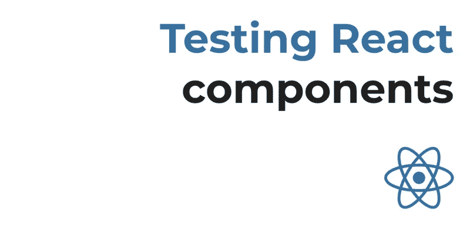

# React 中单元测试的基础

> 原文：<https://medium.com/nerd-for-tech/basics-of-unit-testing-in-react-e38b7ed3be1b?source=collection_archive---------7----------------------->



大家好，这次我带来了另一篇关于 React 中单元测试基础的文章。所以不浪费任何时间，让我们从单元测试的基础开始。

**测试**是执行程序的过程，目的是发现错误。

通常测试分为三类。

*   功能测试
*   非功能测试或性能测试
*   维护(回归和维护)

今天的话题属于功能测试。

让我们从定义什么是**单元测试**开始:

> 单元测试软件测试的一种类型，对软件的单个单元或组件进行测试。目的是验证软件代码的**每个单元**是否按预期执行。

**单元测试由**开发人员**在应用程序的开发(编码阶段)**期间完成。单元测试隔离一段代码并验证其正确性。单元可以是单独的函数、方法、过程、模块或对象。

为了执行单元测试，我们需要编写测试用例，所以你可能会问什么是测试用例。

> **测试用例**是一组条件或变量，在这些条件或变量下，测试人员将确定被测系统是否满足需求或正常工作。

我们必须在**测试套件**中包装我们的测试用例。

> 一个测试套件，通常称为“验证套件”，是一个测试用例的集合，旨在用于测试一个软件程序，以显示它具有一些指定的行为集。

现在我们该谈谈**断言**，断言用于验证**测试用例**并帮助我们了解**测试用例**是通过还是失败。

现在让我们试着理解为什么我们要使用 TDD( **测试驱动开发**)来创建一个 React.js 组件？

TDD 给我们的代码带来了许多好处——高测试覆盖率的一个好处是，它支持简单的代码重构，同时保持代码的整洁和功能性。

如果您以前创建过 React.js 组件，那么您会意识到代码增长非常快。它填充了许多由与状态变化和服务调用相关的语句引起的复杂条件。

每个缺少单元测试的组件都有遗留的代码，这些代码变得难以维护。

# 我们如何对 React.js 组件进行单元测试？

我们可以使用许多策略来测试 React.js 组件:

*   我们可以验证当某个事件被调度时，我们的`props`中的特定函数被调用。
*   我们还可以在给定当前组件状态的情况下获得`render`函数的结果，并将其与预定义的布局进行匹配。
*   我们甚至可以检查组件的子组件数量是否与预期数量相匹配。

为了使用这些策略，我们将使用两个方便的工具在 React.js 中进行测试: [Jest](https://facebook.github.io/jest/) 和 [Enzyme](https://github.com/airbnb/enzyme) 。

# 使用 Jest 创建单元测试

Jest 是由脸书创建的开源测试框架，与 React.js 有很好的集成。它包括一个用于测试执行的命令行工具，类似于 Jasmine 和 Mocha 提供的工具。

它还允许我们用几乎为零的配置创建模拟函数，并提供了一组非常好的匹配器，使得断言更容易阅读。

此外，它提供了一个非常好的特性，叫做“快照测试”，帮助我们检查和验证组件渲染结果。

现在让我们开始写一些代码来理解如何测试我们的组件。

**使用断言**

```
var assert = require(‘assert’);describe(‘Basic Mocha String Test’, function (){it(‘should return number of characters in a
string’, function () {
assert.equal(“Hello”.length, 4);
});it(‘should return first character of the string’,function () {
assert.equal(“Hello”.charAt(0),‘H’);
});});
```

让我们试着理解上面的代码试图做什么:-

**断言**有助于确定测试的状态。
**描述**是一个保存测试集合的函数。它有两个参数，第一个是被测功能的有意义的名称，第二个是包含一个或多个测试的函数。我们也可以嵌套 describe。
**IT** 也是一个函数，它实际上是一个测试本身，有两个参数，第一个参数是测试的名称，第二个参数是保存测试主体的函数。

有时我们在组件中使用第三方库，当我们试图运行我们的测试用例时，它不起作用，因为我们的测试库不知道那个库。对于这样的场景，我们可以使用 jest 创建模拟函数。

模拟函数也被称为“间谍”，因为它们让您可以窥探被其他代码间接调用的函数的行为，而不仅仅是测试输出。

让我们假设我们正在测试一个函数`forEach`的实现，该函数为所提供的数组中的每一项调用一个回调。

```
function forEach(items, callback) {
for (let index = 0; index < items.length; index++) {
callback(items[index]);
}
}
```

为了测试这个函数，我们可以使用一个模拟函数，并检查模拟函数的状态，以确保回调按预期被调用。

```
const mockCallback = jest.fn(x => 42 + x);forEach([0, 1], mockCallback);*// The mock function is called twice*expect(mockCallback.mock.calls.length).toBe(2);*// The first argument of the first call to the function was 0*expect(mockCallback.mock.calls[0][0]).toBe(0);*// The first argument of the second call to the function was 1*expect(mockCallback.mock.calls[1][0]).toBe(1);*// The return value of the first call to the function was 42*expect(mockCallback.mock.results[0].value).toBe(42);
```

**。模拟**属性:-所有模拟函数都有这个特殊的**。mock** 属性，它保存了关于函数如何被调用以及函数返回了什么的数据。

正如我所说的，我们也可以模仿第三方模块，这里有一个例子

```
jest.mock('axios');test('should fetch users', () => {const users = [{name: 'Bob'}];const response = {data: users};axios.get.mockResolvedValue(response);*// or you could use the following depending on your use case:**// axios.get.mockImplementation(() => Promise.resolve(*response*))*return Users.all().then(data => expect(data).toEqual(users));});
```

# 使用酶挂载 React.js 组件

Enzyme 提供了一种挂载和遍历 React.js 组件树的机制。这将帮助我们访问它自己的属性和状态以及它的子属性，以便运行我们的断言。

Enzyme 为元件安装提供了两个基本功能:`shallow`和`mount`。`shallow`函数只在内存中加载根组件，而`mount`加载整个 DOM 树。

enzyme 是 React 的一个 JavaScript 测试工具，它使测试 React 组件的输出变得更加容易。用于完整 DOM 呈现的 mount( <component>)非常适合这样的用例，其中您的组件可能会与 DOM APIs 交互，或者可能需要完整的生命周期来全面测试
组件(即 componentDidMount 等)。)</component>

Mount 是测试 componentDidMount 和 componentDidUpdate 的唯一方法。包括子组件的完整渲染。需要一个 DOM (JSdom)。

用于浅层渲染的**Shallow**(<Component/>)对于约束自己将一个组件作为一个单元进行测试，并确保您的测试不会间接断言子组件的行为是非常有用的。

# 简单的浅层

通话:

*   构造器
*   提供；给予

# 浅+深

通话:

*   componentWillReceiveProps
*   shouldComponentUpdate
*   组件将更新
*   提供；给予

# 浅层+卸载

通话:

*   组件将卸载

> 浅层的例子:-

**基本示例**

```
it('should render three <Foo /> components', () => {
 const wrapper = shallow(<MyComponent />);
 expect(wrapper.find(Foo)).to.have.length(3);
 });
```

**传递子组件时渲染子组件**

```
it('should render children when passed in', () => {
 const wrapper = shallow(
  <MyComponent>
    <div className="unique" />
  </MyComponent>
  );
 expect(wrapper.contains(<div className="unique" />)).to.be.true;
 });
```

**刺激的咔哒声:-**

```
it('simulates click events', () => {
 const onButtonClick = sinon.spy();
 const wrapper = shallow(
 <Foo onButtonClick={onButtonClick} />
 );
 wrapper.find('button').simulate('click');
 expect(onButtonClick.calledOnce).to.be.true;
 });
```

现在我们来说说 **SPY** ，一个测试 SPY 就是**为它所有的[调用](https://sinonjs.org/releases/latest/spy-call)记录参数、返回值、** `**this**` **的值以及抛出的异常(如果有的话)**的函数。有两种类型的间谍:一些是匿名函数，而另一些包装测试系统中已经存在的方法。

sinon.spy(object，“method”)创建一个封装现有函数的 spy。

例子

我们可以检查一个函数被调用了多少次

```
it('should call save once', function() {   
 let save = sinon.spy(Database, 'save');
 setupNewUser({ name: 'test' }, function() { });    
 save.restore();   
 sinon.assert.calledOnce(save); 
});
```

我们可以检查传递给函数的参数是什么

```
it('should pass object with correct values to save', function() {    
 let save = sinon.spy(Database, 'save');
 let info = { name: 'test' };
 let expectedUser = {name:info.name, nameLowercase: info.name.toLowerCase()}; setupNewUser(info, function() { });
 save.restore(); 
 sinon.assert.calledWith(save, expectedUser);
});
```

最后，我还想介绍一下存根，存根就像间谍一样，但是它们取代了目标函数。你可以使用 stubs 来控制一个方法的行为，以强制一个代码路径(比如抛出错误)或者阻止对外部资源的调用(比如 HTTP APIs)。

存根有一些常见的用途:

*   您可以使用它们来替换有问题的代码
*   您可以使用它们来触发本来不会触发的代码路径，比如错误处理
*   您可以使用它们来帮助更容易地测试异步代码

示例:-

我们前面的例子使用了 Database.save，如果我们在运行测试之前没有设置数据库，这可能会成为一个问题。因此，使用存根而不是间谍可能是个好主意。

```
it('should pass object with correct values to save', function() {
 let save = sinon.stub(Database, 'save');
 let info = { name: 'test' };
 let expectedUser = {name: info.name, nameLowercase: info.name.toLowerCase()};
 setupNewUser(info, function() { });
 save.restore();
 sinon.assert.calledWith(save, expectedUser); 
});
```

**存根也可以用来触发不同的代码路径。**

```
it('should pass the error into the callback if save fails', function() {
 let expectedError = new Error('oops');
 let save = sinon.stub(Database, 'save');
 save.throws(expectedError);
 let callback = sinon.spy();
 setupNewUser({ name: 'foo' }, callback);
 save.restore();
 sinon.assert.calledWith(callback, expectedError); 
});
```

希望你喜欢我的文章，谢谢。