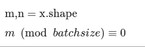
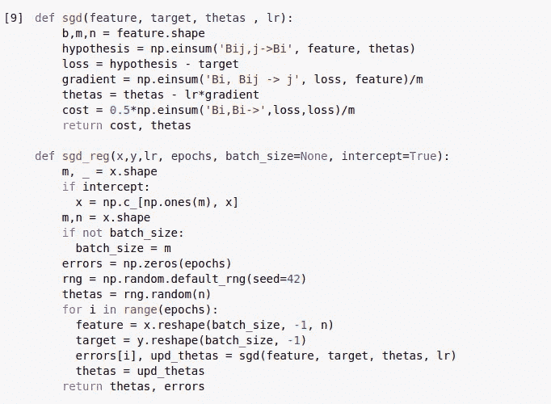
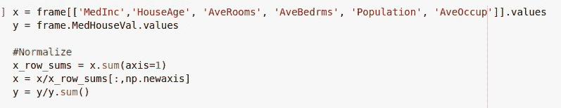
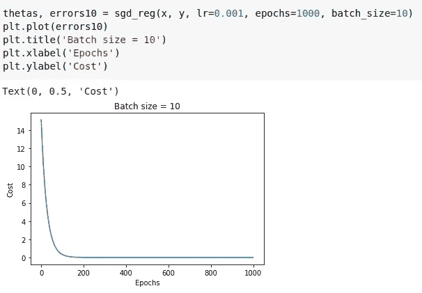
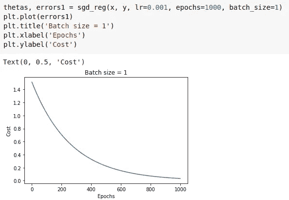
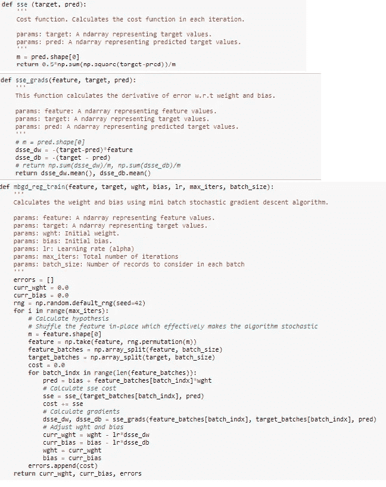
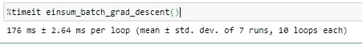
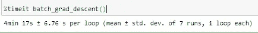

# 使用 Numpy 的 einsum 的批量梯度下降算法

> 原文：<https://medium.com/nerd-for-tech/batch-gradient-descent-algorithm-using-numpy-einsum-f442ef798ee2?source=collection_archive---------23----------------------->

免费[股票图片](https://pixabay.com/photos/albert-einstein-portrait-1933340/)取自 [Pixabay](https://pixabay.com/)

## 爱因斯坦求和技术的应用。不，他没有发明它，他用它来表达广义相对论的完整论文。这是格雷戈里奥·利玛窦发明的——柯巴斯托因利玛窦微积分或他们现在称之为“张量分析”而闻名！

最近我发现了 numpy 的 einsum，并了解了它在速度和内存效率方面的能力。它在表达矩阵和向量的线性代数运算时也很简洁。

所以我决定用它实现批量梯度下降。在我的代码中，我将加州住房数据作为输入。它总共有 20640 条记录。在我的实现中，如果没有给定批量大小，它被设置为 20640，也就是说，所有的东西都是一次取出的。当批大小(n)给定时，记录被分成 n 批，然后在这些批上实施梯度下降。

> 说够了！给我看看代码！！

这是我的 colab 笔记本的链接。

 [## 谷歌联合实验室

批次 _ 梯度 _ 下降 _ 数量 _ 总和](https://colab.research.google.com/drive/11Bzqk5zQVa2UYqTvr9mxoxK4RZeexEm2?usp=sharing) 

下面是使用 numpy 的‘einsum’的批量梯度下降算法的图片。在我的实现中，唯一的限制是数据 X 中的记录总数应该是“batch_size”的倍数，即

数据记录计数' m '应能被批处理大小整除-图像归作者所有

使用 numpy 的 einsum 实现批量梯度下降—图像归作者所有

数据标准化-图像归作者所有

批量为 10 的调用和每次迭代的成本衰减—图片归作者所有

批量为 1 的调用和每次迭代的成本衰减—图片归作者所有

现在你可能会问，为什么在实现批量梯度下降时应该选择“np.einsum”而不是正常的 numpy 函数。让我们尝试在不使用 einsum 方法的情况下实现批量梯度下降。

不使用 einsum 的正常批量梯度下降—图像归作者所有

只需看看在不使用 einsum 的情况下实现正常批处理梯度下降时使用的巨大代码量和大量 for 循环。尽管机器学习对新手来说看起来很容易，但执行这段代码所需的时间和内存却一飞冲天。我还忽略了一个事实，即不使用 einsum 的正常实现只处理一维数组特征向量，而不是完整的数据帧。

以下是**使用 einsum** 方法所用的时间:

使用 1000 个时期、批次大小为 80 的 einsum 进行批次梯度下降所用的时间。—图片归作者所有

这里也是**不使用 einsum** 方法时所用的时间:

不使用具有 1000 个时期和批次大小为 80 的 einsum 的批次梯度下降所用的时间。—图片归作者所有

> 在我的机器上，普通实现比 einsum 实现慢 1，460 倍。慢了 146，022%。唷！

我同意没有 einsum 的批量梯度下降实现可以进一步改进。但它仍然很麻烦，容易出错，并且这种编码在神经网络中使用时无法扩展。

如果这种时间比较不能促使你开始使用 einsum 方法，那么你应该尝试实现任何简单的神经网络，不管有没有 einsum。然后你会开始欣赏它的简单性、速度、记忆效率和表现力。

请慷慨鼓掌(这根本不需要花费)，并在下面分享你的评论，让我知道你是如何喜欢这篇文章的。

我是 TCS 的机器学习工程师，我的(数字软件和解决方案)团队正在开发令人惊叹的产品。点击下面的链接，了解更多关于我们产品的信息:

 [## 数字软件和解决方案:提供高度个性化的体验

### Digital Software & Solutions 的互联智能解决方案将帮助您转变产品和服务…

www.tcs.com](https://www.tcs.com/dss)