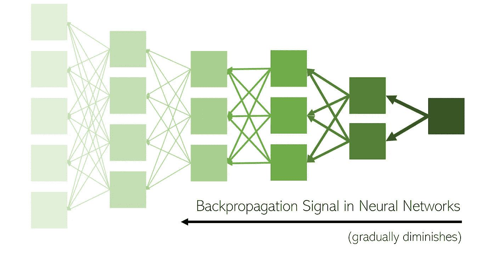
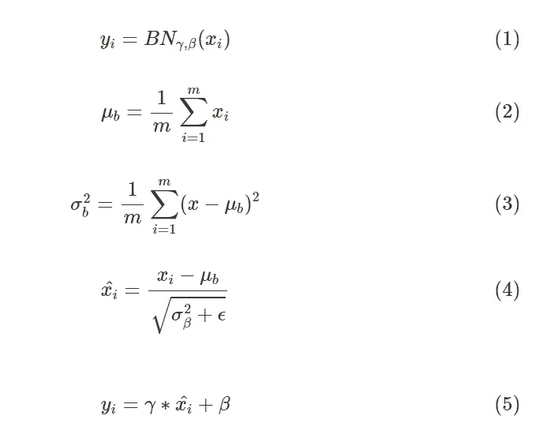

# 批量标准化

> 原文：<https://medium.com/nerd-for-tech/batch-normalization-51e32053f20?source=collection_archive---------6----------------------->


在开始我们的主题之前，让我们看看为什么规范化对于数据是一件重要的事情。当进入数据分析/预测部分时。

**什么是数据规范化？**

当今世界正在处理我们日常生活中的数据。比方说，从亚马逊购买产品，评论你以前购买的产品，添加到每日观看的网络系列中，所有这些都代替了数据收集。同样的数据对预测/客户推荐也很有用。好吧！。让我们从为什么要对数据进行归一化开始。在任何数据库世界中，在将数据用于分析/业务需求之前，都应该对数据进行规范化。通常，数据也可能具有冗余结构。我们还需要删除冗余数据。然后需要有表之间的键映射才能有更好的理解。这一切都是为了使数据规范化。当数据被规范化时，在表/应用程序级 CRUD 操作之间的查询获取可以更容易地完成。让我们开始理解为什么在 ML 中需要规范化。

**在 ML 中归一化**

假设数据集有两种类型的变量，一种以英里为单位，另一种以小时为单位。如果不应用标准化，模型不会提供最佳结果。因此，我们需要在应用模型之前将数据标准化。有一个步骤叫做‘数据预处理’。这将通过应用以下三种技术来实现数据规范化。

*   **重新调整:**也称为“最小-最大归一化”，是所有方法中最简单的方法，计算如下:


*   **均值归一化:**该方法使用转换过程中观察值的均值:


*   **Z 分数标准化:**也称为标准化，这种技术使用 Z 分数或“标准分数”。它广泛用于机器学习算法，如 SVM 和逻辑回归:


这里，z 是标准分数，是总体均值，ϭ是总体标准差。

希望所有的理解都到位。下面详细开始批量归一化。

**为什么需要批量标准化？**

批量归一化适用于深度学习模型。其中输入以层的形式结构化。该层具有多个神经元，并且每个神经元被分配一个权重。增加的权重作为输入传递给另一层。第二层使用权重和流程，并为另一层提供输入。整个数据集不是作为输入传递到图层，而是作为小批传递。


随着不同的小批量数据在网络中加载和传递，各层的输入分布会发生跳跃，这使得各层的工作变得更加困难。除了拟合基础分布之外，所讨论的图层现在还必须考虑图层输入分布中的漂移。这种转移输入分布的现象被称为 ***内部同变量转移*** 。因此，通过使用批量标准化技术，这个问题得到解决。

# 那么，什么是内部协变量转移呢？？

> *“****内部协变移位*** *是由于训练过程中网络参数的变化而引起的网络激活分布的变化。”*


你的关系网越深，内部协变*引起的混乱*就越多。让我们记住，神经网络通过电话的数学游戏来学习和调整它们的权重(链中的人或“层”越多，消息就越混乱)。作为神经网络的构建者，我们的工作是**稳定**并改善输出层结果和每个隐藏层节点之间的联系。

> 当我们网络的输入分布发生变化时，就会发生**内部协变量偏移**。当输入分布改变时，隐藏层试图学习适应新的分布。这会减慢训练过程。如果一个过程变慢了，需要很长时间才能收敛到全局最小值。当网络输入的统计分布与以前看到的输入有很大不同时，就会出现这个问题。批处理规范化和其他规范化技术可以解决这个问题。

你玩过用杯子和绳子打电话的游戏吗？把这个想象成，只有你可以调整你的手机，让它更清晰(例如，调整你的参数)。第一个人告诉第二个人，“去给植物浇水”，第二个人告诉第三个人，“你裤子里有水”，等等，直到最后一个人听到，“风筝砰的一声吃掉脸猴”或者其他完全错误的话。让我们说，这些问题完全是系统性的，完全是因为有缺陷的红杯子。


现在，假设我们可以修理我们的杯子(或者换个新的),这样我们可以更好地传递信息。我们告诉最后一个人正确的答案，他稍微修理了一下他的杯子，然后通过与倒数第二个人交谈来测试它。倒数第二个家伙告诉倒数第三个家伙去修理东西，然后一直回到第一个家伙。反向传播，对吗？

问题是，每个人都在同时修理东西。所以，当一个人告诉另一个人事情时，他是用他的新杯子，也就是参数来做的。这很糟糕，因为每个人都根据他后面的人告诉他的话得到了一部新手机/一个新杯子……只是信息变了，因为杯子变了。换句话说:您的第一层参数发生变化，因此第二层的输入分布也会发生变化。通过改变参数，你会有意地导致 Szegedy 所说的“内部协变量转移”。通常情况下，只有几层不是问题；当你有一个真正深度的神经网络时，事情会变得非常棘手。

这还不是结束。深度学习模型中会出现一些梯度问题。爆炸梯度和消失梯度是出现的两个问题，如果网络看起来很大，这两个问题会更严重。如果问题出现，模型效率会降低，并且各层之间的计算时间会很长。一切就绪后，我们如何解决这个问题？答案是‘批量归一化’可以解决这个问题。开始之前，让我们先介绍一下那些渐变的东西。



**消失渐变**

消失梯度是训练神经网络的主要问题。每层具有多个神经元。每个神经元都有一个加权值。在训练中,(随机梯度下降)SCG 计算损失相对于网络中权重的梯度。正常情况下，神经元的重量相当小。在那种情况下，对个体权重的梯度计算也导致小的。换句话说，梯度消失了。因此，这个问题被称为“消失梯度”。你认为渐变消失的问题是因为小的渐变/固定的权重引起的吗？。我们可以更好地理解它。

**小渐变**

*   通常情况下，梯度计算会产生一个非常小的值。如果任何一个值乘以一个小值，结果也是这个小值。同样的原则也适用于此。梯度是根据神经元的权重计算的。因此，神经元的加权值完全取决于小梯度的产生。

**卡住重物**

*   我们已经知道神经元的重量已经很小了，到了乘以学习率的时候。我们得到一个小值。因此，新的加权值是通过用学习率减去旧值和新计算的权重来计算的。最后，加权值也变小。加权值不动且停滞。不在学习阶段。我们可以说新的加权值大约等于旧的加权值。体重没有任何提高。

**爆炸渐变**

术语所指的分解渐变是分解渐变。耶！在前面的例子中，我们看到梯度是如何导致一个非常小的，但是这里有点相反，比如说大的加权值导致大的梯度。因此，该模型不能很好地执行，并导致较低的准确性。此外，计算出的梯度权重达到最佳值以上。对于每一个新的加权计算，该值增加并进一步乘以学习率。新的权重会很大。新的权重将被极大地转移/快速跳高，但不会达到局部最小值。

**批量归一化**

批量标准化是一个层，允许网络的每一层更独立地进行学习。它用于标准化先前层的输出。激活在规范化中缩放输入图层。使用批量标准化学习变得有效，它还可以用作正则化以避免模型的过拟合。该层被添加到顺序模型以标准化输入或输出。使用这种技术可以避免 ICS 和梯度问题。简而言之，将层权重归一化为均值 0，标准差 1。

**批量规范化是如何工作的？**

我们现在引入批量标准化的概念，它实际上是标准化一个层的输出激活，然后做更多的事情。这里有一个精确的描述。



上面的等式描述了批处理规范层的作用。等式 2-4 描述了如何计算小批量每次激活的平均值和方差，然后减去激活中心的平均值至零，再除以标准偏差。这是为了确定小批量单位(1)中每次激活的标准偏差。

注意，这里计算的平均值和方差是小批量的平均值和方差。

等式 5 是真正神奇的地方。γ和β是所谓的批量归一化层的超参数。等式 5 的输出均值为β，标准差为γ。实际上，批量标准化层有助于我们的优化算法控制该层输出的均值和方差。

然而，当我们在层之间添加批量归一化层时，一个层的统计量只受两个超参数γ和β的影响。现在，我们的优化算法只需调整两个超参数来控制任何层的统计数据，而不是控制前一层的整个权重。

**在 Python 中创建批量规范化**

有两种方法可以实现批量实现。我们来详细看看。

**接近 1**

这里，批量标准化在激活功能之后应用。

```
LAYERS_BN = [
    tf.keras.layers.Flatten(input_shape=[28, 28]),
    tf.keras.layers.BatchNormalization(),
    tf.keras.layers.Dense(300, activation="relu"),
    tf.keras.layers.BatchNormalization(),
    tf.keras.layers.Dense(100, activation="relu"),
    tf.keras.layers.BatchNormalization(),
    tf.keras.layers.Dense(10, activation="softmax")
]model = tf.keras.models.Sequential(LAYERS_BN)
```

**方法 2**

这里，批量标准化在激活函数之前应用。您可以看到 use_bias 应用为 False。基本上，BN 保持可用作偏置的恒定值。

```
LAYERS_BN_BIAS_FALSE = [
    tf.keras.layers.Flatten(input_shape=[28, 28]),
    tf.keras.layers.BatchNormalization(),
    tf.keras.layers.Dense(300, use_bias=False),
    tf.keras.layers.BatchNormalization(),
    tf.keras.layers.Activation("relu"),
    tf.keras.layers.Dense(100, use_bias=False),
    tf.keras.layers.BatchNormalization(),
    tf.keras.layers.Activation("relu"),
    tf.keras.layers.Dense(10, activation="softmax")
]model = tf.keras.models.Sequential(LAYERS_BN_BIAS_FALSE)
```

此外，编译并应用模型如下:

```
## Model Compilation model.compile(loss="sparse_categorical_crossentropy",
              optimizer=tf.keras.optimizers.SGD(lr=1e-3),
              metrics=["accuracy"])## Model Fittinghistory = model.fit(X_train, y_train, epochs=10,
                    validation_data=(X_valid, y_valid))
```

希望这篇文章能让您更好地理解批处理规范化。

感谢您阅读这篇文章。下一篇文章再见:)