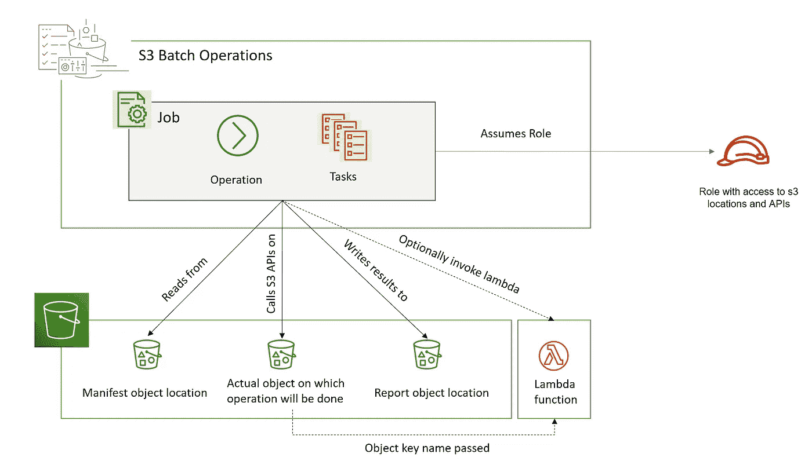
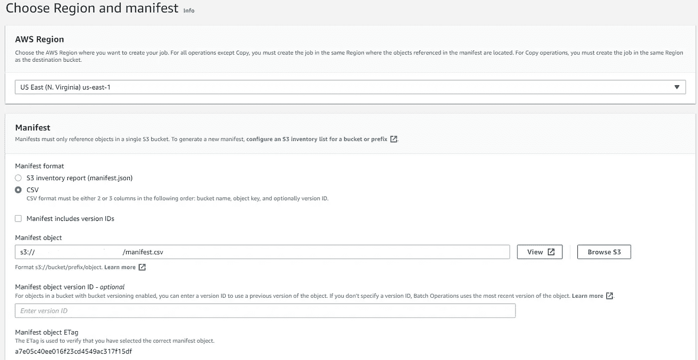
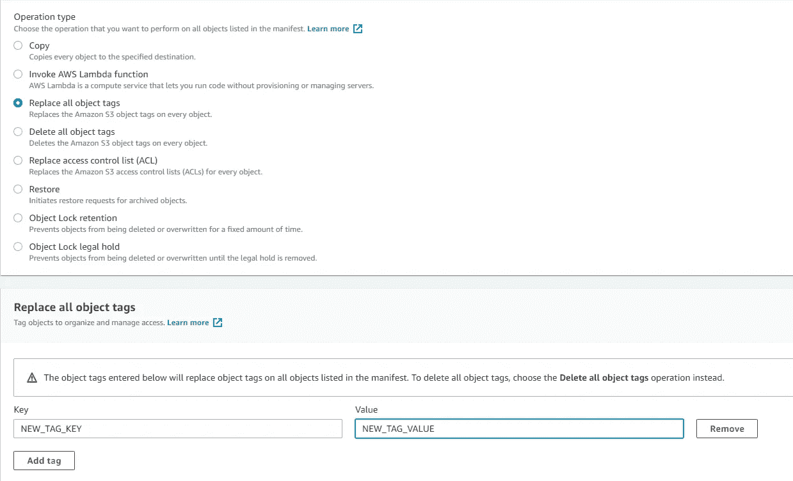
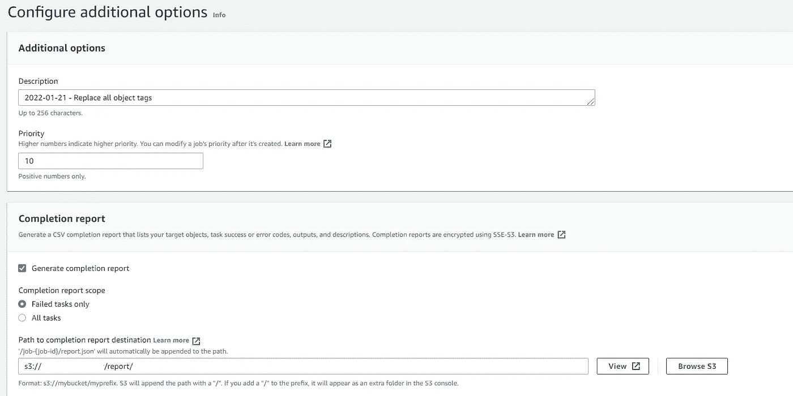
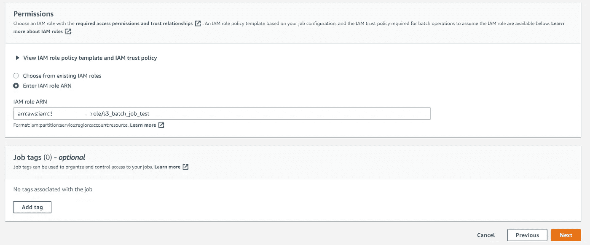
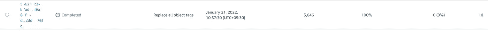
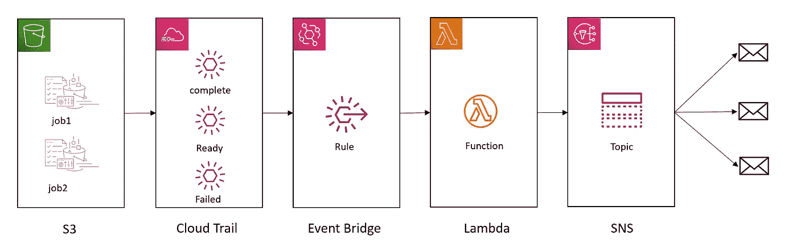

# 批量操作— S3

> 原文：<https://medium.com/nerd-for-tech/batch-operation-s3-da8827dc55dd?source=collection_archive---------1----------------------->


布莱恩·麦高恩在 [Unsplash](https://unsplash.com/s/photos/army-robot?utm_source=unsplash&utm_medium=referral&utm_content=creditCopyText) 上的照片

对大规模 S3 对象执行操作

SDK 测试的学分: [Parikshit Maheshwari](https://medium.com/u/4b740541af70?source=post_page-----da8827dc55dd--------------------------------)

当使用 S3 作为数据湖进行删除时，很多时候，我们不得不执行某些具有批量性质的操作。例如，一旦我们在配置单元中删除了一个表分区，我们就应用一个删除策略标记，这样该分区中的所有对象都会根据标记值自动从 S3 中删除。逐个标记如此大量的对象是非常耗时的。如果我们使用 lambda，它甚至会超时。为了避免这种情况，我们可以使用 S3 批处理操作。

批处理操作的体系结构如下:



作者图片

批处理运算符有三个组成部分:

**作业:**这是批处理操作符中的基本工作单元。它包含对一组对象运行指定操作所需的所有信息。

**操作:**是 API 动作，比如替换标签。作业&操作有一对一的映射。

**任务:** It 任务是一个作业的执行单元。该作业将为清单文件中指定的每个对象创建一个任务。

创建批处理作业:

先决条件:

**货单文件:**我们可以创建 CSV 格式的货单，也可以从 S3 库存中创建。在本例中，我将使用 CSV 创建它。下面是我的清单文件的内容。

```
<bucket-name>,path/to/file/5849_scheduler.logs
<bucket-name>,path/to/file/5849_webserver.logs
<bucket-name>,path/to/file/5898-scheduler.logs
```

*注意:此清单文件不支持正则表达式或通配符，对象键应为完整路径。我们可以利用 AWS S3 库存来获取文件列表。*

**IAM 角色**有权访问清单、实际对象和报告将驻留的所有存储桶位置。我用下面的策略创建了一个角色。

```
{
    "Version": "2012-10-17",
    "Statement": [
        {
            "Effect": "Allow",
            "Action": [
                "s3:PutObjectTagging",
                "s3:PutObjectVersionTagging"
            ],
            "Resource": [
                "arn:aws:s3:::<bucket_name>/path/to/data/*",
            ]
        },
        {
            "Effect": "Allow",
            "Action": [
                "s3:GetObject",
                "s3:GetObjectVersion",
                "s3:GetBucketLocation"
            ],
            "Resource": [
                "arn:aws:s3:::<bucket_name>/path/to/manifest.csv"
            ]
        },
        {
            "Effect": "Allow",
            "Action": [
                "s3:PutObject",
                "s3:GetBucketLocation"
            ],
            "Resource": [
                "arn:aws:s3:::<bucket_name>/path/to/report/*"
            ]
        }
    ]
}
```

此外，我们为这个角色添加了一个信任策略，以便 s3 可以承担这个角色:

```
{
  "Version": "2012-10-17",
  "Statement": [
    {
      "Effect": "Allow",
      "Principal": {
        "Service": "batchoperations.s3.amazonaws.com"
      },
      "Action": "sts:AssumeRole"
    }
  ]
}
```

现在，我们使用控制台创建 S3 批处理作业。记住，创建这个批处理作业操作员的角色/身份应该对我们上面创建的角色拥有 **s3:CreateJob** 权限和 **iam:PassRole** 权限。



作者图片

我选择了原因 CSV 作为清单类型，并添加了清单文件路径。然后我点击下一步。



在操作下，我选择了**“替换所有对象标签”**，并提供了标签键值对。



作者图片

向下滚动并填写权限详细信息



作者图片

填好后点击下一步按钮。在下一页上查看，然后单击创建作业。这将创建作业，并进入***状态，等待您确认运行*** 状态。选择作业并单击运行作业。这将运行作业。它会显示完成百分比。一旦完成将显示以下屏幕。



作者图片

就是这样。我们可以单击作业 id，查看其详细信息以及报告位置。在这篇博客中，我们看到了如何为 S3 操作创建批处理作业。尽管我们从控制台完成了所有工作，但我们也可以从 CLI/SDK 完成。在使用 SDK/CLI 时，我们需要有清单文件的 ETag，AWS **帐户 id** ，**桶 ARN** &我们需要将**报告格式**(S3 batch operations _ CSV _ 2018 08 20)&**confirmation required**传递为 False。最后一个参数将允许作业立即运行。

批量操作需要自己的甜蜜时间。作业在完成之前要经历以下几个阶段。

```
Preparing -> suspended -> Ready -> Active -> Completing -> Complete
```

其他可能的状态有`Failed | Cancelling | Cancelled`。

我们可能需要一种事件驱动的方式，以便在作业完成后得到通知。多亏了 Eventbridge，我们可以使用规则实现同样的功能。我们从 CloudTrail 中过滤状态变更事件，并通知涉众。相同的过滤器模式如下所示:

```
{
    "source": [
        "aws.s3"
    ],
    "detail-type": [
        "AWS Service Event via CloudTrail"
    ],
    "detail": {
        "eventSource": [
            "s3.amazonaws.com"
        ],
        "eventName": [
            "JobStatusChanged"
        ],
        "serviceEventDetails": {
            "status": [
                "Complete"
            ]
        }
    }
}
```

我们可以插入 SNS 或 Lambda 来获取事件消息。



云计算快乐！！