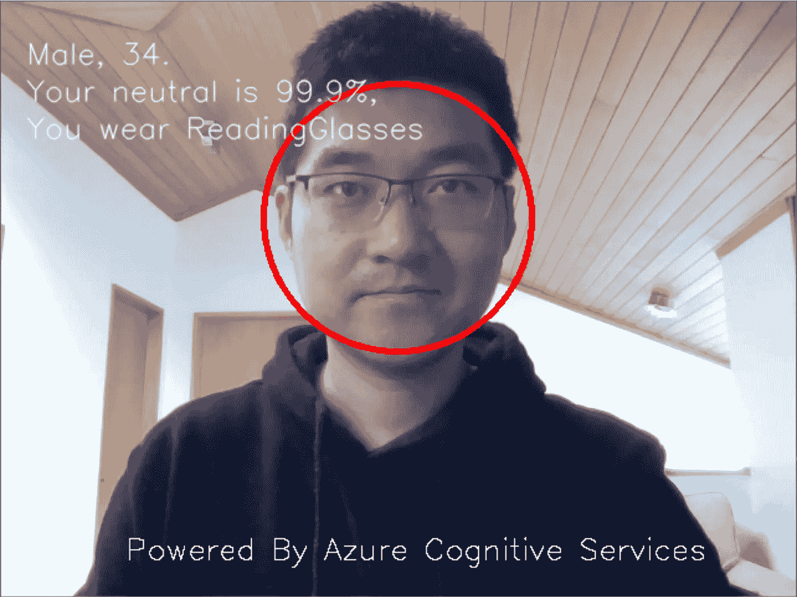
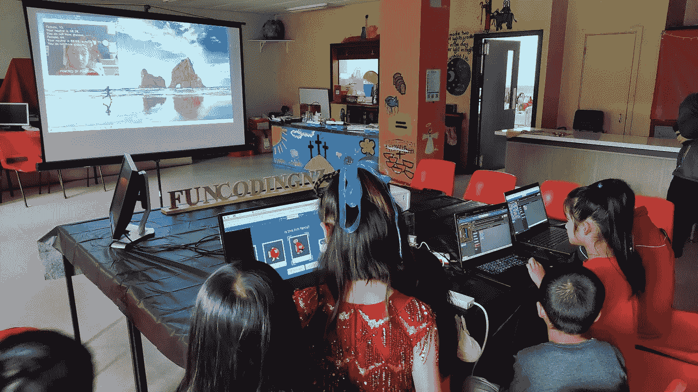

# 做一个拥抱人工智能的终身学习者

> 原文：<https://medium.com/nerd-for-tech/be-a-life-long-learner-to-embrace-ai-6c09a2c4f719?source=collection_archive---------16----------------------->

最近，我参加了 MVP 全球云技能挑战赛，让所有微软 MVP 在全球舞台上竞争。众所周知， [Microsoft Learn](https://docs.microsoft.com/en-us/learn/?WT.mc_id=DT-MVP-5001643) 是一个免费的学习资源网站，面向所有想学习微软技术的人。我已经通过我的社交网络宣传过很多次了。今天，我想分享一下我从# TheMVPChallenge 中学到的东西。

首先，我会说微软学习的内容是超级高质量的，它很容易按照指示来创建您的沉浸式学习体验。在 MVP 挑战之前，我已经沉浸在 Microsoft Learn 几百个小时了。在 Microsoft Learn 的帮助下，我成功取得了以下证书:

微软认证 Azure 基础知识

微软认证 Azure 开发者

微软认证 Azure 解决方案架构师

我完成了[MVP 挑战赛——Azure Data&AI 挑战赛](https://docs.microsoft.com/en-us/learn/challenges?id=cb3d0159-4881-4b81-a67f-6263a700163b&WT.mc_id=DT-MVP-5001643)，它包含了一堆你需要知道的内容来启动你的第一个 AI 应用。例如，你可以学习如何在 Azure 上创建一个认知服务，或者使用 Azure 机器学习创建一个分类模型。你可以找到完成一个功能应用所需的所有资源，甚至可以免费使用 Azure 动手实验室！你所需要的只是一个微软账号和你的耐心。

通过利用 Azure，你不必钻研复杂的人工智能算法。Microsoft Learn 将指导您如何创建资源以及如何编写第一行代码。甚至根本没有代码！你不相信吗？试一试吧。我已经创建了一个关于认知服务的集合，这样你就可以通过它来检测和分析照片中的人脸，或者用你的手机来检测狗的品种。听起来很有趣？找到这里，让我们一起学习:[小迪为 Azure 认知服务的收藏](https://docs.microsoft.com/en-us/users/yanxiaodi/collections/ng15u7qxk66ej5?WT.mc_id=DT-MVP-5001643)。

技术每天都在快速发展，我们必须提高自己的技能以保持对世界的敏感性。这就是为什么我也是终身学习者的倡导者。我从 MVP 挑战赛中学到的是，人工智能将在未来极大地影响我们的生活，我们需要准备好迎接新的人工智能技术。在我的业余时间，我是一名 [**小时代码**](https://hourofcode.com/) 的志愿者——这是一项全球儿童运动，旨在激励他们学习计算机科学。我相信编码将是未来的基本技能。最近，我组织了一次“代码小时”活动。但是我怎样才能更好地激励孩子们呢？有一天在微软 Learn 上学习了一些 AI 课程后，一个想法跃入我的脑海。有了 Azure 认知服务，我才花了一个周末开发了一个人脸识别 app！Azure 认知服务如此强大且易于使用。我只需要从 Azure 创建一个认知服务并上传相机流，然后它可以返回相机中人的一些属性，如性别和年龄等。它甚至能识别情感。多美好啊！我无法想象如果没有 Azure，我们从零开始开发这样一个人工智能应用程序会有多复杂。但是有了 Azure 认知服务，你也可以做到。看起来是这样的:

由 Azure 认知服务支持的我的人脸识别应用程序

我在代码小时活动中展示了这个应用程序，所有的孩子都对它感兴趣。他们兴奋地问:“为什么它知道我多大？”“嘿，我 10 岁了，不是 9 岁！”“它知道你戴眼镜！它怎么会知道呢？”多么快乐的一天！我相信这个有趣的应用程序可以激发他们对计算机科学的好奇心。也许有一天他们也会创造一些很酷的东西！也许创造一个机器人来改善医疗保健？或者克服身体上的劣势，甚至拯救地球？谁知道呢？！但我认为这个应用程序会在他们的人生旅途中点燃计算机科学的火焰。在下面的照片中，一些孩子正在用照片分类器给鱼分类。投影仪屏幕显示了我的人工智能应用程序如何识别相机中的人脸。

孩子们在一小时的代码中玩人脸识别应用程序

如果你也想创建一个这样的应用程序，你可以学习我的收藏中的课程— [通过使用 Azure 认知服务](https://docs.microsoft.com/en-us/learn/modules/identify-faces-with-computer-vision/?WT.mc_id=DT-MVP-5001643)中的计算机视觉 API 来识别人脸和表情。我强烈建议您浏览每个模块，以便更好地理解 Azure 的认知服务。这个集合涵盖了 Azure 认知服务的一些关键方面:

*[Azure 上的 AI 入门](https://docs.microsoft.com/en-us/learn/modules/get-started-ai-fundamentals/?WT.mc_id=DT-MVP-5001643&ns-enrollment-type=Collection&ns-enrollment-id=ng15u7qxk66ej5)
* [使用计算机视觉服务分析图像](https://docs.microsoft.com/en-us/learn/modules/analyze-images-computer-vision/?WT.mc_id=DT-MVP-5001643&ns-enrollment-type=Collection&ns-enrollment-id=ng15u7qxk66ej5)
* [使用自定义视觉服务检测图像中的对象](https://docs.microsoft.com/en-us/learn/modules/detect-objects-images-custom-vision/?WT.mc_id=DT-MVP-5001643&ns-enrollment-type=Collection&ns-enrollment-id=ng15u7qxk66ej5)
* [使用微软自定义视觉服务对图像进行分类](https://docs.microsoft.com/en-us/learn/modules/classify-images-with-custom-vision-service/?WT.mc_id=DT-MVP-5001643&ns-enrollment-type=Collection&ns-enrollment-id=ng15u7qxk66ej5)*[使用 Azure 认知服务中的计算机视觉 API 识别面部和表情](https://docs.microsoft.com/en-us/learn/modules/identify-faces-with-computer-vision/?WT.mc_id=DT-MVP-5001643&ns-enrollment-type=Collection&ns-enrollment-id=ng15u7qxk66ej5)
* [使用自定义视觉对濒危鸟类进行分类](https://docs.microsoft.com/en-us/learn/modules/cv-classify-bird-species/?WT.mc_id=DT-MVP-5001643&ns-enrollment-type=Collection&ns-enrollment-id=ng15u7qxk66ej5)
* [使用 Unity 和 Azure 认知服务创建语言翻译应用](https://docs.microsoft.com/en-us/learn/modules/create-language-translator-mixed-reality-application-unity-azure-cognitive-services/?WT.mc_id=DT-MVP-5001643&ns-enrollment-type=Collection&ns-enrollment-id=ng15u7qxk66ej5)
* [使用语音服务创建支持语音的应用](https://docs.microsoft.com/en-us/learn/modules/transcribe-speech-input-text/?WT.mc_id=DT-MVP-5001643&ns-enrollment-type=Collection&ns-enrollment-id=ng15u7qxk66ej5)
* [使用语音服务翻译语音](https://docs.microsoft.com/en-us/learn/modules/translate-speech-speech-service/?WT.mc_id=DT-MVP-5001643&ns-enrollment-type=Collection&ns-enrollment-id=ng15u7qxk66ej5)

未来我们肯定会面临更多的挑战，但这就是为什么我们要通过终身学习来不断成长。人工智能使我们能够构建能够赋予人类力量的令人惊叹的软件。每个人都应该开始了解一些人工智能的基础知识，因为它将极大地影响我们的日常生活。老实说，如果十年前你问我，我从没想过 AI 会离我们的日常生活这么近。它已经来了。准备好拥抱人工智能技术，现在就做一个终身学习者:[小迪的 Azure 认知服务集合](https://docs.microsoft.com/en-us/users/yanxiaodi/collections/ng15u7qxk66ej5?WT.mc_id=DT-MVP-5001643)！