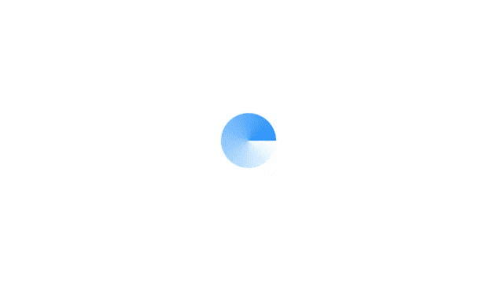

# CSS 中漂亮的旋转器

> 原文：<https://medium.com/nerd-for-tech/beautiful-spinner-in-css-bce7a348f50f?source=collection_archive---------0----------------------->


Josh Frenette 在 [Unsplash](https://unsplash.com?utm_source=medium&utm_medium=referral) 上拍摄的照片

对于那些已经知道一点 CSS 的人来说，这将是一个简短的问题，对于初学者来说，如果你不明白，就在飞行中阅读文档:)

这是我们的最终目标

系好安全带，我们走

首先，我们需要旋转器在屏幕的中央。我们通过`absolute`定位来做到这一点。

```
.spinner {
  position: absolute;
  top: 50%;
  left: 50%;
  transform: translate(-50%, -50%);
}
```

现在它在中心，让我们添加旋转体。我们在这里使用`conic-gradient`给旋转体渐变的外观

```
.spinner {
  position: absolute;
  top: 50%;
  left: 50%;
  transform: translate(-50%, -50%);
  height: 56px;
  width: 56px;
  box-sizing: border-box;
  background: conic-gradient(
    from 90deg at 50% 50%,
    rgba(39, 174, 96, 0) 0deg,
    rgba(31, 144, 255, 0) 0.04deg,
    #1f90ff 360deg
  );
  border-radius: 56px;
}
```



现在让我们隐藏中心部分，这样这个 div 看起来更像一个旋转器。我们这样做，通过绝对定位另一个白色圆圈在它上面。我使用的是`before`伪元素(也可以使用另一个 HTML 元素，但是这里使用`after`或`before`伪元素更方便)。

```
.spinner::before {
  content: "";
  position: absolute;
  left: 50%;
  top: 50%;
  transform: translate(-50%, -50%);
  height: 40px;
  width: 40px;
  background: #fff;
  border-radius: 48px;
}
```


现在它看起来更像一个旋转器。让我们把边缘弄圆吧，这样看起来更顺眼。我们使用`after`伪元素在边上放置一个小圆，这样看起来更平滑

```
.spinner::after {
  content: "";
  position: absolute;
  right: 0;
  top: 50%;
  transform: translateY(-50%);
  height: 8px;
  width: 8px;
  background: #1f90ff;
  border-radius: 8px;
}
```


哇哦，我们准备好了我们的旋转器，只是有一个问题，它还不能旋转。我们用`keyframes`给它添加动画。我们在动画持续时间的`0%`和`100%`上定义旋转。并将`keyframes`名称添加到`animation`属性中。

还有，我们给动画加了`infinite`关键字，否则只会旋转一次。

```
.spinner {
  /* previous code */
  animation: 1s rotate infinite linear;
}
@keyframes rotate {
  0% {
    transform: rotate(0deg);
  }
  100% {
    transform: rotate(360deg);
  }
}
```

上面的代码让我们的 spinner 实际上在旋转:)

要获得完整的代码，请参阅本文开头的 codepen。

直到下一次；)